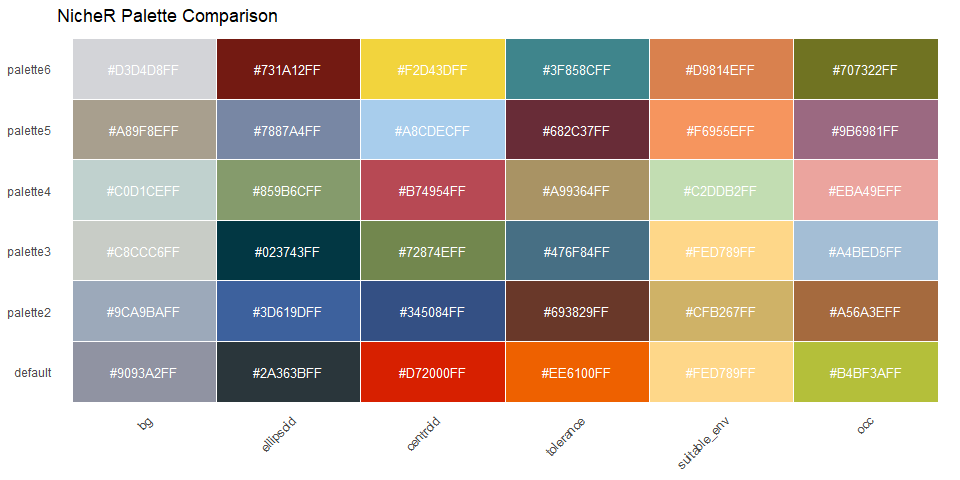
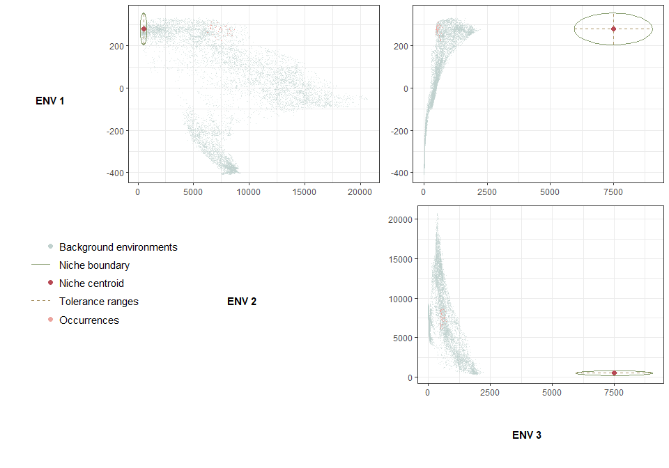
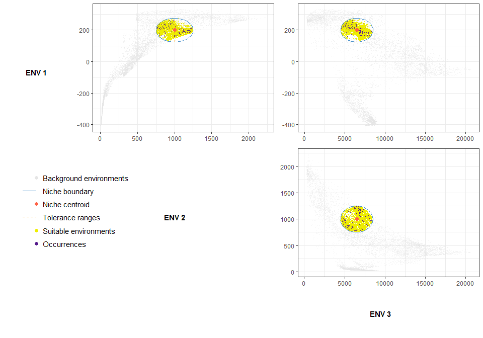

<!-- README.md is generated from README.Rmd. Please edit that file -->

# NicheR: Ellipsoid-Based Virtual Species and Niche Visualization in E-space and G-space

NicheR is an R package for building, visualizing, and sampling
**ellipsoid-based ecological niches** using environmental data.

It provides:

- Explicit ellipsoid construction in n-dimensional environmental
  space.  
- Efficient detection of suitable environments using Mahalanobis
  distance.  
- Sampling of virtual occurrences with flexible strategies and optional
  bias.  
- Visualization tools in environmental space (E-space) and geographic
  space (G-space).  
- A unified R-native workflow, with both high-level and low-level
  functions.

Inspired by the conceptual foundations of **NicheA** and the scripting
flexibility of the **virtualspecies** package, **NicheR** provides a
reproducible, scriptable ecosystem for virtual species simulation and
niche theory exploration.

------------------------------------------------------------------------

## Authors

- Mariana Castaneda-Guzman  
- Paanwaris Paansri  
- Connor Hughes

## Last Updated

11/19/2025

------------------------------------------------------------------------

## Installation

You can install the development version of NicheR from GitHub:

``` r
# 1. Install devtools if you do not have it yet
if (!require("devtools")) {
  install.packages("devtools")
}

# 2. Install NicheR from GitHub
devtools::install_github("castanedaM/NicheR")
```

**Dependencies**

NicheR relies on the following R packages (installed automatically when
you install NicheR):

- `terra` – raster / spatial data handling  
- `ggplot2`, `ggpubr` – plotting and layout  
- `plotly`, `rgl` – interactive and 3D visualization  
- `RColorBrewer` – color palettes  
- plus standard base/system packages

------------------------------------------------------------------------

# Quick Start: Full Workflow in One Step

The easiest way to use NicheR is through the high-level wrapper
`create_virtual_species()`, which:

1.  Builds an ellipsoid niche in E-space  
2.  Computes suitable environments  
3.  Samples occurrence records

``` r
library(NicheR)
library(terra)

# Example environmental data included with the package
bio_1  <- terra::rast(system.file("extdata", "Bio1.tif",  package = "NicheR"))
bio_4  <- terra::rast(system.file("extdata", "Bio4.tif",  package = "NicheR"))
bio_12 <- terra::rast(system.file("extdata", "Bio12.tif", package = "NicheR"))

# BIO1 = Annual Mean Temperature
# BIO12 = Annual Precipitation
# BIO4 = Temperature Seasonality (standard deviation ×100)

env_stack <- c(bio_1, bio_12, bio_4)
names(env_stack) <- c("mean_temp", "annual_precip", "temp_seasonality")

# Define niche parameters
niche_center <- c(mean_temp = 200,
                  annual_precip = 1000,
                  temp_seasonality = 6500)
niche_axes <- c(75, 250, 2000)
niche_angles <- c(0, 0, 0)

vs <- create_virtual_species(
  env_bg    = env_stack,
  center    = niche_center,
  axes      = niche_axes,
  angles    = niche_angles,
  n_occ     = 100,
  out.suit= "both",
  distances = TRUE,
  out.file  = FALSE
)

vs
#> NicheR virtual species components:
#>   niche:        ellipsoid
#>   suitability:  suitable_env/list
#>   bias_surface: NULL
#>   occurrences:  data.frame
```

You can immediately visualize the virtual species in E-space and
G-space:

``` r
env_df <- as.data.frame.nicheR(env_stack)

plot_e_space(env_bg = env_df, vs = vs)
#> No complete x, y, z specification provided. Using predictor columns inferred from 'env_bg': mean_temp, annual_precip, temp_seasonality
#> Using predictor columns: mean_temp, annual_precip, temp_seasonality
#> Sampling 10000 of 310771 rows from 'suitable_env' for plotting.
#> Sampling 10000 of 12412229 rows from 'env_bg' for plotting.
```


``` r
plot_g_space(vs = vs)
#> Coordinate system already present.
#> ℹ Adding new coordinate system, which will replace the existing one.
#> Coordinate system already present.
#> ℹ Adding new coordinate system, which will replace the existing one.
```


------------------------------------------------------------------------

# Function Overview & All Argument Combinations

This section summarizes the **core functions** in NicheR, their purpose,
and the main ways to combine their arguments.

The core functions are:

- `build_ellps()` – construct ellipsoid niche in E-space  
- `get_suitable_env()` – identify environments inside the niche  
- `set_bias_surface()` – build composite sampling bias surfaces  
- `get_sample_occ()` – sample virtual occurrences  
- `plot_e_space()` – visualize in environmental space  
- `plot_g_space()` – visualize in geographic space  
- `create_virtual_species()` – full pipeline wrapper  
- `as.data.frame.nicheR()` – convert large rasters to data frames

Below, each function has its own section with:

- Description  
- Arguments  
- Valid combinations  
- Example usage

------------------------------------------------------------------------

## Function: `build_ellps()`

Constructs an ellipsoid in n-dimensional environmental space.

### Description

`build_ellps()` defines an ellipsoid by its:

- centroid (**center**)  
- semi-axis lengths (**axes**)  
- optional rotation angles (**angles**)

The output is a **niche object** used by other functions.

### Arguments

| Argument   | Type    | Description                                     | Required |
|------------|---------|-------------------------------------------------|----------|
| `center`   | numeric | Centroid (one value per environmental variable) | ✔        |
| `axes`     | numeric | Semi-axis lengths (niche breadth per dimension) | ✔        |
| `angles`   | numeric | Rotation angles (optional, defaults to zeros)   | optional |
| `n_points` | integer | Number of surface points for plotting           | optional |
| `...`      |         | Additional arguments (e.g. internal options)    | optional |

### Valid combinations

- `center + axes` (axis-aligned ellipsoid)  
- `center + axes + angles` (rotated ellipsoid)  
- `center + axes + n_points`  
- `center + axes + angles + n_points`

### Example

``` r
my_niche <- build_ellps(
  center   = c(mean_temp = 280,
               annual_precip = 500,
               temp_seasonality = 7500),
  axes     = c(75, 300, 1550),
  angles   = c(0, 0, 0),
  n_points = 500
)

my_niche
#> Ellipsoid object
#> ----------------
#>  Dimensions: 3D
#>  Center:     280, 500, 7500
#>  Axes:       75, 300, 1550
#>  Angles:     0, 0, 0 radians
#> 
#>  Rotation matrix (R):
#>      [,1] [,2] [,3]
#> [1,]    1    0    0
#> [2,]    0    1    0
#> [3,]    0    0    1
#> 
#>  Covariance matrix (Sigma):
#>                  mean_temp annual_precip temp_seasonality
#> mean_temp             5625             0                0
#> annual_precip            0         90000                0
#> temp_seasonality         0             0          2402500
#> 
#>  Inverse covariance matrix (Sigma_inv):
#>                  mean_temp annual_precip temp_seasonality
#> mean_temp                0             0                0
#> annual_precip            0             0                0
#> temp_seasonality         0             0                0
#> 
#>  Surface points: 250000 (x, y, z)

plot_e_space(env_bg = env_stack,
             niche = my_niche)
#> No complete x, y, z specification provided. Using predictor columns inferred from 'env_bg': mean_temp, annual_precip, temp_seasonality
#> Using predictor columns: mean_temp, annual_precip, temp_seasonality
#> Sampling 10000 of 12412229 rows from 'env_bg' for plotting.
```

## 

## Function: `get_suitable_env()`

Identifies which environmental conditions fall **inside the ellipsoid**
(D² ≤ 1).

### Description

`get_suitable_env()`:

- Computes the squared Mahalanobis distance between each environmental
  point and the ellipsoid centroid  
- Classifies points as inside/outside based on D² ≤ 1  
- Returns outputs in spatial and/or tabular form

### Arguments

| Argument | Type | Description | Required |
|----|----|----|----|
| `niche` | ellipsoid object | Output from `build_ellps()` | ✔ |
| `env_bg` | SpatRaster / df | Environmental background (rasters, or tabular data) | ✔ |
| `out` | character | `"spatial"`, `"data.frame"`, or `"both"` | ✔ |

### Valid combinations

- Raster + `"spatial"` – returns `SpatRaster` mask  
- Raster + `"data.frame"` – returns table of suitable cells  
- Raster + `"both"`  
- data.frame + `"data.frame"` – returns subset of rows  
- data.frame + `"both"` – returns both table and derived raster (if
  requested internally)

### Examples

``` r
# Spatial (G-space) output: suitable raster
suitable_g_space <- get_suitable_env(
  niche  = my_niche,
  env_bg = env_stack,
  out.suit   = "spatial"
)
#> Starting get_suitable_env()...
#> Preparing environmental background...
#> env_bg is a SpatRaster. Estimating size for data.frame conversion...
#> Estimated size ~851 MB. Converting raster to data.frame with as.data.frame.nicheR()...
#> Estimated raster size ~ 425.52 MB (37182370 cells x 3 layers)
#> Using in-memory terra::as.data.frame (below threshold).
#> Using 3 predictor columns for the ellipsoid.
#> Subsetting to the ellipsoid bounding box in E space...
#> Bounding box subsetting reduced data from 12412229 to 804946 rows.
#> 804946 rows have complete predictor values. Computing Mahalanobis distances...
#> 378965 points fall inside the ellipsoid.
#> Building spatial output...
#> Using original SpatRaster as template for spatial output.
#> Finished get_suitable_env().

# Tabular (E-space) output
suitable_df <- get_suitable_env(
  niche  = my_niche,
  env_bg = env_df,
  out.suit = "data.frame",
  distances = TRUE)
#> Starting get_suitable_env()...
#> Preparing environmental background...
#> env_bg provided as data.frame or matrix. Coercing to data.frame...
#> Using 3 predictor columns for the ellipsoid.
#> Subsetting to the ellipsoid bounding box in E space...
#> Bounding box subsetting reduced data from 12412229 to 804946 rows.
#> 804946 rows have complete predictor values. Computing Mahalanobis distances...
#> 378965 points fall inside the ellipsoid.
#> Finished get_suitable_env().

# Both formats
suitable_both <- get_suitable_env(
  niche  = my_niche,
  env_bg = env_stack,
  out    = "both",
  distances = TRUE
)
#> Starting get_suitable_env()...
#> Preparing environmental background...
#> env_bg is a SpatRaster. Estimating size for data.frame conversion...
#> Estimated size ~851 MB. Converting raster to data.frame with as.data.frame.nicheR()...
#> Estimated raster size ~ 425.52 MB (37182370 cells x 3 layers)
#> Using in-memory terra::as.data.frame (below threshold).
#> Using 3 predictor columns for the ellipsoid.
#> Subsetting to the ellipsoid bounding box in E space...
#> Bounding box subsetting reduced data from 12412229 to 804946 rows.
#> 804946 rows have complete predictor values. Computing Mahalanobis distances...
#> 378965 points fall inside the ellipsoid.
#> Building spatial output...
#> Using original SpatRaster as template for spatial output.
#> Also creating distance raster (dist_sq).
#> Finished get_suitable_env().


plot_e_space(env_bg = env_stack,
             niche = my_niche, 
             suitable_env = suitable_both)
#> No complete x, y, z specification provided. Using predictor columns inferred from 'env_bg': mean_temp, annual_precip, temp_seasonality
#> Using predictor columns: mean_temp, annual_precip, temp_seasonality
#> Sampling 10000 of 378965 rows from 'suitable_env' for plotting.
#> Sampling 10000 of 12412229 rows from 'env_bg' for plotting.
```


------------------------------------------------------------------------

## Function: `set_bias_surface()`

Combines one or more layers into a composite **sampling bias surface**.

### Description

`set_bias_surface()`:

- Standardizes each bias layer to \[0, 1\]  
- Optionally reverses layers (e.g., distance → proximity)  
- Multiplies layers together to form a single bias surface  
- Optionally masks the bias surface with a suitability raster

### Arguments

| Argument | Type | Description | Required |
|----|----|----|----|
| `bias_surface` | raster / list | One or more layers representing potential sampling bias | ✔ |
| `bias_dir` | numeric (1 / -1) | Direction per layer: 1 = keep, -1 = invert | ✔ |
| `suitable_env` | raster / object | Optional, mask/align with suitability | optional |
| `out.bias` | character | `"biased"`, `"standardized"`, or `"both"` | optional |
| `verbose` | logical | Print messages | optional |

### Valid combinations

- Single bias layer (e.g., road proximity)  
- Multiple bias layers (e.g., road proximity + human density)  
- Direction coded by `bias_dir` (e.g., distance-from-roads with -1)  
- With or without `suitable_env` mask  
- Return only standardized stack, only pooled surface, or both

### Example

``` r
sp_rich   <- terra::rast(system.file("extdata", "sr_sp_host_0.05.tif", package = "NicheR"))
nighttime <- terra::rast(system.file("extdata", "nighttime.tif",        package = "NicheR"))

bias_obj <- set_bias_surface(
  bias_surface = c(sp_rich, nighttime),
  bias_dir     = c(1, -1),
  suitable_env = suitable_g_space,
  out.bias     = "both"
)
#> Starting set_bias_surface()...
#> bias_surface provided as SpatRaster. Splitting into single layers...
#> Using 'suitable_env' raster as template and mask.
#> Processing and standardizing 2 bias layer(s) on the template grid...
#>   - Aligning bias layer 1 (sp_richness) to template grid (resample).
#>   - Aligning bias layer 2 (nighttime) to template grid (resample).
#> Finished processing bias layers.
#> Pooling 2 bias layer(s) into a single surface...
#> Finished pooling bias layers.
#> |---------|---------|---------|---------|=========================================                                          
#> set_bias_surface() completed successfully.

names(bias_obj)
#> [1] "pooled_bias_sp"         "directional_bias_stack" "combination_formula"
```


------------------------------------------------------------------------

## Function: `get_sample_occ()`

Samples virtual **occurrence points** from suitable conditions.

### Description

`get_sample_occ()`:

- Uses the niche (`niche`) and environmental background (`env_bg`)  
- Identifies suitable points (D² ≤ 1)  
- Samples `n_occ` points under a chosen strategy  
- Optionally applies a bias surface to weight selection

### Arguments

| Argument | Type | Description | Required |
|----|----|----|----|
| `n_occ` | integer | Number of occurrences to sample | ✔ |
| `niche` | ellipsoid object | Niche from `build_ellps()` | ✔ |
| `env_bg` | raster / data.frame | Environmental background | ✔ |
| `method` | character | `"random"`, `"center"`, `"edge"` | optional |
| `bias_surface` | raster / df | Optional bias surface from `set_bias_surface()` | optional |
| `seed` | integer | Optional random seed for reproducibility | optional |

### Sampling methods

- `"random"` – all suitable points equally likely  
- `"center"` – higher weight near niche centroid (low D²)  
- `"edge"` – higher weight near niche edge (high D² but inside)

### Valid combinations

- Unbiased sampling with `"random"` / `"center"` / `"edge"`  
- Biased sampling with `bias_surface`  
- Raster or data.frame environmental background

### Examples

``` r
# 1) Random sampling
occ_random <- get_sample_occ(
  n_occ  = 50,
  suitable_env = suitable_both,
  method = "random",
  seed   = 42
)
#> Starting get_sample_occ()...
#> Coercing 'suitable_env' to a data.frame of candidate environments...
#> Suitable pool contains 378965 candidate environments.
#> No 'bias_surface' supplied; sampling based only on 'method'.
#> Computing sampling weights using method = 'random'...
#> Setting seed to 42 and drawing 50 samples...
#> Finished get_sample_occ(): sampled 50 occurrences.

# 2) Center-biased sampling
occ_center <- get_sample_occ(
  n_occ  = 50,
  suitable_env = suitable_both,
  method = "center",
  seed   = 42
)
#> Starting get_sample_occ()...
#> Coercing 'suitable_env' to a data.frame of candidate environments...
#> Suitable pool contains 378965 candidate environments.
#> No 'bias_surface' supplied; sampling based only on 'method'.
#> Computing sampling weights using method = 'center'...
#> Setting seed to 42 and drawing 50 samples...
#> Finished get_sample_occ(): sampled 50 occurrences.

# 3) Edge-biased sampling with a bias surface
occ_edge_bias <- get_sample_occ(
  n_occ        = 50,
  suitable_env = suitable_both,
  method       = "edge",
  bias_surface = bias_obj$pooled_bias_sp,
  seed         = 42
)
#> Starting get_sample_occ()...
#> Coercing 'suitable_env' to a data.frame of candidate environments...
#> Suitable pool contains 378965 candidate environments.
#> Extracting bias values at suitable locations...
#> Computing sampling weights using method = 'edge'...
#> Applying bias surface to sampling weights...
#> Setting seed to 42 and drawing 50 samples...
#> Finished get_sample_occ(): sampled 50 occurrences.
```

------------------------------------------------------------------------

## Function: `plot_e_space()`

Visualizes niches and occurrences in **environmental space (E-space)**.

### Description

`plot_e_space()` supports:

- Pairwise 2D scatterplots with ellipsoid boundaries  
- Optional highlighting of suitable environments  
- Optional density plots for occurrences  
- Interactive 3D ellipsoid + points (via `plotly`)

### Arguments (most commonly used)

| Argument           | Description                                |
|--------------------|--------------------------------------------|
| `env_bg`           | Background environmental data (data.frame) |
| `x`, `y`, `z`      | Names of variables to plot                 |
| `labels`           | Optional axis labels                       |
| `niche`            | Ellipsoid object                           |
| `occ_pts`          | Optional occurrence points                 |
| `suitable_env`     | Suitable env inside the niche              |
| `show.occ.density` | Show marginal density of occurrences       |
| `plot.3d`          | TRUE → 3D plotly ellipsoid                 |
| `palette`          | Built-in palette name                      |
| `colors`           | Custom named list of hex colors            |

### Valid combinations

- 2D pairwise plots (x, y only)  
- 3D plots (x, y, z + `plot.3d = TRUE`)  
- With or without occurrence points  
- With or without highlighting suitable environments  
- Using default palettes or custom colors

### Examples

#### 2D pairwise E-space plot

``` r
plot_e_space(
  env_bg   = env_stack,
  x        = "mean_temp",
  y        = "annual_precip",
  z        = "temp_seasonality",
  labels   = c("Mean T (C)", "Annual Prec (mm)", "Temp Seasonality"),
  niche    = my_niche,
  suitable_env = suitable_both
)
#> Sampling 10000 of 378965 rows from 'suitable_env' for plotting.
#> Sampling 10000 of 12412229 rows from 'env_bg' for plotting.
```


#### 3D interactive E-space plot (not evaluated here)

``` r
plot_e_space(
  env_bg   = env_df,
  labels   = c("Mean T (C)",
               "Annual Prec (mm)",
               "Temp Seasonality"),
  niche    = my_niche,
  suitable_env = suitable_both,
  plot.3d  = TRUE
)
```

------------------------------------------------------------------------

## Function: `plot_g_space()`

Visualizes suitability and/or occurrences in **geographic space
(G-space)**.

### Description

`plot_g_space()`:

- Uses raster background (`env_bg`) for map context  
- Can overlay suitable environments  
- Can overlay occurrence points  
- Can optionally color by distance to centroid

### Arguments (core)

| Argument        | Description                                |
|-----------------|--------------------------------------------|
| `env_bg`        | Background raster (study area)             |
| `niche`         | Ellipsoid object (for suitability)         |
| `show.suitable` | TRUE → display suitable area mask          |
| `show.distance` | TRUE → continuous distance/suitability map |
| `occ_pts`       | Optional occurrence points                 |

### Valid combinations

- Suitability map only  
- Occurrence points only  
- Suitability + occurrences  
- Suitability + distance + occurrences

### Example

``` r
plot_g_space(
  env_bg        = env_stack,
  niche         = my_niche,
  occ_pts       = occ_center
)
#> Suitability was not supplied; computed internally via get_suitable_env().
#> For repeated plots, consider calling get_suitable_env() once and passing the result to `suitable_env`.
#> Coordinate system already present.
#> ℹ Adding new coordinate system, which will replace the existing one.
#> Coordinate system already present.
#> ℹ Adding new coordinate system, which will replace the existing one.
```


------------------------------------------------------------------------

## Function: `create_virtual_species()`

High-level **pipeline wrapper** that calls:

1.  `build_ellps()`  
2.  `get_suitable_env()`  
3.  `get_sample_occ()`

### Description

`create_virtual_species()` builds, projects, and samples from a virtual
species in a single call, returning a list that can include:

- niche object  
- suitability outputs  
- occurrence points  
- call arguments and more

### Key Arguments (subset)

| Argument    | Description                             |
|-------------|-----------------------------------------|
| `env_bg`    | environmental background (raster stack) |
| `center`    | ellipsoid centroid (vector)             |
| `axes`      | ellipsoid semi-axes                     |
| `angles`    | ellipsoid rotation angles               |
| `n_occ`     | number of occurrence points             |
| `out`       | `"suitability"`, `"occ"`, or `"both"`   |
| `distances` | whether to compute D² distances         |
| `out.file`  | TRUE to save output to file             |

### Example

``` r
vs_full <- create_virtual_species(
  env_bg    = env_stack,
  center    = niche_center,
  axes      = niche_axes,
  angles    = niche_angles,
  n_occ     = 200,
  out.suit  = "both",
  distances = TRUE
)
#> Starting virtual species workflow.
#> Running build_ellps()...
#> Finished build_ellps().
#> Running get_suitable_env()...
#> Finished get_suitable_env().
#> No 'bias_surface' supplied; skipping bias construction.
#> Running get_sample_occ()...
#> Finished get_sample_occ().
#> out.file = FALSE: object not saved to disk.
#> Workflow completed.

vs_full
#> NicheR virtual species components:
#>   niche:        ellipsoid
#>   suitability:  suitable_env/list
#>   bias_surface: NULL
#>   occurrences:  data.frame
names(vs_full)
#> [1] "niche"        "suitability"  "bias_surface" "occurrences"  "call_args"   
#> [6] "routed_args"  "save_path"
```

------------------------------------------------------------------------

## Function: `as.data.frame.nicheR()`

Efficiently converts large rasters to a **disk-backed** data frame
suitable for E-space operations.

In many cases you can call `as.data.frame()` directly on NicheR rasters,
but `as.data.frame.nicheR()` methods are designed to be memory-aware.

### Example

``` r
env_df <- as.data.frame.nicheR(env_stack, verbose = TRUE)
#> Estimated raster size ~ 425.52 MB (37182370 cells x 3 layers)
#> Using in-memory terra::as.data.frame (below threshold).
head(env_df)
#>                 x        y mean_temp annual_precip temp_seasonality
#> 1271690 -33.04107 83.61742      -104           156             9524
#> 1271691 -32.99941 83.61742      -104           156             9516
#> 1271692 -32.95776 83.61742      -104           156             9509
#> 1271693 -32.91610 83.61742      -104           156             9502
#> 1271694 -32.87445 83.61742      -104           156             9495
#> 1271695 -32.83279 83.61742      -104           156             9489
```

------------------------------------------------------------------------

# Color Palettes and Custom Colors

NicheR includes multiple **built-in palettes** for consistent plotting.

You can explore and compare them like this:



You can select a palette by name:

``` r
plot_e_space(
  env_bg   = env_df,
  x        = "mean_temp",
  y        = "temp_seasonality",
  z        = "annual_precip",
  niche    = my_niche,
  occ_pts  = occ_center,
  palette  = "palette4"
)
#> Sampling 10000 of 12412229 rows from 'env_bg' for plotting.
```



Or provide custom colors:

``` r
plot_e_space(
  env_bg   = env_df,
  vs = vs_full,
  colors = list(
    bg           = "grey90",
    ellipsoid    = "steelblue3",
    centroid     = "#FF6347",
    tolerance    = "orange",
    suitable_env = "#EEEE00",
    occ          = "purple4"
  )
)
#> No complete x, y, z specification provided. Using predictor columns inferred from 'env_bg': mean_temp, annual_precip, temp_seasonality
#> Using predictor columns: mean_temp, annual_precip, temp_seasonality
#> Sampling 10000 of 310771 rows from 'suitable_env' for plotting.
#> Sampling 10000 of 12412229 rows from 'env_bg' for plotting.
```



Note: For 3D plotting it is best to use HEX color codes.

------------------------------------------------------------------------

# Saving Publication-Ready Figures

You can save high-resolution plots using base R graphics:

``` r
tiff(filename = "NicheR_plot2D.tiff",
     width = 11, height = 8,
     units = "in", res = 300,
     compression = "lzw")

plot_e_space(
  env_bg   = env_df,
  vs = vs_full,
  labels   = c("Mean T (°C)", "Temp Seasonality", "Annual Prec (mm)"),
  show.occ.density = TRUE,
  palette  = "palette3"
)

dev.off()
```

------------------------------------------------------------------------

# Contributing

We welcome contributions!

If you have:

- suggestions,  
- bug reports, or  
- would like to contribute code,

please open an issue or submit a pull request on the **NicheR** GitHub
repository.

When contributing, please:

- keep functions documented with roxygen2,  
- include minimal reproducible examples, and  
- add tests whenever appropriate.

Thank you for helping improve NicheR!
