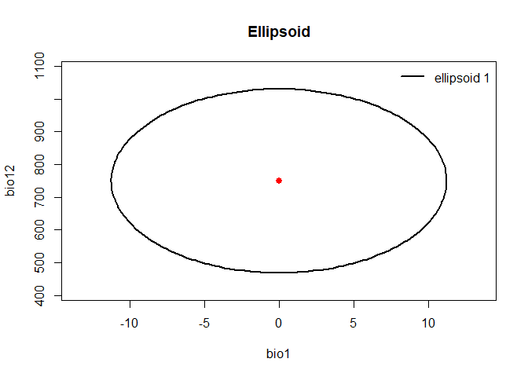
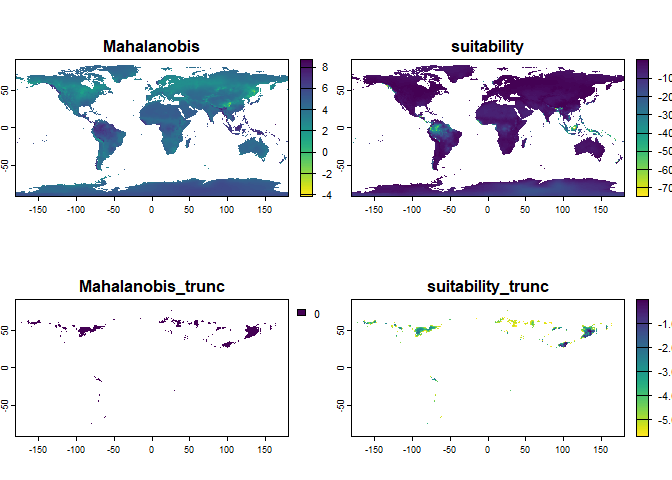
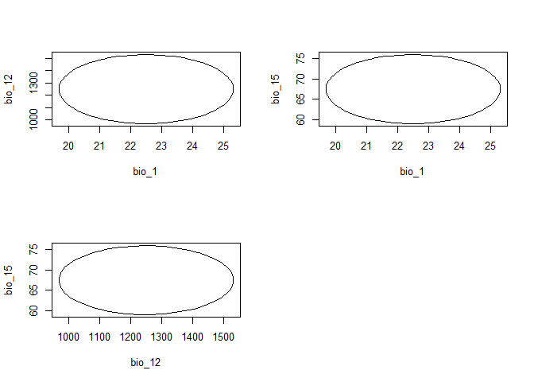

<!-- README.md is generated from README.Rmd. Please edit that file -->

# NicheR

### Ellipsoid-Based Virtual Species and Niche Modeling in E-space and G-space

**NicheR** is an R package for building, visualizing, predicting, and
sampling **ellipsoid-based ecological niches** using environmental data.

It provides:

- Explicit ellipsoid construction in n-dimensional environmental space  
- Efficient suitability detection using Mahalanobis distance  
- Flexible virtual occurrence sampling strategies  
- Visualization tools in environmental space (E-space) and geographic
  space (G-space)  
- A unified, fully scriptable R-native workflow

Inspired by the conceptual foundations of **NicheA** and the flexibility
of the **virtualspecies** package, **NicheR** provides a reproducible
framework for virtual species simulation and niche theory exploration.

------------------------------------------------------------------------

## Authors

- Mariana Castaneda-Guzman  
- Connor Hughes  
- Paanwaris Paansri  
- Marlon Cobos

------------------------------------------------------------------------

## Installation

Install the development version from GitHub:

``` r
if (!require("devtools")) install.packages("devtools")
#> Loading required package: devtools
#> Warning: package 'devtools' was built under R version 4.4.3
#> Loading required package: usethis
#> Warning: package 'usethis' was built under R version 4.4.3
devtools::install_github("castanedaM/nicheR")
#> Using GitHub PAT from the git credential store.
#> Skipping install of 'nicheR' from a github remote, the SHA1 (8650bc7e) has not changed since last install.
#>   Use `force = TRUE` to force installation
library(nicheR)
```

------------------------------------------------------------------------

## Quick Example

``` r
library(nicheR)
library(terra)
#> Warning: package 'terra' was built under R version 4.4.3
#> terra 1.8.70

# Download environmental data
wc <- geodata::worldclim_global(var = "bio",
                                res = 10,
                                path = tempdir())

bios <- wc[[c(1, 12, 15)]]
names(bios) <- c("bio1", "bio12", "bio15")

# Define environmental ranges
range_df <- data.frame(bio1  = c(-10, 10),
                       bio12 = c(500, 1000),
                       bio15 = c(30, 150))

# Build ellipsoid niche
ell <- build_ellipsoid(range = range_df)
#> Starting: building ellipsoidal niche from ranges...
#> Step: computing covariance matrix...
#> Step: computing safe covariance limits... see out$cov_limits for options
#> Step: computing ellipsoid metrics...
#> Done: created ellipsoidal niche.
plot_nicheR(list(ell))
```



``` r

# Predict suitability
pred <- predict(ell,
                newdata = bios,
                include_mahalanobis = TRUE,
                include_suitability = TRUE,
                suitability_truncated = TRUE,
                mahalanobis_truncated = TRUE)
#> Starting: predict suitab...
#> Step: Using  3  predictor variables:  bio1, bio12, bio15 
#> Done: prediction completed.

plot(log(pred), col = rev(viridis::viridis(100)))
```



------------------------------------------------------------------------

## Sampling Virtual Occurrences

``` r
# Sample center, edge, and random occurrences
occ_center <- sample_data(n_occ = 1000,
                          suitable_env = pred,
                          sampling = "center",
                          method = "probability",
                          seed = 42)
#> Starting: sampling data...
#> Done: sampled  1000  occurrences.

occ_edge <- sample_data(n_occ = 1000,
                        suitable_env = pred,
                        sampling = "edge",
                        method = "probability",
                        seed = 42)
#> Starting: sampling data...
#> Done: sampled  1000  occurrences.

occ_random <- sample_data(n_occ = 1000,
                          suitable_env = pred,
                          sampling = "random",
                          method = "probability",
                          seed = 42)
#> Starting: sampling data...
#> Done: sampled  1000  occurrences.
```

Extract environmental values for E-space visualization:

``` r
occ_center_env <- terra::extract(bios, occ_center)
occ_edge_env <- terra::extract(bios, occ_edge)
occ_random_env <- terra::extract(bios, occ_random)
```

Plot in environmental space:

``` r
par(mfrow = c(3, 3)) 

# Center pairs
plot_nicheR(
  list(ell),
  dims = c(1, 2),
  main = "Center-weighted sampling",
  occ_list = list(occ_center_env))

plot_nicheR(
  list(ell),
  dims = c(1, 3),
  main = "Center-weighted sampling",
  occ_list = list(occ_center_env))

plot_nicheR(
  list(ell),
  dims = c(3, 2),
  main = "Center-weighted sampling",
  occ_list = list(occ_center_env))


# edge pairs
plot_nicheR(
  list(ell),
  dims = c(1, 2),
  main = "edge-weighted sampling",
  occ_list = list(occ_edge_env))

plot_nicheR(
  list(ell),
  dims = c(1, 3),
  main = "edge-weighted sampling",
  occ_list = list(occ_edge_env))

plot_nicheR(
  list(ell),
  dims = c(3, 2),
  main = "edge-weighted sampling",
  occ_list = list(occ_edge_env))


# random pairs
plot_nicheR(
  list(ell),
  dims = c(1, 2),
  main = "random-weighted sampling",
  occ_list = list(occ_random_env))

plot_nicheR(
  list(ell),
  dims = c(1, 3),
  main = "random-weighted sampling",
  occ_list = list(occ_random_env))

plot_nicheR(
  list(ell),
  dims = c(3, 2),
  main = "random-weighted sampling",
  occ_list = list(occ_random_env))
```



------------------------------------------------------------------------

## Conceptual Framework

NicheR operates across two complementary spaces:

- **E-space (Environmental Space)**  
  Ellipsoids represent multivariate environmental tolerances.

- **G-space (Geographic Space)**  
  Predictions are projected across raster layers to identify suitable
  geographic regions.

This dual-space structure allows explicit separation between niche
definition, projection, and sampling processes.

------------------------------------------------------------------------

## Contributing

We welcome contributions.

If you have:

- Suggestions  
- Bug reports  
- Feature requests  
- Code improvements

Please open an issue or submit a pull request on GitHub.

When contributing:

- Document functions using roxygen2  
- Include minimal reproducible examples  
- Add tests when appropriate

Thank you for helping improve **NicheR**.
