# Creating Ellipsoid Based Niches

## Summary

- [Description](#description)
- [Getting ready](#getting-ready)
- [Loading example data](#loading-example-data)
- [Building and visualizing ellipsoid
  niches](#building-and-visualizing-ellipsoid-niches)
  - [Creating a basic ellipsoid](#creating-a-basic-ellipsoid)
  - [Adjusting ellipsoid covariance](#adjusting-ellipsoid-covariance)
  - [Comparing multiple species
    niches](#comparing-multiple-species-niches)
  - [Save and import](#save-and-import)
- [Working in more than 2
  dimensions](#working-in-more-than-2-dimensions)

------------------------------------------------------------------------

## Description

This vignette introduces the core workflow for defining species
ecological niches as ellipsoids in environmental space using the
`nicheR` package. The ellipsoid-based approach follows the Hutchinsonian
concept of the ecological niche by representing the set of environmental
conditions under which a species can persist as an n-dimensional
hypervolume in multivariate environmental space. Ellipsoids are
well-suited to this task because they are a straightforward and
interpatable way of capturing the shape, size, and orientation of a
species’ niche, including correlations between environmental variables.

The main functions covered in this vignette are:

- [`build_ellipsoid()`](https://castanedam.github.io/nicheR/reference/build_ellipsoid.md):
  constructs a `nicheR_ellipsoid` object from user-defined environmental
  ranges.
- [`update_ellipsoid_covariance()`](https://castanedam.github.io/nicheR/reference/update_ellipsoid_covariance.md):
  modifies the covariance structure of an existing ellipsoid to
  introduce correlations between environmental variables.
- [`plot_ellipsoid()`](https://castanedam.github.io/nicheR/reference/plot_ellipsoid.md):
  visualizes an ellipsoid in two-dimensional environmental space,
  optionally alongside background data.
- [`add_ellipsoid()`](https://castanedam.github.io/nicheR/reference/add_ellipsoid.md):
  adds an additional ellipsoid to an existing plot for visual
  comparison.
- [`add_data()`](https://castanedam.github.io/nicheR/reference/add_data.md):
  overlays additional data points (centroids, other background data,
  occurrence records) onto an existing ellipsoid plot.
- [`plot_ellipsoid_pairs()`](https://castanedam.github.io/nicheR/reference/plot_ellipsoid_pairs.md):
  plots all pairwise projections of a multidimensional ellipsoid at
  once.
- [`save_nicheR()`](https://castanedam.github.io/nicheR/reference/save_nicheR.md)
  /
  [`read_nicheR()`](https://castanedam.github.io/nicheR/reference/read_nicheR.md):
  saves and reloads `nicheR` objects to and from disk.

  

## Getting ready

If `nicheR` has not been installed yet, please do so. See the [Main
guide](https://castanedam.github.io/nicheR/articles/index.md) for
installation instructions.

Use the following lines of code to load `nicheR` and other packages
needed for this vignette, and to set a working directory (if necessary).

Note: We will display functions from other packages as
`package::function()`.

``` r
# Load packages
library(nicheR)
#library(terra)

# Current directory
getwd()

# Define new directory
#setwd("YOUR/DIRECTORY")  # modify if setting a new directory
```

  

## Loading example data

The lines of code below load the environmental raster data included in
the `nicheR` package. These layers represent Bioclim variables and will
be used both as background data to provide environmental context and as
the basis for visualizing ellipsoids.

``` r
# Load raster layers
bios <- terra::rast(system.file("extdata", "ma_bios.tif",
                                package = "nicheR"))
```

  

For the examples in this vignette we will work with three variables:
mean annual temperature (bio_1), annual precipitation (bio_12), and
precipitation seasonality (bio_15). We extract these layers and convert
them to a data frame for use in plotting and background comparisons.

``` r
# Subset to the three variables used in this vignette
bios <- bios[[c("bio_1", "bio_12", "bio_15")]]

# Convert raster to data frame (retaining xy coordinates)
bios_df <- as.data.frame(bios, xy = TRUE)

# Quick look at each variable
terra::plot(c(bios$bio_1, bios$bio_12, bios$bio_15),
            main = c("Bio 1 - Mean Annual Temperature",
                     "Bio 12 - Annual Precipitation",
                     "Bio 15 - Precipitation Seasonality"))
```

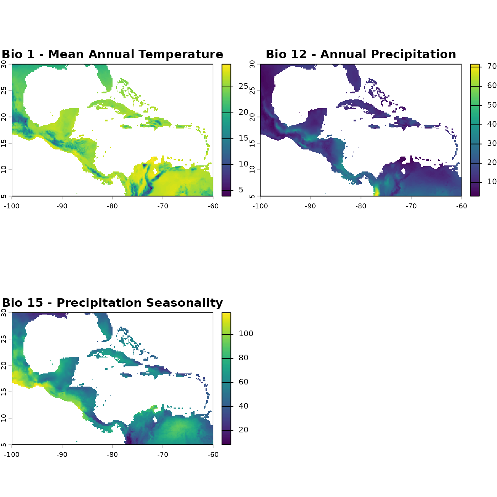

  

### Building and visualizing ellipsoid niches

### Background

A key distinction in ecological niche modeling is between environmental
space (E-space) and geographic space (G-space). E-space is the
multivariate space defined by environmental variables, such as
temperature and precipitation, where each axis represents a single
variable and each point represents a unique combination of environmental
conditions. The ellipsoid niche is defined and parameterized entirely in
E-space, where its shape, size, and position have direct ecological
meaning. G-space, by contrast, is the familiar two-dimensional
geographic map, where each point corresponds to a location on the
landscape. Because every geographic location can be characterized by its
environmental conditions, there is a direct relationship between the two
concepts and once a niche is defined in E-space it can be projected onto
G-space to identify which locations on a real landscape fall within the
species’ tolerances. This projection from E-space to G-space is what
produces a map of predicted suitable habitat, and is covered in the
[Making Predictions
vignette](https://castanedam.github.io/nicheR/articles/link).

The foundation of niche modeling in `nicheR` is the ellipsoid, which
represents the set of environmental conditions a species can tolerate.
An ellipsoid in environmental space is defined by three components: a
centroid (the optimal or central environmental conditions), a covariance
matrix (which controls the shape and orientation of the ellipsoid), and
a volume (determined by the size of the environmental ranges). The
boundary of the ellipsoid is defined by a threshold of the Mahalanobis
distance from the centroid, a multivariate measure of distance that
accounts for correlations among variables.

The Mahalanobis distance of a point in E-space measures how far that
point lies from the centroid of the ellipsoid, scaled by the covariance
structure of the niche. Unlike Euclidean distance, which treats all
directions equally, Mahalanobis distance accounts for the fact that the
ellipsoid may extend further along some environmental axes than others,
and that axes may be correlated. A point that falls exactly on the
boundary of the ellipsoid has a Mahalanobis distance equal to the
chi-square cutoff; points inside the ellipsoid have smaller distances
and are considered suitable, while points outside have larger distances
and are considered unsuitable. This means that suitability declines
continuously and symmetrically from the centroid outward, reaching zero
at the ellipsoid boundary.

### Creating a basic ellipsoid

The function
[`build_ellipsoid()`](https://castanedam.github.io/nicheR/reference/build_ellipsoid.md)
constructs a niche ellipsoid from user-supplied environmental ranges.
The centroid is placed at the midpoint of each range, and no correlation
between variables is assumed. The size of the ellipsoid along each axis
is determined by the range provided.

In the example below, we define a species tolerating mean annual
temperatures between 20 and 32 degrees and annual precipitation between
750 and 4000 mm.

``` r
# Define environmental ranges for the species
range <- data.frame(bio_1  = c(20, 32),
                    bio_12 = c(750, 4000))

# Build the ellipsoid
ell <- build_ellipsoid(range = range)
#> Starting: building ellipsoidal niche from ranges...
#> Step: computing covariance matrix...
#> Step: computing additional ellipsoidal niche metrics...
#> Done: created ellipsoidal niche.
```

  

Printing the ellipsoid object provides a summary of its key properties.

``` r
print(ell)
#> nicheR Ellipsoid Object
#> -----------------------
#> Dimensions:        2D
#> Chi-square cutoff: 9.21
#> Centroid (mu):     26, 2375
#> 
#> Covariance matrix:
#>        bio_1   bio_12
#> bio_1      4      0.0
#> bio_12     0 293402.8
#> 
#> Ellipsoid semi-axis lengths:
#>   1643.879, 6.07
#> 
#> Ellipsoid axis endpoints:
#>  Axis 1:
#>          bio_1   bio_12
#> vertex_a    26  731.121
#> vertex_b    26 4018.879
#> 
#>  Axis 2:
#>          bio_1 bio_12
#> vertex_a 32.07   2375
#> vertex_b 19.93   2375
#> 
#> Ellipsoid volume:  31346.4
```

  

Each component of the printed output describes a different aspect of the
ellipsoid:

**Dimensions** reports the number of environmental variables the
ellipsoid is defined in. Here we are working in 2D space (bio_1 and
bio_12).

**Chi-square cutoff** is the Mahalanobis distance threshold that defines
the outer boundary of the ellipsoid. It is derived from the chi-squared
distribution with degrees of freedom equal to the number of dimensions,
at a fixed probability level. Any point in environmental space with a
Mahalanobis distance from the centroid less than or equal to this value
is considered within the niche. A cutoff of 9.21 corresponds to the 99th
percentile of the chi-squared distribution with 2 degrees of freedom.

**Centroid** is the center of the ellipsoid in environmental space,
placed at the midpoint of each supplied range. For our species this is
bio_1 = 26 and bio_12 = 2375, which correspond exactly to the midpoints
of the ranges we defined (20 to 32 and 750 to 4000 respectively).

**Covariance matrix** describes the shape and orientation of the
ellipsoid. The diagonal values are the variances along each
environmental axis and determine how elongated the ellipsoid is in each
direction. Off-diagonal values represent covariance between variables;
since we have not yet applied any, these are zero and the ellipsoid axes
are aligned with the coordinate axes.

**Ellipsoid semi-axis lengths** are the half-lengths of the ellipsoid
along each of its principal axes, in the units of the corresponding
variables. These are calculated as the square root of each eigenvalue of
the covariance matrix multiplied by the chi-square cutoff. The first
axis (1643.879 units) runs along the bio_12 direction and the second
(6.07 units) runs along bio_1, reflecting that our precipitation range
is much wider in absolute terms than our temperature range.

**Ellipsoid axis endpoints** give the actual coordinates of where each
semi-axis terminates in environmental space. Axis 1 spans bio_12 from
731.1 to 4018.9 at a fixed bio_1 of 26, confirming that the full
precipitation range of the ellipsoid is recovered from the centroid plus
or minus the semi-axis length. Axis 2 spans bio_1 from 19.93 to 32.07 at
a fixed bio_12 of 2375, similarly recovering the temperature range we
defined.

**Ellipsoid volume** is the hypervolume of the ellipsoid in the units of
the environmental variables, calculated as the product of the semi-axis
lengths scaled by the appropriate geometric constant (pi in 2D). This
gives a single number summarizing the total amount of environmental
space the niche occupies and is useful for comparing niche breadth
across species.

  

The ellipsoid can be quickly visualized using
[`plot_ellipsoid()`](https://castanedam.github.io/nicheR/reference/plot_ellipsoid.md).
On its own, this shows the ellipsoid boundary in the selected pair of
dimensions.

``` r
plot_ellipsoid(ell)
```


  

Overlaying background environmental data places the ellipsoid in the
context of what is actually available in the study region. This helps
evaluate whether the defined niche is ecologically realistic and how
much of the available environmental space the species may be predicted
to occupy. Note: Background data is not a strict requirement for
defining an ellipsoid niche in `nicheR`; niches can also be defined
purely in theoretical space without reference to any background data.
For a walkthrough of that alternative approach, see [this
vignette](https://castanedam.github.io/nicheR/articles/link).

``` r
plot_ellipsoid(ell, background = bios_df, dim = c(1, 2))
```

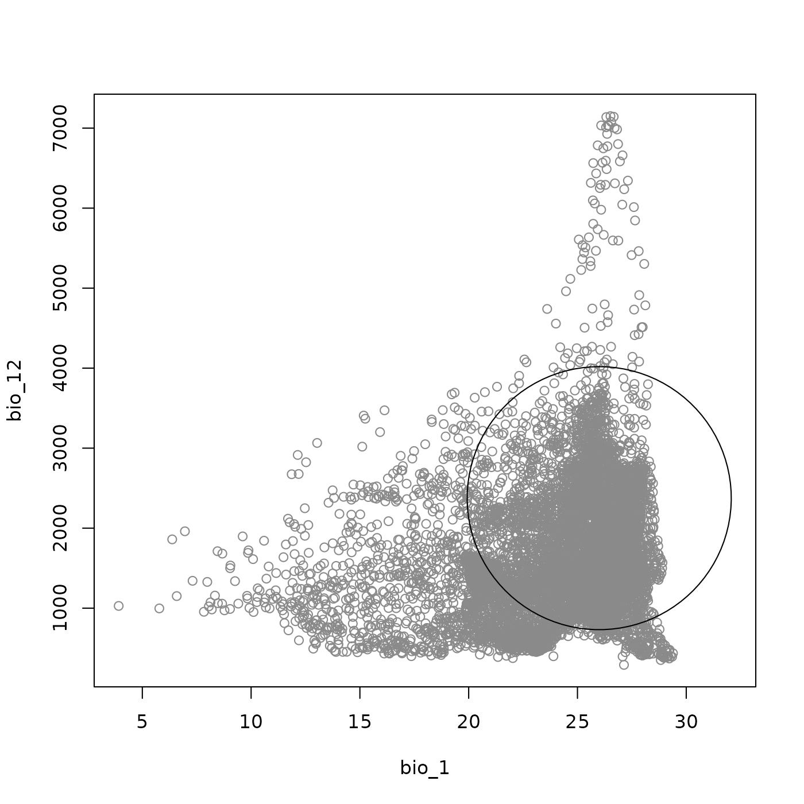

  

The appearance of both the background points and the ellipsoid boundary
can be adjusted using familiar base R graphical parameters: point style
and size for the background are controlled via pch, cex_bg, and col_bg,
while the ellipsoid line style and color are set with lty, lwd, and
col_ell. The axis limits of the plot can be fixed using the fixed_lims
argument, and the number of background points rendered can be reduced
with bg_sample to improve plotting speed when working with dense
environmental data.

The
[`add_data()`](https://castanedam.github.io/nicheR/reference/add_data.md)
function can be used to overlay additional information onto the plot,
such as the ellipsoid centroid, species occurrence records, or a second
set of background points. In the example below we add the centroid of
the ellipsoid as a reference point.

``` r
plot_ellipsoid(ell, background = bios_df, dim = c(1, 2), bg_sample = 5000,
               pch = ".", cex_bg = 1.5, col_bg = "gray50", lwd = 2,
               fixed_lims = list(xlim = c(5, 32), ylim = c(200, 7500)))

add_data(as.data.frame(t(ell$centroid)),
         x = "bio_1", y = "bio_12",
         pts_col = "red", cex = 1, pch = 18)
```

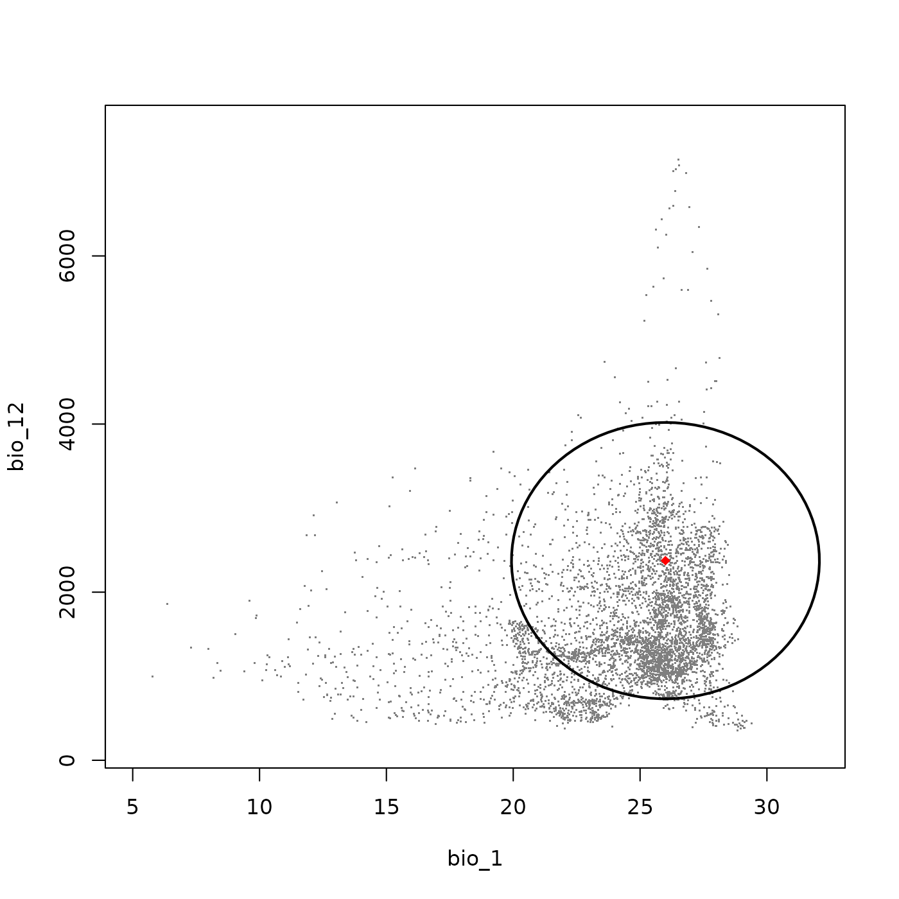

  

### Adjusting ellipsoid covariance

An important property of an ellipsoidal niche is covariance between
environmental variables. Covariance captures the idea that a species may
not independently tolerate the full range of each variable; instead, its
tolerance along one axis may depend on conditions along another. For
example, a species might tolerate high temperatures only when
precipitation is also high, creating a positive covariance between
temperature and precipitation.

When an ellipsoid is first created with
[`build_ellipsoid()`](https://castanedam.github.io/nicheR/reference/build_ellipsoid.md),
all covariances are set to zero, meaning the ellipsoid axes are aligned
with the coordinate axes. Each ellipsoid object contains a `cov_limits`
element that reports the minimum and maximum covariance values that are
valid for that ellipsoid given its shape and size.

``` r
# Inspect the allowable covariance range
ell$cov_limits
#>                    min      max
#> bio_1-bio_12 -1083.333 1083.333
```

  

The
[`update_ellipsoid_covariance()`](https://castanedam.github.io/nicheR/reference/update_ellipsoid_covariance.md)
function applies a new covariance value to an existing ellipsoid. All
properties of the object (covariance matrix, ellipsoid boundary, volume)
are recalculated to reflect the updated shape. Applying a covariance
value introduces a tilt in the ellipsoid, reflecting the correlation
between the two variables.

``` r
# Apply a positive covariance between bio_1 and bio_12
ell2 <- update_ellipsoid_covariance(ell, c("bio_1-bio_12" = 750))
#> Starting: updating covariance values...
#> Step: computing ellipsoid metrics...
#> Done: updated ellipsoidal niche metrics
ell2
#> nicheR Ellipsoid Object
#> -----------------------
#> Dimensions:        2D
#> Chi-square cutoff: 9.21
#> Centroid (mu):     26, 2375
#> 
#> Covariance matrix:
#>        bio_1   bio_12
#> bio_1      4    750.0
#> bio_12   750 293402.8
#> 
#> Ellipsoid semi-axis lengths:
#>   1643.885, 4.38
#> 
#> Ellipsoid axis endpoints:
#>  Axis 1:
#>           bio_1   bio_12
#> vertex_a 21.798  731.121
#> vertex_b 30.202 4018.879
#> 
#>  Axis 2:
#>          bio_1   bio_12
#> vertex_a 30.38 2374.989
#> vertex_b 21.62 2375.011
#> 
#> Ellipsoid volume:  22619.64
```

  

Attempting to set a covariance value outside the allowable range will
return an error rather than producing an invalid ellipsoid.

``` r
ell2 <- update_ellipsoid_covariance(ell, c("bio_1-bio_12" = 10000))
#> Starting: updating covariance values...
#> Error in `update_covariance()`:
#> ! The provided covariance values result in a non-positive definite matrix.
```

  

We can use
[`add_ellipsoid()`](https://castanedam.github.io/nicheR/reference/add_ellipsoid.md)
to overlay the updated ellipsoid on the same plot as the original,
allowing a direct visual comparison of the two shapes. The updated
ellipsoid (green) shows a clear tilt relative to the original (purple),
reflecting the introduced covariance.

``` r
plot_ellipsoid(ell, background = bios_df, dim = c(1, 2), bg_sample = 5000,
               pch = ".", cex_bg = 1.5, col_bg = "gray50", lwd = 3,
               col_ell = "purple", lty = 6,
               fixed_lims = list(xlim = c(14, 32), ylim = c(200, 5000)))

nicheR::add_data(as.data.frame(t(ell$centroid)),
                 x = "bio_1", y = "bio_12",
                 pts_col = "purple", cex = 1, pch = 18)

add_ellipsoid(ell2, lwd = 3, col_ell = "forestgreen", lty = 6)

nicheR::add_data(as.data.frame(t(ell2$centroid)),
                 x = "bio_1", y = "bio_12",
                 pts_col = "forestgreen", cex = 1, pch = 18)
```

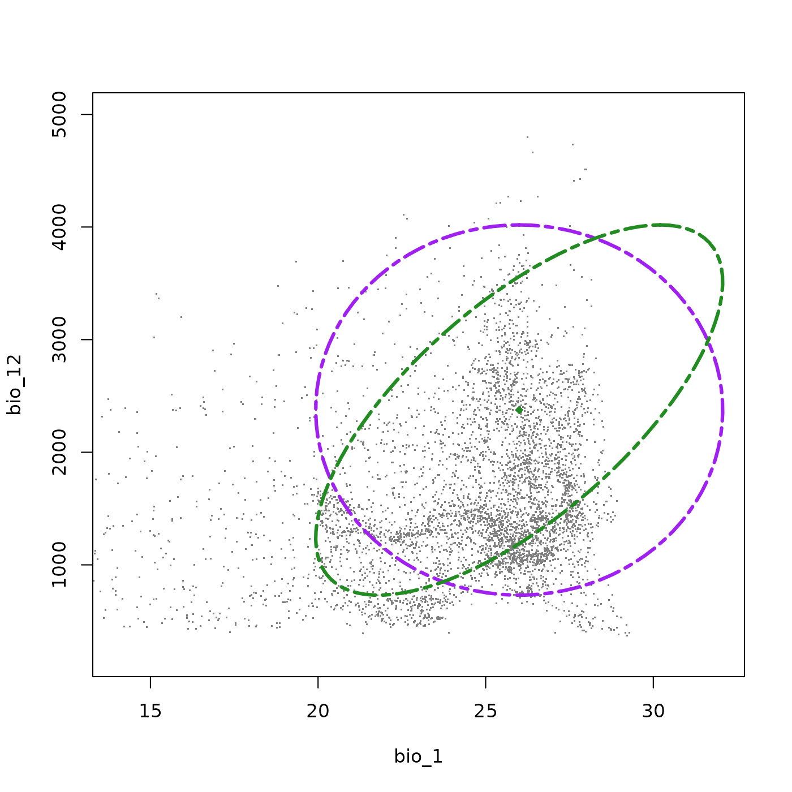

  

### Comparing multiple species niches

To illustrate how different niches can be represented and compared, we
will build two additional species and progressively add them to the same
environmental space. This demonstrates both the range of niche shapes
that can be parameterized and the use of
[`add_ellipsoid()`](https://castanedam.github.io/nicheR/reference/add_ellipsoid.md)
for visual comparison.

Let’s start with a second species characterized by cooler and wetter
environmental requirements.

``` r
range <- data.frame(bio_1  = c(12, 24),
                    bio_12 = c(1400, 4500))
ell3 <- build_ellipsoid(range = range)
#> Starting: building ellipsoidal niche from ranges...
#> Step: computing covariance matrix...
#> Step: computing additional ellipsoidal niche metrics...
#> Done: created ellipsoidal niche.
ell3$cov_limits
#>                    min      max
#> bio_1-bio_12 -1033.333 1033.333
ell3 <- update_ellipsoid_covariance(ell3, c("bio_1-bio_12" = 500))
#> Starting: updating covariance values...
#> Step: computing ellipsoid metrics...
#> Done: updated ellipsoidal niche metrics
```

  

Plotting both species together shows how they appear in the available
environmental space. Species 1 (green) occupies a broad warm-climate
niche with wide precipitation tolerance, avoiding only the warmest and
driest conditions due to the covaraince between those variables. Species
2 (brown) is shifted toward cooler, wetter environments with a similar
covariance structure, but its niche falls in a region of the background
that is less represented in our background data, meaning that dispite a
similar niche volume, this species is realistically more limited within
the actual environment of our study region.

``` r
plot_ellipsoid(ell2, background = bios_df, dim = c(1, 2), bg_sample = 5000,
               pch = ".", cex_bg = 1.5, col_bg = "gray50", lwd = 3,
               col_ell = "forestgreen", lty = 6,
               fixed_lims = list(xlim = c(6, 32), ylim = c(200, 5000)))

add_data(as.data.frame(t(ell2$centroid)),
         x = "bio_1", y = "bio_12",
         pts_col = "forestgreen", cex = 2, pch = 18)

add_ellipsoid(ell3, lwd = 3, col_ell = "brown", lty = 6)

add_data(as.data.frame(t(ell3$centroid)),
         x = "bio_1", y = "bio_12",
         pts_col = "brown", cex = 2, pch = 18)
```

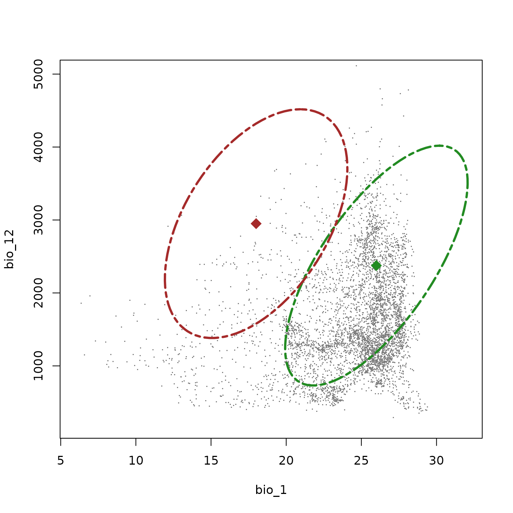

  

Now let’s define a third species with a very different ecological
character: a warm-adapted specialist restricted to dry environments.

``` r
range <- data.frame(bio_1  = c(18, 30),
                    bio_12 = c(200, 1100))
ell4 <- build_ellipsoid(range = range)
#> Starting: building ellipsoidal niche from ranges...
#> Step: computing covariance matrix...
#> Step: computing additional ellipsoidal niche metrics...
#> Done: created ellipsoidal niche.
ell4$cov_limits
#>               min max
#> bio_1-bio_12 -300 300
ell4 <- update_ellipsoid_covariance(ell4, c("bio_1-bio_12" = 120))
#> Starting: updating covariance values...
#> Step: computing ellipsoid metrics...
#> Done: updated ellipsoidal niche metrics
```

  

Adding this third species to the plot shows its uniquness compared to
the other two species. While the first two species follow a broadly
wet-warm axis, this species (orange) is specialized toward the warm, dry
corner of the environmental space. While its thermal tolerances are
still relativly wide, its explicitly specialized to dry environments.
Its niche volume is smaller and its covariance is much lower than in the
other two species (showing as a less extreem tilt), reflecting only a
slight tendency to tolerate marginally warmer conditions in comprably
wetter environments.

``` r
plot_ellipsoid(ell2, background = bios_df, dim = c(1, 2), bg_sample = 5000,
               pch = ".", cex_bg = 1.5, col_bg = "gray50", lwd = 3,
               col_ell = "forestgreen", lty = 6,
               fixed_lims = list(xlim = c(6, 32), ylim = c(200, 5000)))

add_data(as.data.frame(t(ell2$centroid)),
         x = "bio_1", y = "bio_12",
         pts_col = "forestgreen", cex = 2, pch = 18)

add_ellipsoid(ell3, lwd = 3, col_ell = "brown", lty = 6)

add_data(as.data.frame(t(ell3$centroid)),
         x = "bio_1", y = "bio_12",
         pts_col = "brown", cex = 2, pch = 18)

add_ellipsoid(ell4, lwd = 3, col_ell = "orange", lty = 6)

add_data(as.data.frame(t(ell4$centroid)),
         x = "bio_1", y = "bio_12",
         pts_col = "orange", cex = 2, pch = 18)
```

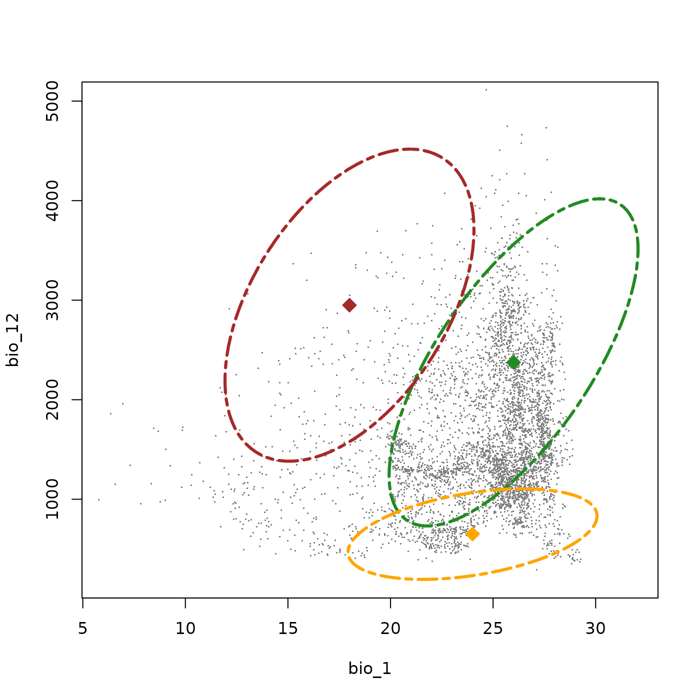

  

### Save and import

To facilitate saving `nicheR` objects between sessions, this package
provides the
[`save_nicheR()`](https://castanedam.github.io/nicheR/reference/save_nicheR.md)
and
[`read_nicheR()`](https://castanedam.github.io/nicheR/reference/read_nicheR.md)
functions. These work with any `nicheR_ellipsoid` object and allow
previously defined niches to be saved and reloaded without repeating the
parameterization workflow. Let’s save the three species we have defined
so far.

``` r
# Save ellipsoid objects to a local directory
temp_file1 <- file.path(tempdir(), "example_sp_1.rds")
save_nicheR(ell2, file = temp_file1)

temp_file2 <- file.path(tempdir(), "example_sp_2.rds")
save_nicheR(ell3, file = temp_file2)

temp_file3 <- file.path(tempdir(), "example_sp_3.rds")
save_nicheR(ell4, file = temp_file3)
```

  

We can reload any of these objects and work with them exactly as before.
Below we reimport the first species and visualize it to confirm the
niche has been recovered correctly.

``` r
# Import an ellipsoid object from a local directory
read_example_sp <- read_nicheR(temp_file1)

print(read_example_sp)
#> nicheR Ellipsoid Object
#> -----------------------
#> Dimensions:        2D
#> Chi-square cutoff: 9.21
#> Centroid (mu):     26, 2375
#> 
#> Covariance matrix:
#>        bio_1   bio_12
#> bio_1      4    750.0
#> bio_12   750 293402.8
#> 
#> Ellipsoid semi-axis lengths:
#>   1643.885, 4.38
#> 
#> Ellipsoid axis endpoints:
#>  Axis 1:
#>           bio_1   bio_12
#> vertex_a 21.798  731.121
#> vertex_b 30.202 4018.879
#> 
#>  Axis 2:
#>          bio_1   bio_12
#> vertex_a 30.38 2374.989
#> vertex_b 21.62 2375.011
#> 
#> Ellipsoid volume:  22619.64

plot_ellipsoid(read_example_sp, background = bios_df, dim = c(1, 2),
               bg_sample = 5000, pch = ".", cex_bg = 1.5, col_bg = "gray50",
               lwd = 3, col_ell = "forestgreen", lty = 6,
               fixed_lims = list(xlim = c(6, 32), ylim = c(200, 5000)))

add_data(as.data.frame(t(read_example_sp$centroid)),
         x = "bio_1", y = "bio_12",
         pts_col = "forestgreen", cex = 2, pch = 18)
```

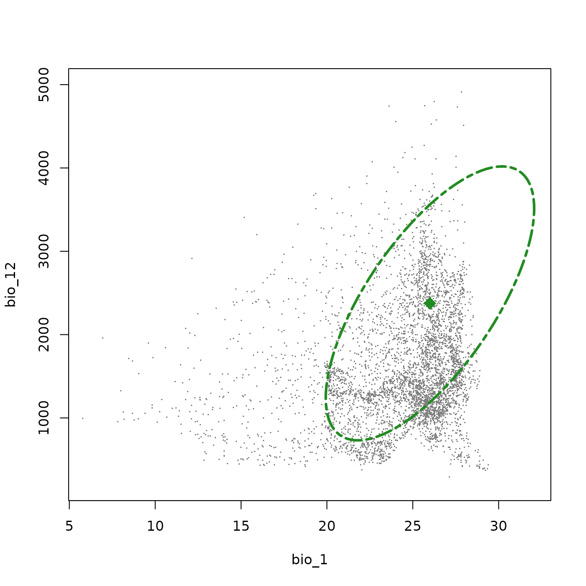

  

## Working in more than 2 dimensions

All examples so far have defined niches in two-dimensional environmental
space. However, `nicheR` supports ellipsoid niches in any number of
dimensions. The workflow is similar to the two-dimensional examples,
with the only addition being more variables included in the `range` data
frame. Here we add ‘bio_15’, precipitation seasonality, as an additional
dimension.

``` r
# Define ranges across three environmental variables
range <- data.frame(bio_1  = c(22, 32),
                    bio_12 = c(800, 4200),
                    bio_15 = c(45, 115))

ell5 <- build_ellipsoid(range = range)
#> Starting: building ellipsoidal niche from ranges...
#> Step: computing covariance matrix...
#> Step: computing additional ellipsoidal niche metrics...
#> Done: created ellipsoidal niche.
ell5
#> nicheR Ellipsoid Object
#> -----------------------
#> Dimensions:        3D
#> Chi-square cutoff: 11.345
#> Centroid (mu):     27, 2500, 80
#> 
#> Covariance matrix:
#>        bio_1   bio_12  bio_15
#> bio_1  2.778      0.0   0.000
#> bio_12 0.000 321111.1   0.000
#> bio_15 0.000      0.0 136.111
#> 
#> Ellipsoid semi-axis lengths:
#>   1908.655, 39.296, 5.614
#> 
#> Ellipsoid axis endpoints:
#>  Axis 1:
#>          bio_1   bio_12 bio_15
#> vertex_a    27  591.345     80
#> vertex_b    27 4408.655     80
#> 
#>  Axis 2:
#>          bio_1 bio_12  bio_15
#> vertex_a    27   2500  40.704
#> vertex_b    27   2500 119.296
#> 
#>  Axis 3:
#>           bio_1 bio_12 bio_15
#> vertex_a 21.386   2500     80
#> vertex_b 32.614   2500     80
#> 
#> Ellipsoid volume:  1763644
```

  

With three variables, the `cov_limits` element now reports allowable
covariance ranges for each of the three variable pairs. The number of
covariance parameters grows with the number of dimensions, so it is
important to review these limits before making adjustments.

``` r
ell5$cov_limits
#>                        min     max
#> bio_1-bio_12   -472.222222  935.00
#> bio_1-bio_15     -9.722222   19.25
#> bio_12-bio_15 -3305.555555 6545.00
```

  

Multiple covariances can be updated simultaneously using
[`update_ellipsoid_covariance()`](https://castanedam.github.io/nicheR/reference/update_ellipsoid_covariance.md).
Here we introduce a positive covariance between bio_1 and bio_12, no
covariance between bio_1 and bio_15, and a negative covariance between
bio_12 and bio_15, reflecting that this species is more tolerant of
comprably dryer environments when those environments have extreme
seasonal pulses of precipitation.

``` r
ell5 <- update_ellipsoid_covariance(ell5, c("bio_1-bio_12"  =    200,
                                             "bio_1-bio_15"  =      0,
                                             "bio_12-bio_15" = -5000))
#> Starting: updating covariance values...
#> Step: computing ellipsoid metrics...
#> Done: updated ellipsoidal niche metrics
```

  

Two-dimensional projections of the multidimensional ellipsoid can be
plotted individually using
[`plot_ellipsoid()`](https://castanedam.github.io/nicheR/reference/plot_ellipsoid.md)
by specifying the `dim` argument.

``` r
plot_ellipsoid(ell5, background = bios_df, dim = c(1, 2), bg_sample = 5000,
               pch = ".", cex_bg = 1.5, col_bg = "gray50", lwd = 3,
               col_ell = "blue", lty = 6,
               fixed_lims = list(xlim = c(6, 32), ylim = c(200, 5000)))
```

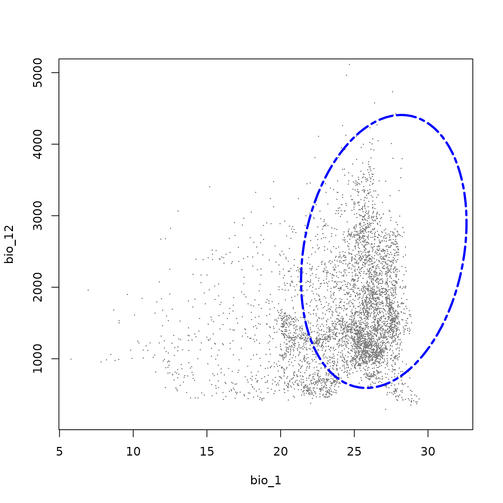

``` r

plot_ellipsoid(ell5, background = bios_df, dim = c(2, 3), bg_sample = 5000,
               pch = ".", cex_bg = 1.5, col_bg = "gray50", lwd = 3,
               col_ell = "blue", lty = 6,
               fixed_lims = list(xlim = c(200, 5000), ylim = c(20, 120)))
```

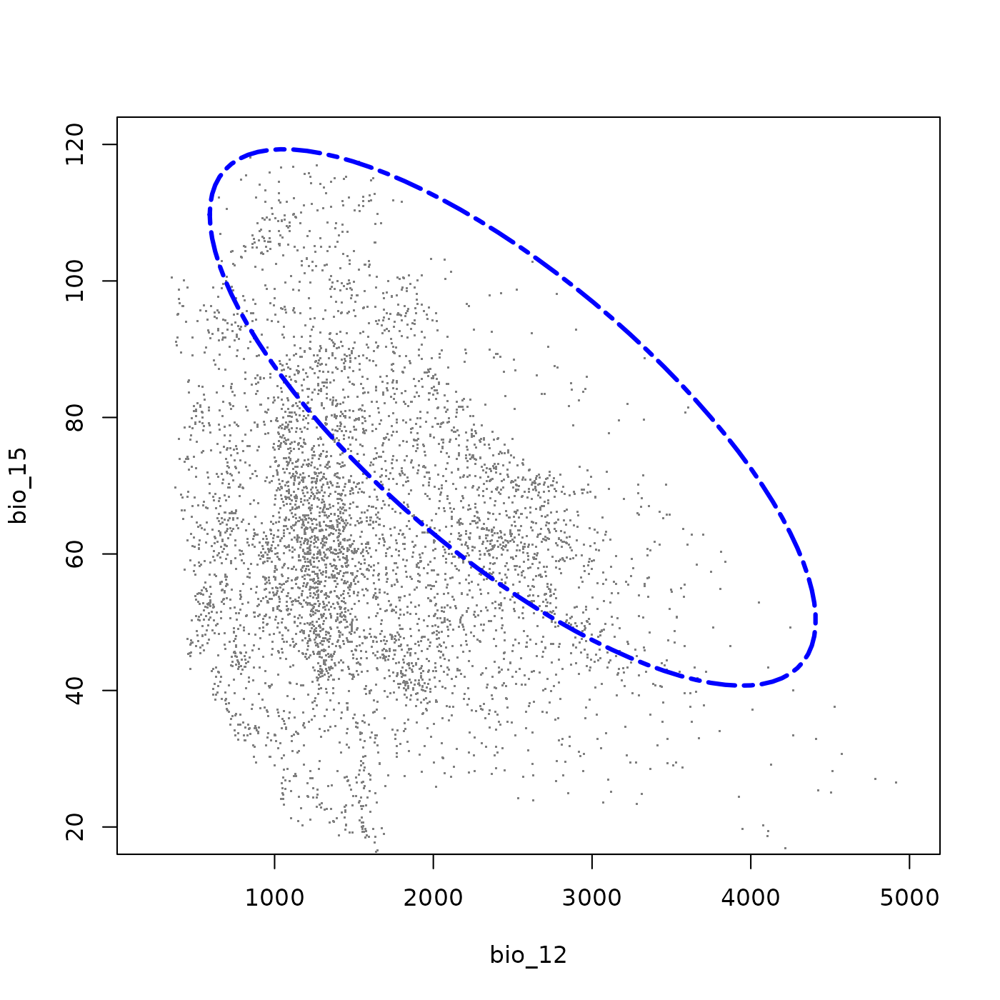

``` r

plot_ellipsoid(ell5, background = bios_df, dim = c(1, 3), bg_sample = 5000,
               pch = ".", cex_bg = 1.5, col_bg = "gray50", lwd = 3,
               col_ell = "blue", lty = 6,
               fixed_lims = list(xlim = c(6, 32), ylim = c(20, 120)))
```

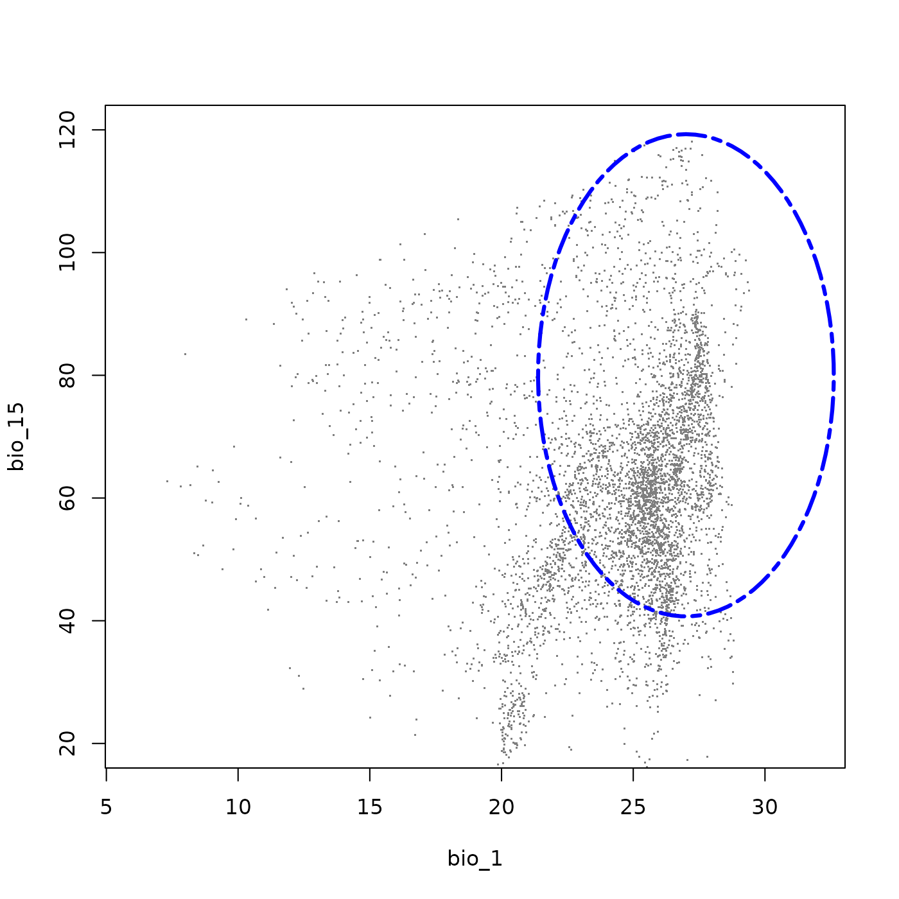

  

Alternatively,
[`plot_ellipsoid_pairs()`](https://castanedam.github.io/nicheR/reference/plot_ellipsoid_pairs.md)
produces all pairwise projections at once. This function offers fewer
customization options than
[`plot_ellipsoid()`](https://castanedam.github.io/nicheR/reference/plot_ellipsoid.md)
([`add_data()`](https://castanedam.github.io/nicheR/reference/add_data.md)
and
[`add_ellipsoid()`](https://castanedam.github.io/nicheR/reference/add_ellipsoid.md)
don’t work with this tool) and is intended primarily for quick
exploratory visualization.

``` r
plot_ellipsoid_pairs(ell5, background = bios_df, pch = ".", cex_bg = 1.5,
                     col_bg = "gray50", lwd = 3, lty = 6, col_ell = "blue")
```

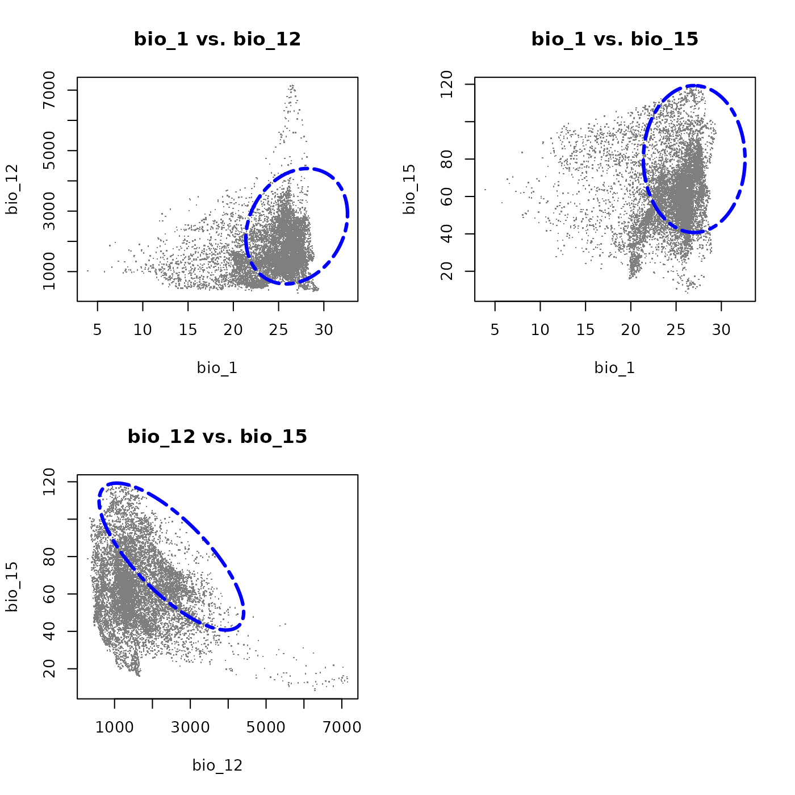

  

This three-dimensional species shares the wide thermal and precipitation
tolerances of the first example, including an avoidance of the warmest
and driest environments. The addition of bio_15 characterizes the
species in terms of precipitation seasonality: the strong negative
covariance between bio_12 and bio_15 means the species tolerates less
seasonal precipitation regimes only where total precipitation is high,
but depends on strongly seasonal rainfall where precipitation is
comprably lower. This makes it a good example of a species adapted to
seasonally pulsed precipitation environments.

  

### Save and import

We can save this three-dimensional species for use in later sessions
alongside the two-dimensional examples defined above.

``` r
temp_file4 <- file.path(tempdir(), "example_sp_4.rds")
save_nicheR(ell5, file = temp_file4)
```

  

This concludes the basics for defining ellipsoid-based tolerances for
species in E-space. To learn how to make predictions from these
ellipsoid niches and visualize them in geographic space (G-space), see
the next vignette: [Making
Predictions](https://castanedam.github.io/nicheR/articles/link).
