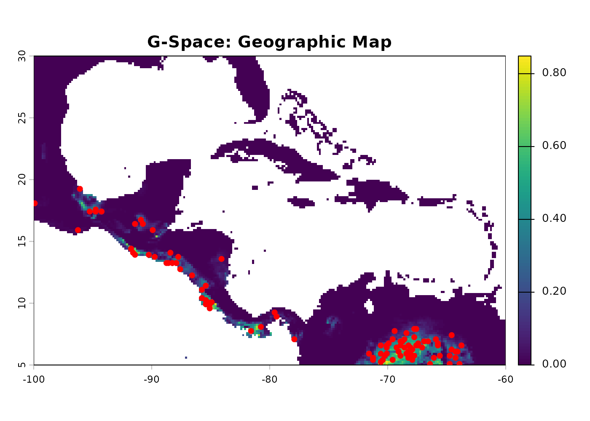
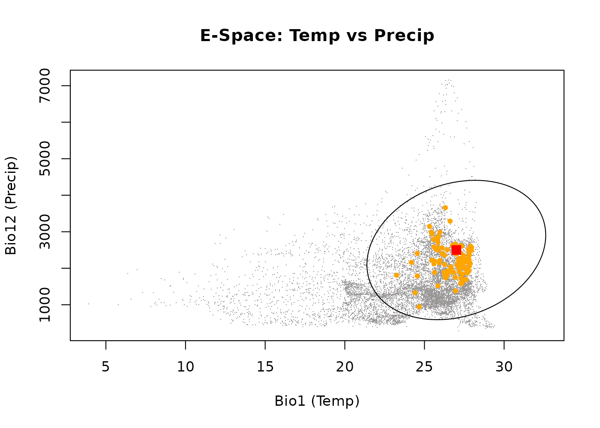
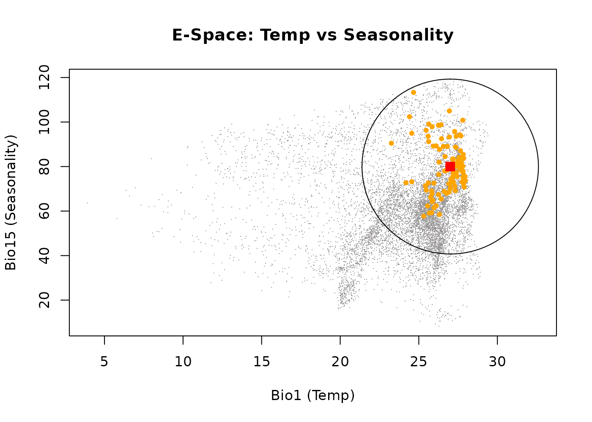
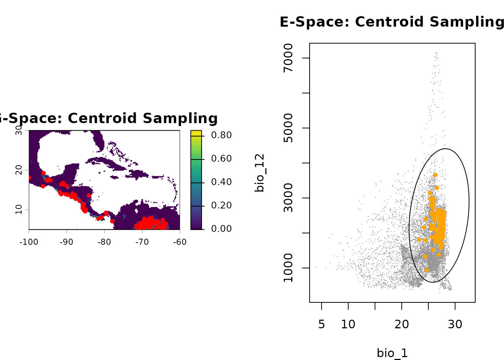
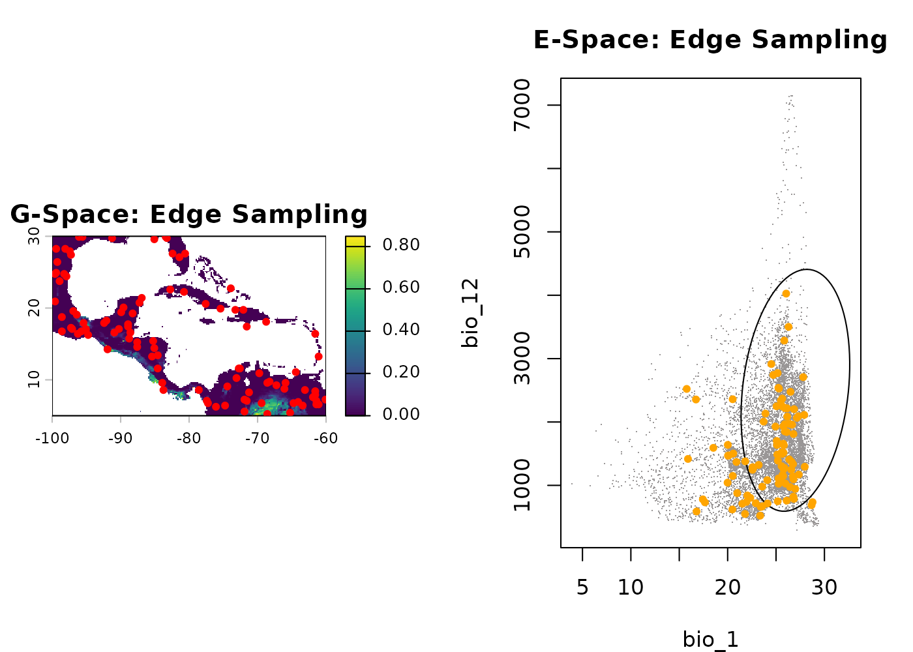
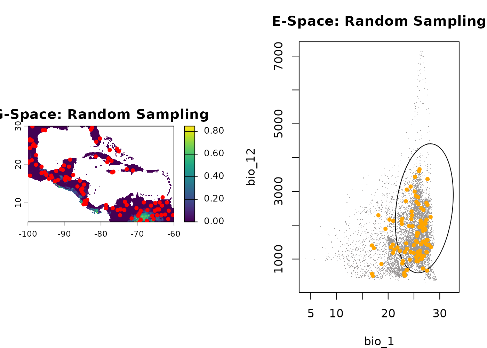
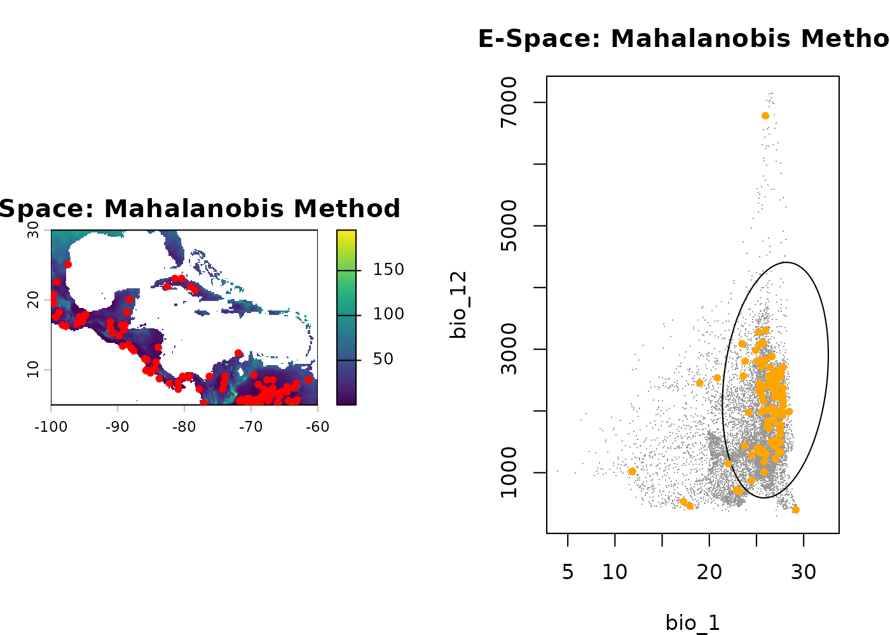

# Generate occurrence data

## Summary

- [Description](#description)
- [Getting ready](#getting-ready)
- [Basic generation](#basic-generation)
  - [Visualizing basic generation](#visualizing-basic-generation)
    - [1. Geographic Space](#sec-1.-geographic-space-)
    - [2. Environmental Space Bio1
      vs. Bio12](#sec-2.-environmental-space-bio1-vs.-bio12)
    - [3. Environmental Space Bio1
      vs. Bio15](#sec-3.-environmental-space-bio1-vs.-bio15)
- [Effect of the sampling argument](#effect-of-the-sampling-argument)
  - [Visualizing spatial bias](#visualizing-spatial-bias)
    - [1. Centroid Sampling](#sec-1.-centroid-sampling)
    - [2. Edge Sampling](#sec-2.-edge-sampling)
    - [3. Random Sampling](#sec-3.-random-sampling)
- [Effect of the method argument](#effect-of-the-method-argument)
  - [Visualizing probability weights](#visualizing-probability-weights)
    - [1. Suitability Method](#sec-1.-suitability-method)
    - [2. Mahalanobis Method](#sec-2.-mahalanobis-method)
- [Effect of the strict argument](#effect-of-the-strict-argument)
  - [Visualizing boundary limits](#visualizing-boundary-limits)
    - [1. Strict = FALSE](#sec-1.strict--false)
    - [1. Strict = TRUE](#sec-1.strict--true)
- [Save and export](#save-and-export)

------------------------------------------------------------------------

## Description

The `nicheR` package allows you to simulate how a species might be
distributed across a landscape by generating synthetic occurrence data
from a continuous prediction surface. Rather than viewing this as
“sampling” empirical field data, the
[`sample_data()`](https://castanedam.github.io/nicheR/reference/sample_data.md)
function acts as a virtual ecologist, generating presence points across
the available environmental background based on the species’ theoretical
preferences.

This vignette focuses exclusively on the
[`sample_data()`](https://castanedam.github.io/nicheR/reference/sample_data.md)
function. We will explore how adjusting its core arguments—`sampling`,
`method`, and `strict`—alters the spatial and environmental distribution
of the generated occurrences.

  

## Getting ready

First, we load `nicheR` and `terra`. For this vignette, we assume you
have already defined a fundamental niche ellipsoid and projected it onto
geographic space to create a prediction surface.

If you are unfamiliar with these prerequisite steps, please review the
“**Creating Ellipsoid Based Niches”** and”**Predict”** vignettes first.

``` r
# Load packages
library(nicheR)
library(terra)

# 1. Load environmental background
bios <- terra::rast(system.file("extdata", "ma_bios.tif", package = "nicheR"))
vars <- c("bio_1", "bio_12", "bio_15")

# 2. Load reference niche (nicheR_ellipsoid object)
data("example_sp_4", package = "nicheR")

# 3. Load pre-calculated prediction surface (from previous vignette)
# This SpatRaster contains "suitability", "Mahalanobis", "suitability_trunc", etc.
pred <- terra::rast(system.file("extdata", "predictions_3d_rast.tif", package = "nicheR"))
```

  

## Basic generation

The
[`sample_data()`](https://castanedam.github.io/nicheR/reference/sample_data.md)
function generates a spatial data frame of coordinates. By default, it
requires the number of occurrences you want to generate (`n_occ`), the
prediction spatial raster (`prediction`), and the specific layer to use
as the probability weight (`prediction_layer`).

Let’s generate a basic set of 100 occurrences using the default
suitability layer.

``` r
# Generate basic occurrence data
occ_basic <- sample_data(
  n_occ = 100,
  prediction = pred,
  prediction_layer = "suitability",
  seed = 123
)
#> Starting: sample_data()
#> Done: sampled 100 points.

head(occ_basic)
#>               x         y    bio_1 bio_12   bio_15 Mahalanobis suitability
#> 23354 -87.75000 13.750000 26.44637   1926 92.50568   1.3047519  0.52080691
#> 33085 -65.91667  7.083333 26.78357   1894 78.32585   3.4916432  0.17450155
#> 35473 -67.91667  5.416667 27.89421   2604 70.77233   1.6418095  0.44003338
#> 19492 -91.41667 16.416667 24.18323   2160 72.71249   4.5789394  0.10132017
#> 22870 -88.41667 14.083333 23.25510   1809 90.48694   5.8673258  0.05320181
#> 34512 -68.08333  6.083333 27.80744   2373 77.89075   0.8279358  0.66102219
#>       suitability_trunc
#> 23354        0.52080691
#> 33085        0.17450155
#> 35473        0.44003338
#> 19492        0.10132017
#> 22870        0.05320181
#> 34512        0.66102219
```

  

### Visualizing basic generation

We can visualizendefined these generated points in both **Geographic
Space (G-Space)** (the physical landscape) and **Environmental Space
(E-Space)** (the multi-dimensional climate space). Every physical
location on the map corresponds to a specific set of climate coordinates
inside the fundamental niche ellipsoid.

  

#### **1. Geographic Space**

First, let’s look at the physical map. The background colors represent
habitat suitability (green is high, brown/white is low). The black dots
are the physical coordinates (Longitude/Latitude) where our 100 virtual
individuals were generated. Because we generated points based on
suitability, notice how the dots cluster in the greenest areas.

``` r
terra::plot(pred[["suitability"]], main = "G-Space: Geographic Map")
points(occ_basic[, c("x", "y")], pch = 20, col = "red", cex = 1.2)
```



  

#### **2. Environmental Space Bio1 vs. Bio12**

Now, let’s shift our view from geography to climate. Here, we plot the
exact same 100 individuals, but instead of mapping their physical
location, we map the climate they are experiencing. The gray dust
represents the available background climate in our study area. The large
ellipse is the fundamental niche boundary. The **red square** is the
niche centroid for the species. The **orange dots** are our generated
occurrences.

``` r
plot_ellipsoid(example_sp_4, background = as.data.frame(bios[[vars]]), dim = c(1, 2), pch = ".", col_bg = "#9a9797", 
               xlab = "Bio1 (Temp)", ylab = "Bio12 (Precip)", main = "E-Space: Temp vs Precip")
add_data(occ_basic, x = "bio_1", y = "bio_12", pts_col = "orange", pch = 20)
add_data(as.data.frame(t(example_sp_4$centroid)), x = "bio_1", y = "bio_12", pts_col = "red", pch = 15, cex = 1.5)
```



  

#### **3. Environmental Space Bio1 vs. Bio15**

Because niches are multi-dimensional, we must look at other axes. Here,
we keep Temperature (Bio1) on the X-axis but change the Y-axis to
Precipitation Seasonality (Bio15) to see how the species tolerates
fluctuations in rainfall.

``` r
plot_ellipsoid(example_sp_4, background = as.data.frame(bios[[vars]]), dim = c(1, 3), pch = ".", col_bg = "#9a9797", 
               xlab = "Bio1 (Temp)", ylab = "Bio15 (Seasonality)", main = "E-Space: Temp vs Seasonality")
add_data(occ_basic, x = "bio_1", y = "bio_15", pts_col = "orange", pch = 20)
add_data(as.data.frame(t(example_sp_4$centroid)), x = "bio_1", y = "bio_15", pts_col = "red", pch = 15, cex = 1.5)
```



By default, the function generates points proportional to habitat
suitability (the niche centroid). Therefore, you can see the orange dots
clumping somewhat near the red centroid in E-Space, which translates to
black dots clumping in the greenest areas of the G-Space map.

  

## Effect of the `sampling` argument

The `sampling` argument determines the spatial bias of the selection
probability. It answers the question: *Where within the niche is the
species most likely to be found?*

- **`centroid`**: The species strongly prefers its optimal conditions.
  Generates points clustered near the center of the niche.

- **`edge`**: The species is frequently pushed into marginal
  environments (e.g., due to competition). Generates points scattered
  toward the niche boundaries.

- **`random`**: The species is distributed uniformly across all suitable
  habitats, regardless of optimality.

``` r
occ_cent <- sample_data(100, pred, "suitability", sampling = "centroid", seed = 123)
#> Starting: sample_data()
#> Done: sampled 100 points.
occ_edge <- sample_data(100, pred, "suitability", sampling = "edge", seed = 123)
#> Starting: sample_data()
#> 
#> Done: sampled 100 points.
occ_rand <- sample_data(100, pred, "suitability", sampling = "random", seed = 123)
#> Starting: sample_data()
#> 
#> Done: sampled 100 points.
```

  

### Visualizing spatial bias

Let’s compare these three strategies side-by-side in both G-Space and
E-Space.

  

#### **1. Centroid Sampling**

Notice how the orange dots huddle tightly around the red square in
E-Space. Geographically, this translates to highly concentrated, clumped
points on the map in only the most pristine habitats.

``` r
par(mfrow = c(1, 2), mar = c(4, 4, 3, 2)) 
terra::plot(pred[["suitability"]], main = "G-Space: Centroid Sampling"); points(occ_cent[, 1:2], pch = 20, col = "red")
plot_ellipsoid(example_sp_4, background = as.data.frame(bios[[vars]]), dim = c(1, 2), pch = ".", col_bg = "#9a9797", main = "E-Space: Centroid Sampling")
add_data(occ_cent, x = "bio_1", y = "bio_12", pts_col = "orange", pch = 20)
```



  

#### **2. Edge Sampling**

Here, the orange dots are repelled from the center and hug the outer
boundary of the ellipse. Geographically, this forces the species into
fragmented, peripheral habitats on the fringes of its range.

``` r
par(mfrow = c(1, 2), mar = c(4, 4, 3, 2)) 
terra::plot(pred[["suitability"]], main = "G-Space: Edge Sampling"); points(occ_edge[, 1:2], pch = 20, col = "red")
plot_ellipsoid(example_sp_4, background = as.data.frame(bios[[vars]]), dim = c(1, 2), pch = ".", col_bg = "#9a9797", main = "E-Space: Edge Sampling")
add_data(occ_edge, x = "bio_1", y = "bio_12", pts_col = "orange", pch = 20)
```



  

#### **3. Random Sampling**

The points are scattered broadly across all suitable environments
without bias toward the core or the edge.

``` r
par(mfrow = c(1, 2), mar = c(4, 4, 3, 2)) 
terra::plot(pred[["suitability"]], main = "G-Space: Random Sampling"); points(occ_rand[, 1:2], pch = 20, col = "red")
plot_ellipsoid(example_sp_4, background = as.data.frame(bios[[vars]]), dim = c(1, 2), pch = ".", col_bg = "#9a9797", main = "E-Space: Random Sampling")
add_data(occ_rand, x = "bio_1", y = "bio_12", pts_col = "orange", pch = 20)
```



  

## Effect of the `method` argument

The `method` argument controls the underlying mathematical weight used
to draw the samples.

- **`suitability`**: Weights the probability of occurrence linearly
  based on the 0-1 habitat suitability index.

- **`mahalanobis`**: Weights the probability based on the multivariate
  environmental distance from the centroid. This often creates a more
  dramatic, non-linear drop-off in generation probability compared to
  suitability.

``` r
occ_meth_suit <- sample_data(100, pred, "suitability", method = "suitability", seed = 123)
#> Starting: sample_data()
#> Done: sampled 100 points.
occ_meth_maha <- sample_data(100, pred, "Mahalanobis", method = "mahalanobis", seed = 123)
#> Starting: sample_data()
#> 
#> Done: sampled 100 points.
```

  

### Visualizing probability weights

  

#### **1. Suitability Method**

Points are drawn linearly based on habitat quality.

``` r
par(mfrow = c(1, 2), mar = c(4, 4, 3, 2)) 
terra::plot(pred[["suitability"]], main = "G-Space: Suitability Method"); points(occ_meth_suit[, 1:2], pch = 20, col = "red")
plot_ellipsoid(example_sp_4, background = as.data.frame(bios[[vars]]), dim = c(1, 2), pch = ".", col_bg = "#9a9797", main = "E-Space: Suitability Method")
add_data(occ_meth_suit, x = "bio_1", y = "bio_12", pts_col = "orange", pch = 20)
```


  

#### **2. Mahalanobis Method**

Because Mahalanobis distance penalizes deviations from the centroid
heavily, generating points based on this method creates an even stricter
concentration of points in optimal environments. This is highly useful
for simulating sensitive, specialist species.

``` r
par(mfrow = c(1, 2), mar = c(4, 4, 3, 2)) 
terra::plot(pred[["Mahalanobis"]], main = "G-Space: Mahalanobis Method"); points(occ_meth_maha[, 1:2], pch = 20, col = "red")
plot_ellipsoid(example_sp_4, background = as.data.frame(bios[[vars]]), dim = c(1, 2), pch = ".", col_bg = "#9a9797", main = "E-Space: Mahalanobis Method")
add_data(occ_meth_maha, x = "bio_1", y = "bio_12", pts_col = "orange", pch = 20)
```



  

## Effect of the `strict` argument

By default, generating occurrences allows points to fall slightly
outside the strict boundaries of the fundamental niche ellipsoid
(`strict = FALSE`). This is ecologically realistic, as it simulates sink
populations, source-sink dynamics, or the influence of unmeasured
micro-climates.

Setting `strict = TRUE` (and using a truncated prediction layer)
establishes a hard boundary, forbidding any generated points from
falling in unsuitable environments.

``` r
# strict = FALSE (Allows points outside the ellipse)
occ_lax <- sample_data(100, pred, "suitability", strict = FALSE, seed = 123)
#> Starting: sample_data()
#> Done: sampled 100 points.

# strict = TRUE (Restricts points strictly to the ellipse using truncated layers)
occ_strict <- sample_data(100, pred, "suitability_trunc", strict = TRUE, seed = 123)
#> Starting: sample_data()
#> 
#> Done: sampled 100 points.
```

  

### Visualizing boundary limits

#### **1. Strict = FALSE**

In the E-Space plot below, notice how a few rogue orange dots fall just
outside the purple boundary line of the ellipsoid. These represent our
simulated sink populations.

``` r
par(mfrow = c(1, 2), mar = c(4, 4, 3, 2)) 
terra::plot(pred[["suitability"]], main = "G-Space: Strict = FALSE"); points(occ_lax[, 1:2], pch = 20, col = "red")
plot_ellipsoid(example_sp_4, background = as.data.frame(bios[[vars]]), dim = c(1, 2), pch = ".", col_bg = "#9a9797", main = "E-Space: Strict = FALSE")
add_data(occ_lax, x = "bio_1", y = "bio_12", pts_col = "orange", pch = 20)
```


#### **2. Strict = TRUE**

Here, the generation algorithm respects the hard mathematical
threshold—every single orange dot is contained strictly within the
boundary line.

``` r
par(mfrow = c(1, 2), mar = c(4, 4, 3, 2)) 
terra::plot(pred[["suitability_trunc"]], main = "G-Space: Strict = TRUE"); points(occ_strict[, 1:2], pch = 20, col = "red")
plot_ellipsoid(example_sp_4, background = as.data.frame(bios[[vars]]), dim = c(1, 2), pch = ".", col_bg = "#9a9797", main = "E-Space: Strict = TRUE")
add_data(occ_strict, x = "bio_1", y = "bio_12", pts_col = "orange", pch = 20)
```


``` r
dev.off()
#> null device 
#>           1
```

  

## Save and export

Once you are satisfied with your generated occurrence points, you can
easily save the resulting data frame for use in other software or later
R sessions. We will save the `occ_basic` dataset we generated at the
very beginning of this vignette.

``` r
# Save the basic generated occurrence data frame to your local directory
# saveRDS(occ_basic, file = "data/generate_occurrences.rds")

# To load this data back into a future session:
# my_occurrences <- readRDS("data/virtual_occurrences.rds")
```
