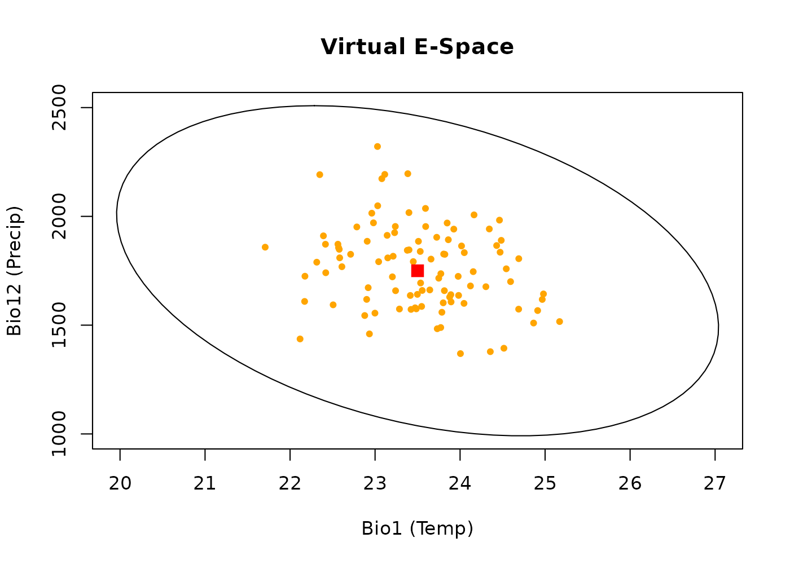
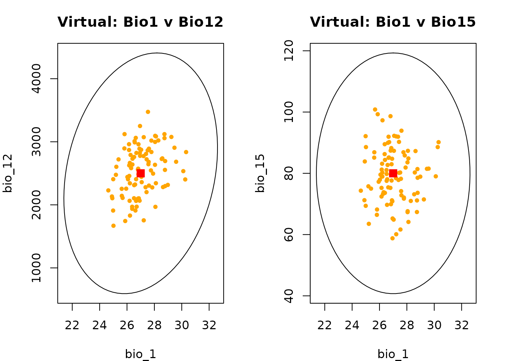
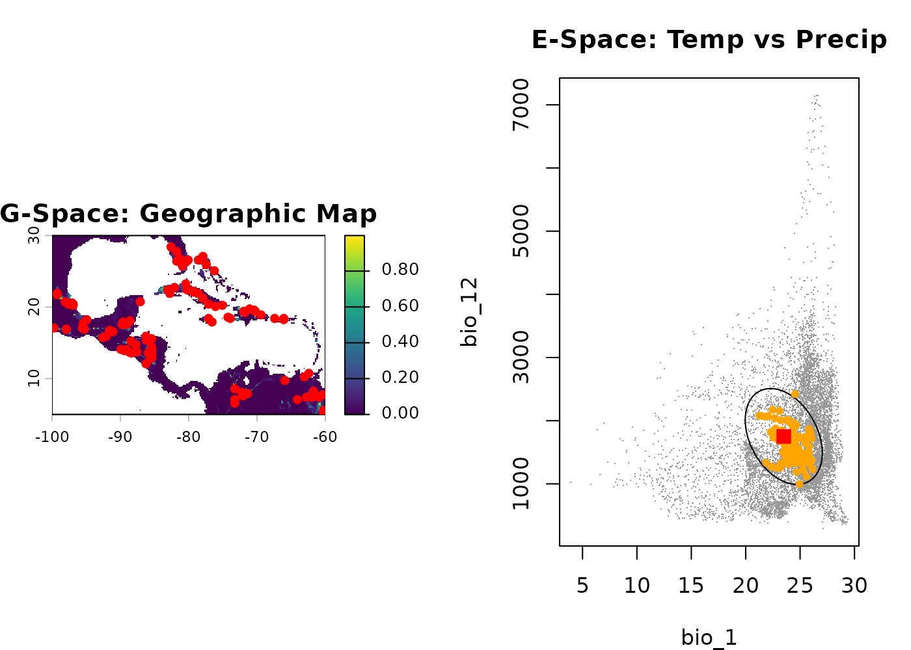
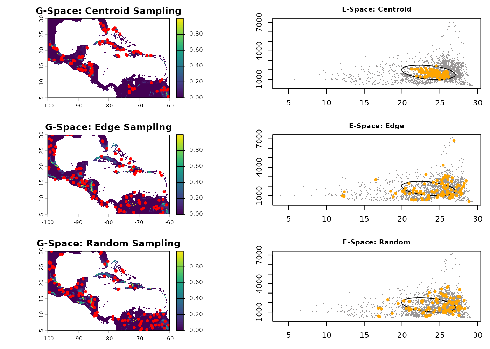
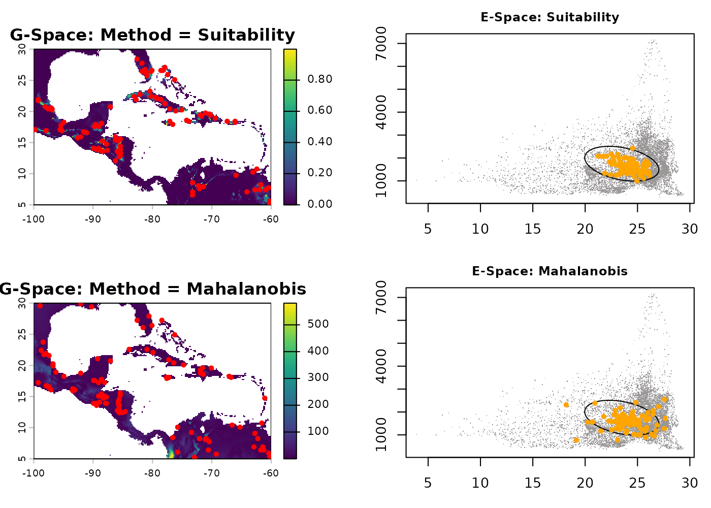
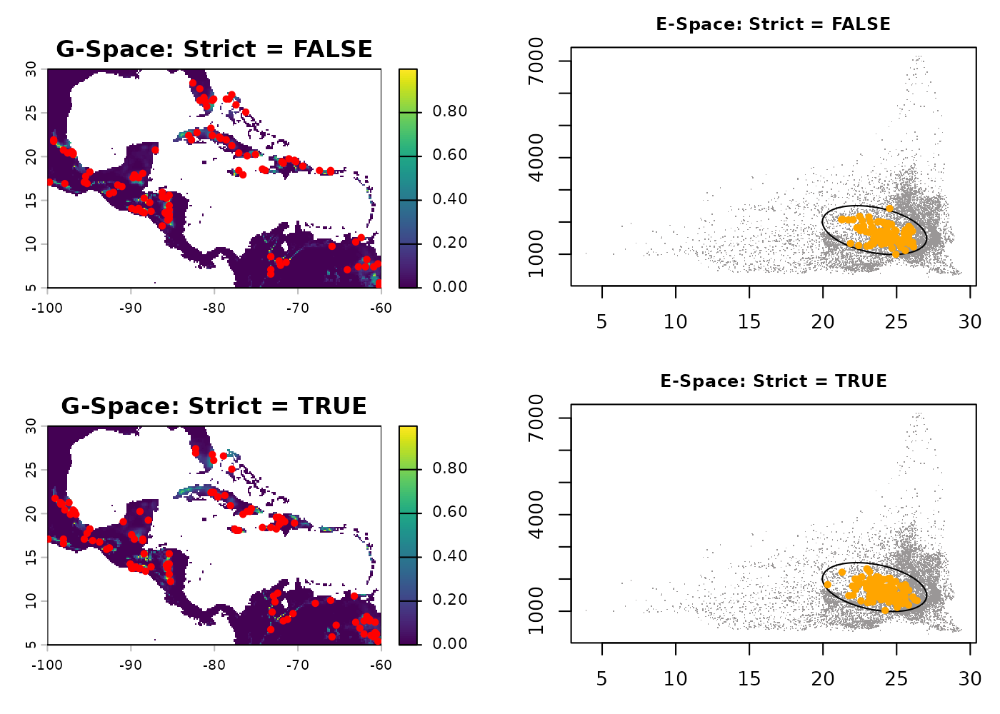
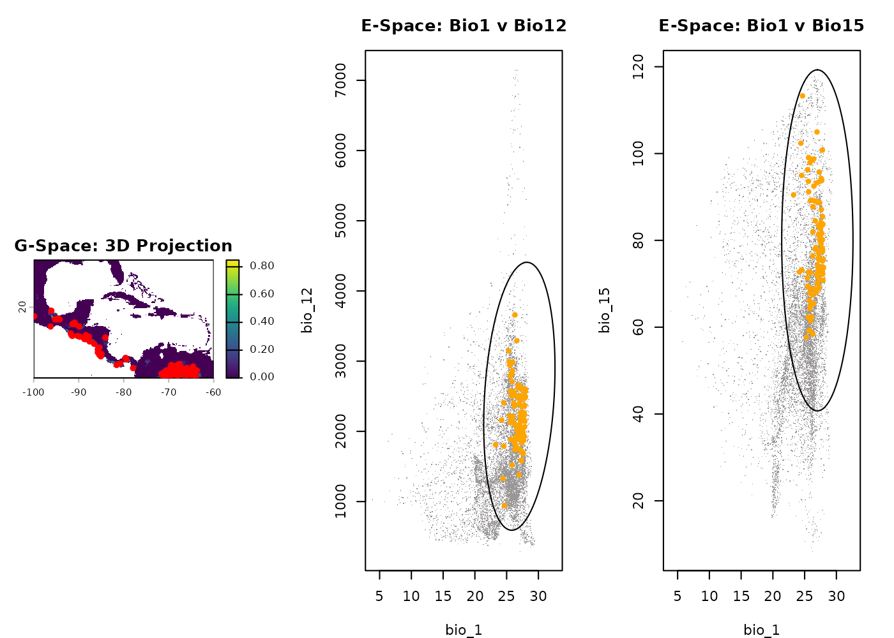
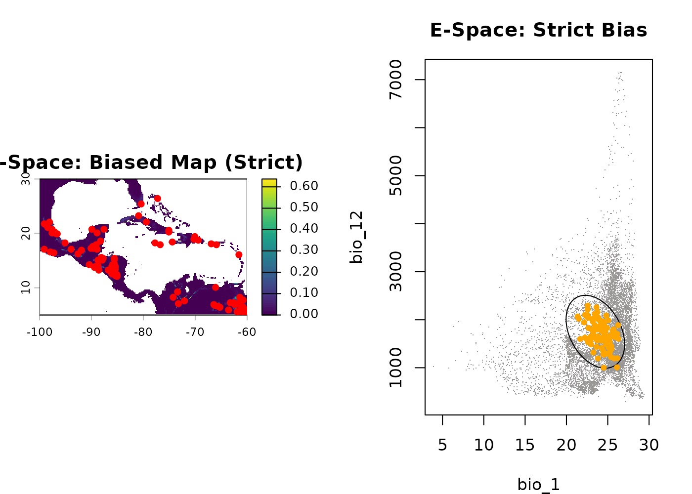
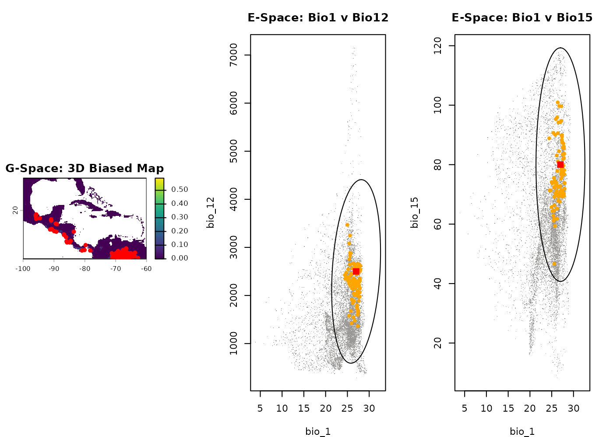

# Generate occurrence data

------------------------------------------------------------------------

## Summary

- [Description](#description)
- [Getting ready](#getting-ready)
- [Part 1: Virtual Data](#sec-part-1-virtual-data)
  - [Basic generation](#sec-basic-generation)
  - [Visualizing virtual data](#sec-visualizing-virtual-data-in-2d)
  - [Three-dimensional virtual
    example](#sec-three-dimensional-virtual-example)
- [Part 2: Spatially-Explicit Occurrence
  Data](#sec-part-2-spatially-explicit-occurrence-data)
  - [Basic generation in 2D](#sec-basic-generation-in-2d)
  - [Effect of the `sampling`
    argument](#sec-effect-of-the-sampling-argument)
  - [Effect of the `method`
    argument](#sec-effect-of-the-method-argument)
  - [Effect of the `strict`
    argument](#sec-effect-of-the-strict-argument)
  - [Three-Dimensional Example](#sec-three-dimensional-example)
- [Part 3: Biased Occurrence Data](#sec-part-3-biased-occurrence-data)
  - [Basic biased generation in 2D](#sec-basic-biased-generation-in-2d)
  - [Effect of the biased `strict`
    argument](#sec-effect-of-the-biased-strict-argument)
  - [Three-Dimensional Biased
    Example](#sec-three-dimensional-biased-example)
- [Save and export](#sec-save-and-export)

------------------------------------------------------------------------

## Description

The `nicheR` package allows you to simulate how a species might be
distributed by generating synthetic occurrence data from continuous
prediction surfaces. This vignette progresses through three levels of
complexity:

1.  **Virtual Data:** Simulating species entirely within Environmental
    Space (E-Space), bypassing geographic rasters to test theoretical
    concepts.

2.  **Geographic Occurrence Data:** Acting as a “virtual ecologist” to
    generate presence points across a physical landscape (G-Space) based
    on theoretical preferences.

3.  **Biased Occurrence Data:** Introducing real-world collection bias
    (e.g., ninghttime light, proximity to roads, species richness, land
    use land cover) to see how human sampling effort distorts our view
    of a species’ niche.

  

## Getting ready

First, we load `nicheR` and `terra`, alongside our pre-built fundamental
niches and prediction layers. We will not be building models from
scratch here; instead, we rely on data created in previous vignettes.

``` r
# Load packages
library(nicheR)
library(terra)
#> terra 1.9.11

# 1. Load environmental background raster
bios <- terra::rast(system.file("extdata", "ma_bios.tif", package = "nicheR"))

# 2. Load pre-calculated reference niches
data("ref_ellipse", package = "nicheR")  # 2D Niche (Bio1, Bio12)
data("example_sp_4", package = "nicheR") # 3D Niche (Bio1, Bio12, Bio15)

# 3. Load pre-calculated virtual backgrounds (E-Space only)
pred_virt_2d <- read.csv(system.file("extdata", "predictions_virt.csv", package = "nicheR"))
pred_virt_3d <- read.csv(system.file("extdata", "predictions_virt_3d.csv", package = "nicheR"))

# 4. Load pre-calculated geographic prediction surfaces
pred_2d <- terra::rast(system.file("extdata", "predictions_rast.tif", package = "nicheR"))
pred_3d <- terra::rast(system.file("extdata", "predictions_3d_rast.tif", package = "nicheR"))

# 5. Load pre-calculated biased prediction surfaces 
# (Habitat Suitability * Accessibility Bias)
bias_2d <- terra::rast(system.file("extdata", "applied_bias_rast.tif", package = "nicheR"))
bias_3d <- terra::rast(system.file("extdata", "applied_bias_3d_rast.tif", package = "nicheR"))
```

  

## Part 1: Virtual Data

Virtual species are highly useful for controlled, purely theoretical
experiments in quantitative ecology. Because the
[`virtual_data()`](https://castanedam.github.io/nicheR/reference/virtual_data.md)
function generates points purely based on mathematical distributions,
**these points do not possess spatial coordinates
(Longitude/Latitude).** They exist exclusively in E-Space.

We will use the pre-calculated virtual backgrounds (`pred_virt_2d` and
`pred_virt_3d`) loaded during our setup phase. These data frames contain
1,000 theoretical background points that have already been scored for
suitability.

  

### Basic generation

The
[`sample_virtual_data()`](https://castanedam.github.io/nicheR/reference/sample_virtual_data.md)
function acts as the non-spatial twin to
[`sample_data()`](https://castanedam.github.io/nicheR/reference/sample_data.md).
It picks “occurrences” from our virtual background.

``` r
occ_virt_basic <- sample_virtual_data(
  n_occ = 100, 
  object = ref_ellipse,
  virtual_prediction = pred_virt_2d, 
  prediction_layer = "suitability", 
  seed = 123
)
#> Starting: sample_virtual_data()
#> Warning in resolve_prediction(virtual_prediction, prediction_layer):
#> 'prediction' is a data.frame, and it is missing 'x' and 'y', results wont show
#> geographical connections.
#> Done: sampled 100 points.

head(occ_virt_basic)
#>        bio_1   bio_12 Mahalanobis suitability suitability_trunc
#> 369 23.89412 1606.865  0.35049855   0.8392478         0.8392478
#> 640 24.48426 1889.806  1.52756876   0.4658999         0.4658999
#> 430 23.47108 1579.717  0.53955996   0.7635475         0.7635475
#> 168 24.51566 1393.877  2.19468357   0.3337571         0.3337571
#> 766 23.07951 2173.194  2.92031454   0.2321998         0.2321998
#> 552 23.53559 1693.781  0.05302895   0.9738339         0.9738339
```

  

### Visualizing virtual data in 2D

Since virtual data lacks Geography, we visualize it exclusively in
E-Space. The gray dots are our 1,000 background points. The orange dots
are the 100 sampled individuals. Notice they cluster toward the center
(red square) because higher suitability exists there.

``` r
plot_ellipsoid(ref_ellipse, dim = c(1, 2), pch = ".", col_bg = "#9a9797", 
               xlab = "Bio1 (Temp)", ylab = "Bio12 (Precip)", main = "Virtual E-Space")
add_data(occ_virt_basic, x = "bio_1", y = "bio_12", pts_col = "orange", pch = 20)
add_data(as.data.frame(t(ref_ellipse$centroid)), x = "bio_1", y = "bio_12", pts_col = "red", pch = 15, cex = 1.5)
```



  

### Three-dimensional virtual example

We can simulate pure virtual points across a 3-dimensional niche. The
workflow is identical: generate a 3D background, score its suitability,
and sample from it.

``` r
# Sample 100 virtual occurrences from the 3D background
occ_virt_3d <- sample_virtual_data(
  n_occ = 100, 
  object = example_sp_4,
  virtual_prediction = pred_virt_3d, 
  prediction_layer = "suitability", 
  seed = 123
)
#> Starting: sample_virtual_data()
#> Warning in resolve_prediction(virtual_prediction, prediction_layer):
#> 'prediction' is a data.frame, and it is missing 'x' and 'y', results wont show
#> geographical connections.
#> Done: sampled 100 points.

# Visualize across multiple dimensions in E-Space
par(mfrow = c(1, 2), mar = c(4, 4, 3, 2)) 

plot_ellipsoid(example_sp_4, dim = c(1, 2), pch = ".", col_bg = "#9a9797", main = "Virtual: Bio1 v Bio12")
add_data(occ_virt_3d, x = "bio_1", y = "bio_12", pts_col = "orange", pch = 20)
add_data(as.data.frame(t(example_sp_4$centroid)), x = "bio_1", y = "bio_12", pts_col = "red", pch = 15, cex = 1.5)

plot_ellipsoid(example_sp_4, dim = c(1, 3), pch = ".", col_bg = "#9a9797", main = "Virtual: Bio1 v Bio15")
add_data(occ_virt_3d, x = "bio_1", y = "bio_15", pts_col = "orange", pch = 20)
add_data(as.data.frame(t(example_sp_4$centroid)), x = "bio_1", y = "bio_15", pts_col = "red", pch = 15, cex = 1.5)
```



  

## Part 2: Spatially-Explicit Occurrence Data

While virtual data exists solely in climate theory,
[`sample_data()`](https://castanedam.github.io/nicheR/reference/sample_data.md)
projects the niche onto a physical landscape raster. This generates
spatial occurrences with physical coordinates (Longitude/Latitude) while
simultaneously extracting their underlying environmental values. As a
result, we can visualize and analyze these occurrences in both
Geographic Space (G-Space) and Environmental Space (E-Space) at the same
time.

  

### Basic generation in 2D

Let’s generate 100 geographically grounded occurrences using the default
suitability layer of our 2D prediction raster.

``` r
occ_geo_basic <- sample_data(
  n_occ = 100,
  prediction = pred_2d,
  prediction_layer = "suitability",
  seed = 123
)
#> Starting: sample_data()
#> Done: sampled 100 points.

par(mfrow = c(1, 2), mar = c(4, 4, 3, 2)) 

# 1. Geographic Space
terra::plot(pred_2d[["suitability"]], main = "G-Space: Geographic Map")
points(occ_geo_basic[, c("x", "y")], pch = 20, col = "red", cex = 1.2)

# 2. Environmental Space
plot_ellipsoid(ref_ellipse, background = as.data.frame(bios[[c("bio_1", "bio_12")]]), 
               dim = c(1, 2), pch = ".", col_bg = "#9a9797", main = "E-Space: Temp vs Precip")
add_data(occ_geo_basic, x = "bio_1", y = "bio_12", pts_col = "orange", pch = 20)
add_data(as.data.frame(t(ref_ellipse$centroid)), x = "bio_1", y = "bio_12", pts_col = "red", pch = 15, cex = 1.5)
```



  

### Effect of the `sampling` argument

The `sampling` argument determines the spatial bias of the selection
probability.

- **`centroid`**: Species strongly prefers optimal conditions (huddles
  near the center).

- **`edge`**: Species is pushed into marginal environments (repelled to
  boundaries).

- **`random`**: Uniform distribution across suitable habitats.

``` r
occ_cent <- sample_data(100, pred_2d, "suitability", sampling = "centroid", seed = 123)
#> Starting: sample_data()
#> Done: sampled 100 points.
occ_edge <- sample_data(100, pred_2d, "suitability", sampling = "edge", seed = 123)
#> Starting: sample_data()
#> 
#> Done: sampled 100 points.
occ_rand <- sample_data(100, pred_2d, "suitability", sampling = "random", seed = 123)
#> Starting: sample_data()
#> 
#> Done: sampled 100 points.

par(mfrow = c(3, 2), mar = c(3, 3, 2, 1), cex.main = 0.9) 

# Centroid
terra::plot(pred_2d[["suitability"]], main = "G-Space: Centroid Sampling"); points(occ_cent[, 1:2], pch = 20, col = "red")
plot_ellipsoid(ref_ellipse, background = as.data.frame(bios[[c("bio_1", "bio_12")]]), dim = c(1, 2), pch = ".", col_bg = "#9a9797", main = "E-Space: Centroid")
add_data(occ_cent, x = "bio_1", y = "bio_12", pts_col = "orange", pch = 20)

# Edge
terra::plot(pred_2d[["suitability"]], main = "G-Space: Edge Sampling"); points(occ_edge[, 1:2], pch = 20, col = "red")
plot_ellipsoid(ref_ellipse, background = as.data.frame(bios[[c("bio_1", "bio_12")]]), dim = c(1, 2), pch = ".", col_bg = "#9a9797", main = "E-Space: Edge")
add_data(occ_edge, x = "bio_1", y = "bio_12", pts_col = "orange", pch = 20)

# Random
terra::plot(pred_2d[["suitability"]], main = "G-Space: Random Sampling"); points(occ_rand[, 1:2], pch = 20, col = "red")
plot_ellipsoid(ref_ellipse, background = as.data.frame(bios[[c("bio_1", "bio_12")]]), dim = c(1, 2), pch = ".", col_bg = "#9a9797", main = "E-Space: Random")
add_data(occ_rand, x = "bio_1", y = "bio_12", pts_col = "orange", pch = 20)
```



  

### Effect of the `method` argument

The `method` argument controls the underlying mathematical weight used
to draw the samples.

- **`suitability`**: Weights linearly based on the 0-1 habitat
  suitability index.

- **`mahalanobis`**: Weights based on the multivariate environmental
  distance, creating a stricter concentration in optimal environments.

``` r
occ_meth_suit <- sample_data(100, pred_2d, "suitability", method = "suitability", seed = 123)
#> Starting: sample_data()
#> Done: sampled 100 points.
occ_meth_maha <- sample_data(100, pred_2d, "Mahalanobis", method = "mahalanobis", seed = 123)
#> Starting: sample_data()
#> 
#> Done: sampled 100 points.

par(mfrow = c(2, 2), mar = c(3, 3, 2, 1), cex.main = 0.9) 

# Suitability
terra::plot(pred_2d[["suitability"]], main = "G-Space: Method = Suitability"); points(occ_meth_suit[, 1:2], pch = 20, col = "red")
plot_ellipsoid(ref_ellipse, background = as.data.frame(bios[[c("bio_1", "bio_12")]]), dim = c(1, 2), pch = ".", col_bg = "#9a9797", main = "E-Space: Suitability")
add_data(occ_meth_suit, x = "bio_1", y = "bio_12", pts_col = "orange", pch = 20)

# Mahalanobis
terra::plot(pred_2d[["Mahalanobis"]], main = "G-Space: Method = Mahalanobis"); points(occ_meth_maha[, 1:2], pch = 20, col = "red")
plot_ellipsoid(ref_ellipse, background = as.data.frame(bios[[c("bio_1", "bio_12")]]), dim = c(1, 2), pch = ".", col_bg = "#9a9797", main = "E-Space: Mahalanobis")
add_data(occ_meth_maha, x = "bio_1", y = "bio_12", pts_col = "orange", pch = 20)
```



  

### Effect of the `strict` argument

By default (`strict = FALSE`), generating occurrences allows points to
fall slightly outside the strict boundaries of the fundamental niche to
simulate sink populations. Setting `strict = TRUE` (using a truncated
layer) establishes a hard boundary.

``` r
occ_lax <- sample_data(100, pred_2d, "suitability", strict = FALSE, seed = 123)
#> Starting: sample_data()
#> Done: sampled 100 points.
occ_strict <- sample_data(100, pred_2d, "suitability_trunc", strict = TRUE, seed = 123)
#> Starting: sample_data()
#> 
#> Done: sampled 100 points.

par(mfrow = c(2, 2), mar = c(3, 3, 2, 1), cex.main = 0.9) 

# Lax
terra::plot(pred_2d[["suitability"]], main = "G-Space: Strict = FALSE"); points(occ_lax[, 1:2], pch = 20, col = "red")
plot_ellipsoid(ref_ellipse, background = as.data.frame(bios[[c("bio_1", "bio_12")]]), dim = c(1, 2), pch = ".", col_bg = "#9a9797", main = "E-Space: Strict = FALSE")
add_data(occ_lax, x = "bio_1", y = "bio_12", pts_col = "orange", pch = 20)

# Strict
terra::plot(pred_2d[["suitability_trunc"]], main = "G-Space: Strict = TRUE"); points(occ_strict[, 1:2], pch = 20, col = "red")
plot_ellipsoid(ref_ellipse, background = as.data.frame(bios[[c("bio_1", "bio_12")]]), dim = c(1, 2), pch = ".", col_bg = "#9a9797", main = "E-Space: Strict = TRUE")
add_data(occ_strict, x = "bio_1", y = "bio_12", pts_col = "orange", pch = 20)
```



  

### Three-Dimensional Example

Generating occurrences for a 3-dimensional niche operates exactly the
same way. We simply pass the 3D prediction raster and view the outputs
across multiple axes (e.g., Temperature vs. Precipitation, and
Temperature vs. Seasonality).

``` r
occ_geo_3d <- sample_data(100, pred_3d, "suitability", seed = 123)
#> Starting: sample_data()
#> Done: sampled 100 points.

par(mfrow = c(1, 3), mar = c(4, 4, 3, 2)) 
terra::plot(pred_3d[["suitability"]], main = "G-Space: 3D Projection")
points(occ_geo_3d[, c("x", "y")], pch = 20, col = "red", cex = 1.2)

plot_ellipsoid(example_sp_4, background = as.data.frame(bios[[c("bio_1", "bio_12", "bio_15")]]), dim = c(1, 2), pch = ".", col_bg = "#9a9797", main = "E-Space: Bio1 v Bio12")
add_data(occ_geo_3d, x = "bio_1", y = "bio_12", pts_col = "orange", pch = 20)

plot_ellipsoid(example_sp_4, background = as.data.frame(bios[[c("bio_1", "bio_12", "bio_15")]]), dim = c(1, 3), pch = ".", col_bg = "#9a9797", main = "E-Space: Bio1 v Bio15")
add_data(occ_geo_3d, x = "bio_1", y = "bio_15", pts_col = "orange", pch = 20)
```



  

## Part 3: Biased Occurrence Data

In the real world, species occurrence data is heavily influenced by
human accessibility. If a model is trained on biased data, it will
predict *where the observers go*, rather than *where the species lives*.

Using
[`sample_biased_data()`](https://castanedam.github.io/nicheR/reference/sample_biased_data.md),
we can draw points from a raster that has already been mathematically
multiplied by a bias layer (e.g., nighttime light, distance to roads) to
simulate this real-world distortion.

  

### Basic biased generation in 2D

Once the spatial points are generated, we must use
[`terra::extract()`](https://rspatial.github.io/terra/reference/extract.html)
to pull the underlying climate values so we can plot them in E-Space and
observe the distortion.

``` r
occ_bias_xy <- sample_biased_data(
  n_occ = 100, 
  prediction = bias_2d, 
  prediction_layer = "suitability_biased_direct", 
  strict = FALSE,
  seed = 123
)
#> Starting: sample_biased_data()
#> Done: sampled 100 points from biased prediction layer

# Extract environmental data at these coordinates to view E-space distortion
occ_bias_env <- terra::extract(bios, occ_bias_xy[, c("x", "y")])

par(mfrow = c(1, 2), mar = c(4, 4, 3, 2)) 
plot(bias_2d[["suitability_biased_direct"]], main = "G-Space: Biased Map")
points(occ_bias_xy[, c("x", "y")], pch = 20, col = "red", cex = 1.2)

plot_ellipsoid(ref_ellipse, background = as.data.frame(bios[[c("bio_1", "bio_12")]]), dim = c(1, 2), pch = ".", col_bg = "#9a9797", main = "E-Space: Distorted Niche")
add_data(occ_bias_env, x = "bio_1", y = "bio_12", pts_col = "orange", pch = 20)
add_data(as.data.frame(t(ref_ellipse$centroid)), x = "bio_1", y = "bio_12", pts_col = "red", pch = 15, cex = 1.5)
```


**Notice the Distortion:** Because observers only sampled accessible
areas, the orange dots are dragged away from the optimal centroid (red
square) and pushed into marginal climates.

**Important Note:** Why are there no `sampling` or `method` arguments?
{#bias-no-sampling}

You might notice that
[`sample_biased_data()`](https://castanedam.github.io/nicheR/reference/sample_biased_data.md)
is missing the `sampling` and `method` arguments found in
[`sample_data()`](https://castanedam.github.io/nicheR/reference/sample_data.md).

This is mathematically intentional! In biased sampling, the prediction
layer values themselves define *exactly* where points are drawn from.
The raster acts as a direct, literal probability surface. Overlaying an
artificial “edge” or “centroid” preference via an argument would
undermine the spatial collection bias (e.g., roads) we are trying to
simulate.

  

### Effect of the biased `strict` argument

While we don’t control sampling strategies, we *can* control whether
occurrences are allowed in zero-probability/NA cells. Setting
`strict = TRUE` acts as a strict firewall, removing any `NA` and
zero-valued pixels prior to pulling samples.

``` r
# strict = TRUE ensures sampling ONLY happens in explicitly positive bias areas
occ_bias_strict_xy <- sample_biased_data(100, bias_2d, "suitability_biased_direct", strict = TRUE, seed = 123)
#> Starting: sample_biased_data()
#> Done: sampled 100 points from biased prediction layer
occ_bias_strict_env <- terra::extract(bios, occ_bias_strict_xy[, c("x", "y")])

par(mfrow = c(1, 2), mar = c(4, 4, 3, 2)) 
plot(bias_2d[["suitability_biased_direct"]], main = "G-Space: Biased Map (Strict)")
points(occ_bias_strict_xy[, c("x", "y")], pch = 20, col = "red", cex = 1.2)

plot_ellipsoid(ref_ellipse, background = as.data.frame(bios[[c("bio_1", "bio_12")]]), dim = c(1, 2), pch = ".", col_bg = "#9a9797", main = "E-Space: Strict Bias")
add_data(occ_bias_strict_env, x = "bio_1", y = "bio_12", pts_col = "orange", pch = 20)
```



  

### Three-Dimensional Biased Example

Finally, let’s look at biased sampling on a 3-dimensional niche
(`example_sp_4`).

``` r
occ_bias_3d_xy <- sample_biased_data(100, bias_3d, "suitability_biased_direct", seed = 123)
#> Starting: sample_biased_data()
#> Done: sampled 100 points from biased prediction layer
occ_bias_3d_env <- terra::extract(bios, occ_bias_3d_xy[, c("x", "y")])

par(mfrow = c(1, 3), mar = c(4, 4, 3, 2)) 
plot(bias_3d[["suitability_biased_direct"]], main = "G-Space: 3D Biased Map")
points(occ_bias_3d_xy[, c("x", "y")], pch = 20, col = "red", cex = 1.2)

plot_ellipsoid(example_sp_4, background = as.data.frame(bios[[c("bio_1", "bio_12", "bio_15")]]), dim = c(1, 2), pch = ".", col_bg = "#9a9797", main = "E-Space: Bio1 v Bio12")
add_data(occ_bias_3d_env, x = "bio_1", y = "bio_12", pts_col = "orange", pch = 20)
add_data(as.data.frame(t(example_sp_4$centroid)), x = "bio_1", y = "bio_12", pts_col = "red", pch = 15, cex = 1.5)

plot_ellipsoid(example_sp_4, background = as.data.frame(bios[[c("bio_1", "bio_12", "bio_15")]]), dim = c(1, 3), pch = ".", col_bg = "#9a9797", main = "E-Space: Bio1 v Bio15")
add_data(occ_bias_3d_env, x = "bio_1", y = "bio_15", pts_col = "orange", pch = 20)
add_data(as.data.frame(t(example_sp_4$centroid)), x = "bio_1", y = "bio_15", pts_col = "red", pch = 15, cex = 1.5)
```



  

## Save and export

Because we generated standard spatial coordinates and data frames,
exporting these simulated datasets for testing model robustness or
downstream analyses is straightforward.

``` r
# Save Pure Virtual Data
write.csv(occ_virt_basic, file = tempfile(), row.names = FALSE)

# Save Geographic Data
write.csv(occ_geo_basic, file = tempfile(), row.names = FALSE)

# Save Biased Data (combining XY and environmental data)
biased_final <- cbind(occ_bias_xy, occ_bias_env)
write.csv(biased_final, file = tempfile(), row.names = FALSE)
```
