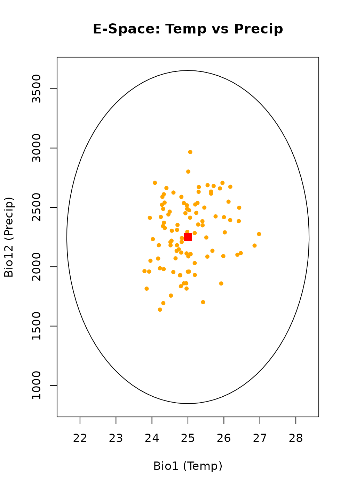
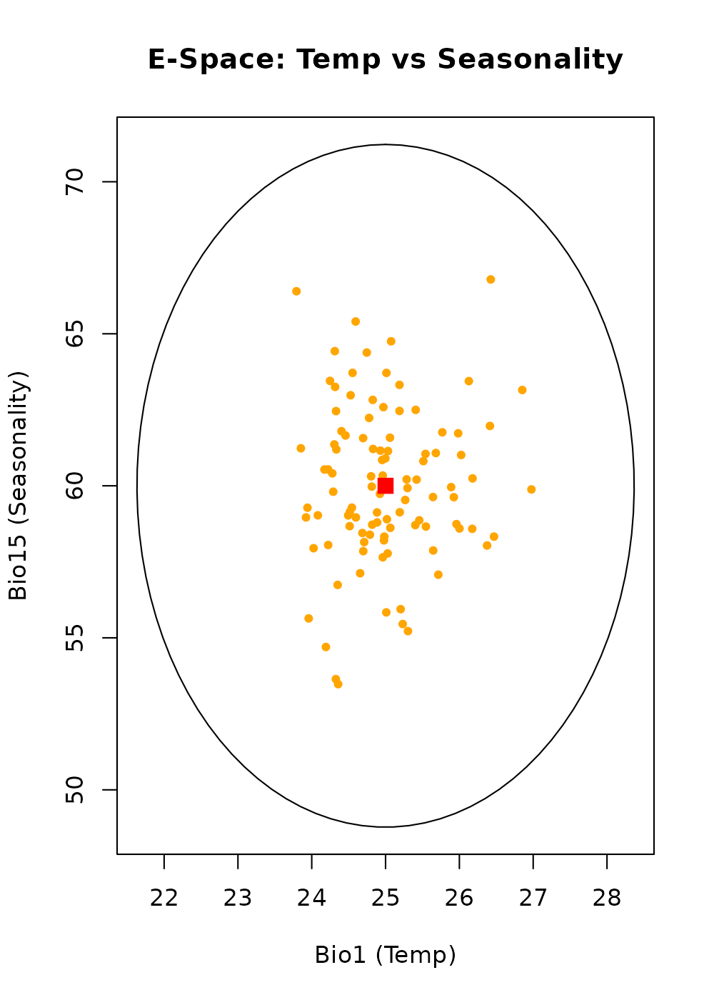
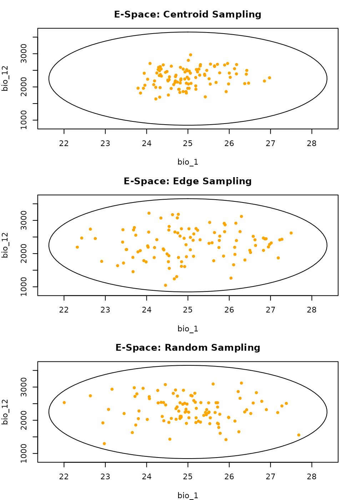
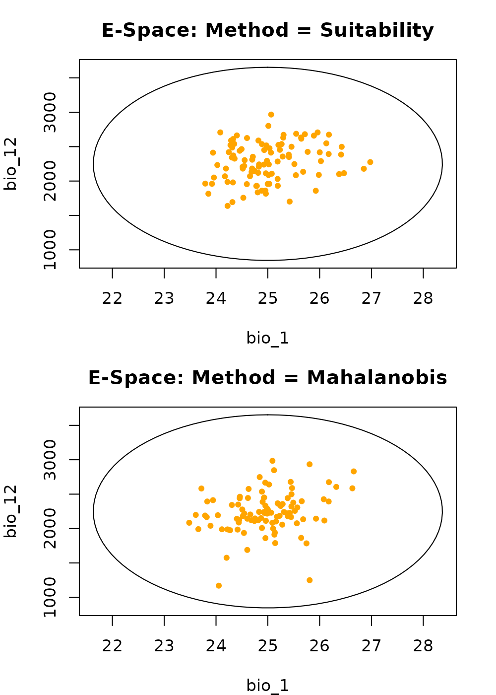
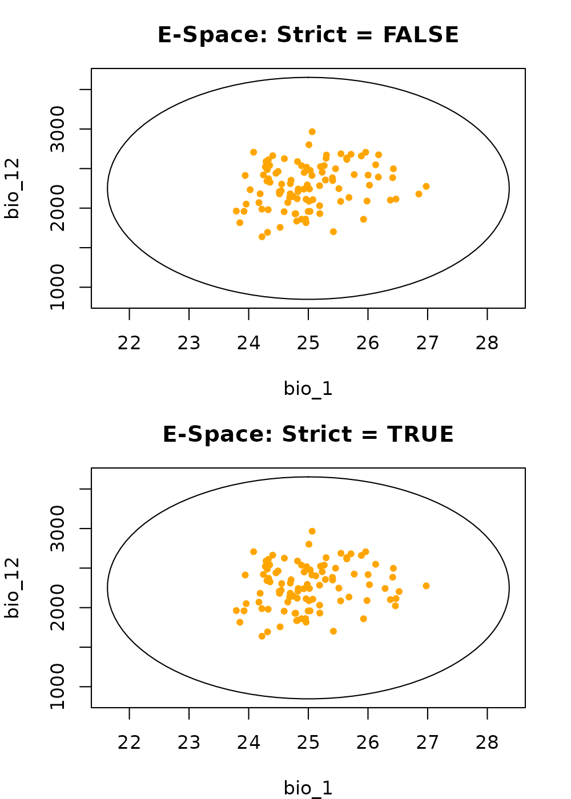

# Generate occurrence data with virtual data

## Summary

- [Description](#description)
- [Getting ready](#sec-getting-ready)
- [Basic generation](#sec-basic-generation)
  - [Visualizing basic generation](#sec-visualizing-basic-generation)
  - [1. Environmental Space Bio1
    vs. Bio12](#sec-1.-environmental-space-bio1-vs.-bio12)
  - [2. Environmental Space Bio1
    vs. Bio15](#sec-2.-environmental-space-bio1-vs.-bio15)
- [Effect of the `sampling`
  argument](#sec-effect-of-the-sampling-argument)
  - [Visualizing spatial bias](#sec-visualizing-spatial-bias)
- [Effect of the `method` argument](#sec-effect-of-the-method-argument)
  - [Visualizing probability
    weights](#sec-visualizing-probability-weights)
- [Effect of the `strict` argument](#sec-effect-of-the-strict-argument)
  - [Visualizing boundary limits](#sec-visualizing-boundary-limits)
- [A note on G-space](#sec-a-note-on-g-space)
- [Save and export](#sec-save-and-export)

------------------------------------------------------------------------

## Description

Virtual species are highly useful for controlled, purely theoretical
experiments in quantitative ecology. This workflow allows you to
simulate species data entirely within Environmental Space (E-Space),
bypassing geographic rasters. This is ideal for testing how models
perform under different sampling biases without the confounding
influence of real-world landscape fragmentation.

  

## Getting ready

First, we load nicheR and define a fundamental niche. We also use
virtual_data() to generate an environmental “background” of 1,000 points
that our virtual species can potentially inhabit.

``` r
# Load packages
library(nicheR)

# 1. Define Niche Space
range_df <- data.frame(bio_1  = c(22, 28),
                       bio_12 = c(1000, 3500),
                       bio_15 = c(50, 70))
ell <- build_ellipsoid(range = range_df)

# 2. Generate Environmental Background (The "Universe")
# We draw 1,000 points from the mathematical distribution of the niche
virt_bg <- virtual_data(ell, n = 1000, truncate = FALSE, effect = "direct", seed = 1)

# 3. Predict Suitability for the Background
# We score our background points so we can sample from them
pred_virt <- predict(ell, newdata = virt_bg, include_suitability = TRUE, 
                     suitability_truncated = TRUE, keep_data = TRUE)
```

  

## Basic generation

The
[`sample_virtual_data()`](https://castanedam.github.io/nicheR/reference/sample_virtual_data.md)
function acts as the non-spatial twin to
[`sample_data()`](https://castanedam.github.io/nicheR/reference/sample_data.md).
It picks “occurrences” from our virtual background based on the
suitability scores we just calculated.

``` r
# Generate basic virtual occurrence data
occ_virt_basic <- sample_virtual_data(
  n_occ = 100, 
  object = ell,
  virtual_prediction = pred_virt, 
  prediction_layer = "suitability", 
  seed = 123
)
#> Starting: sample_virtual_data()
#> Warning in resolve_prediction(virtual_prediction, prediction_layer):
#> 'prediction' is a data.frame, and it is missing 'x' and 'y', results wont show
#> geographical connections.
#> Done: sampled 100 points.

head(occ_virt_basic)
#>        bio_1   bio_12   bio_15 Mahalanobis suitability suitability_trunc
#> 356 25.45661 2498.431 58.86515   0.6798950   0.7118077         0.7118077
#> 720 25.96074 2706.620 58.74015   2.2668354   0.3219311         0.3219311
#> 74  24.95347 1860.793 60.84983   0.9397016   0.6250955         0.6250955
#> 29  23.95850 2050.771 55.63882   3.0251331   0.2203437         0.2203437
#> 651 26.97629 2275.384 59.88062   3.9107082   0.1415144         0.1415144
#> 655 25.28578 2355.890 60.21157   0.1502863   0.9276107         0.9276107
```

  

### Visualizing basic generation

Since virtual data does not have Latitude/Longitude, we visualize it
exclusively in E-Space. We will look at two pairs of dimensions to see
how the generated points sit within the niche volume.

  

#### **1. Environmental Space Bio1 vs. Bio12**

The gray dots are our 1,000 background points. The orange dots are the
100 individuals we sampled based on suitability. Notice they cluster
toward the center (red square) because higher suitability exists there.

``` r
plot_ellipsoid(ell, dim = c(1, 2), pch = ".", col_bg = "#9a9797", 
               xlab = "Bio1 (Temp)", ylab = "Bio12 (Precip)", main = "E-Space: Temp vs Precip")
add_data(occ_virt_basic, x = "bio_1", y = "bio_12", pts_col = "orange", pch = 20)
add_data(as.data.frame(t(ell$centroid)), x = "bio_1", y = "bio_12", pts_col = "red", pch = 15, cex = 1.5)
```



  

#### **2. Environmental Space Bio1 vs. Bio15**

Viewing the same points along the Seasonality (Bio15) axis ensures the
sampling is consistent across the 3D ellipsoid.

``` r
plot_ellipsoid(ell, dim = c(1, 3), pch = ".", col_bg = "#9a9797", 
               xlab = "Bio1 (Temp)", ylab = "Bio15 (Seasonality)", main = "E-Space: Temp vs Seasonality")
add_data(occ_virt_basic, x = "bio_1", y = "bio_15", pts_col = "orange", pch = 20)
add_data(as.data.frame(t(ell$centroid)), x = "bio_1", y = "bio_15", pts_col = "red", pch = 15, cex = 1.5)
```



  

## Effect of the `sampling` argument

The `sampling` argument dictates which part of the niche the individuals
“prefer” to occupy.

``` r
occ_cent <- sample_virtual_data(100, ell, pred_virt, "suitability", sampling = "centroid", seed = 123)
#> Starting: sample_virtual_data()
#> Warning in resolve_prediction(virtual_prediction, prediction_layer):
#> 'prediction' is a data.frame, and it is missing 'x' and 'y', results wont show
#> geographical connections.
#> Done: sampled 100 points.
occ_edge <- sample_virtual_data(100, ell, pred_virt, "suitability", sampling = "edge", seed = 123)
#> Starting: sample_virtual_data()
#> Warning in resolve_prediction(virtual_prediction, prediction_layer):
#> 'prediction' is a data.frame, and it is missing 'x' and 'y', results wont show
#> geographical connections.
#> Done: sampled 100 points.
occ_rand <- sample_virtual_data(100, ell, pred_virt, "suitability", sampling = "random", seed = 123)
#> Starting: sample_virtual_data()
#> Warning in resolve_prediction(virtual_prediction, prediction_layer):
#> 'prediction' is a data.frame, and it is missing 'x' and 'y', results wont show
#> geographical connections.
#> Done: sampled 100 points.
```

  

### Visualizing spatial bias

In virtual space, “spatial bias” refers to the distribution relative to
the niche center.

**Centroid vs. Edge vs. Random:** In **Centroid**, orange dots huddle at
the red square. In **Edge**, they are repelled to the purple boundary
line. In **Random**, they fill the ellipsoid evenly.

``` r
par(mfrow = c(3, 1), mar = c(4, 4, 3, 2)) 
# Centroid
plot_ellipsoid(ell, dim = c(1, 2), pch = ".", col_bg = "#9a9797", main = "E-Space: Centroid Sampling")
add_data(occ_cent, x = "bio_1", y = "bio_12", pts_col = "orange", pch = 20)
# Edge
plot_ellipsoid(ell, dim = c(1, 2), pch = ".", col_bg = "#9a9797", main = "E-Space: Edge Sampling")
add_data(occ_edge, x = "bio_1", y = "bio_12", pts_col = "orange", pch = 20)
# Random
plot_ellipsoid(ell, dim = c(1, 2), pch = ".", col_bg = "#9a9797", main = "E-Space: Random Sampling")
add_data(occ_rand, x = "bio_1", y = "bio_12", pts_col = "orange", pch = 20)
```



  

## Effect of the `method` argument

The `method` argument changes the mathematical weight used to draw
points from the 1,000 background candidates.

``` r
occ_meth_suit <- sample_virtual_data(100, ell, pred_virt, "suitability", method = "suitability", seed = 123)
#> Starting: sample_virtual_data()
#> Warning in resolve_prediction(virtual_prediction, prediction_layer):
#> 'prediction' is a data.frame, and it is missing 'x' and 'y', results wont show
#> geographical connections.
#> Done: sampled 100 points.
occ_meth_maha <- sample_virtual_data(100, ell, pred_virt, "Mahalanobis", method = "mahalanobis", seed = 123)
#> Starting: sample_virtual_data()
#> Warning in resolve_prediction(virtual_prediction, prediction_layer):
#> 'prediction' is a data.frame, and it is missing 'x' and 'y', results wont show
#> geographical connections.
#> Done: sampled 100 points.
```

  

### Visualizing probability weights

**Suitability vs. Mahalanobis:** The **Mahalanobis** method creates a
much tighter concentration of points in the niche core compared to the
**Suitability** method, as it penalizes environmental distance more
severely.

``` r
par(mfrow = c(2, 1), mar = c(4, 4, 3, 2)) 
# Suitability
plot_ellipsoid(ell, dim = c(1, 2), pch = ".", col_bg = "#9a9797", main = "E-Space: Method = Suitability")
add_data(occ_meth_suit, x = "bio_1", y = "bio_12", pts_col = "orange", pch = 20)
# Mahalanobis
plot_ellipsoid(ell, dim = c(1, 2), pch = ".", col_bg = "#9a9797", main = "E-Space: Method = Mahalanobis")
add_data(occ_meth_maha, x = "bio_1", y = "bio_12", pts_col = "orange", pch = 20)
```



  

## Effect of the `strict` argument

The `strict` argument determines if the virtual individuals can exist in
“sink” environments outside the fundamental niche boundary.

``` r
# Allow points in marginal background outside the ellipse
occ_lax <- sample_virtual_data(100, ell, pred_virt, "suitability", strict = FALSE, seed = 123)
#> Starting: sample_virtual_data()
#> Warning in resolve_prediction(virtual_prediction, prediction_layer):
#> 'prediction' is a data.frame, and it is missing 'x' and 'y', results wont show
#> geographical connections.
#> Done: sampled 100 points.

# Force points to remain inside the ellipse
occ_strict <- sample_virtual_data(100, ell, pred_virt, "suitability_trunc", strict = TRUE, seed = 123)
#> Starting: sample_virtual_data()
#> Warning in resolve_prediction(virtual_prediction, prediction_layer):
#> 'prediction' is a data.frame, and it is missing 'x' and 'y', results wont show
#> geographical connections.
#> Done: sampled 100 points.
```

  

### Visualizing boundary limits

**Strict = FALSE vs. Strict = TRUE:** When `strict = FALSE`, you can see
orange dots drifting outside the purple ellipse line. When
`strict = TRUE`, the boundary acts as a hard wall.

``` r
par(mfrow = c(2, 1), mar = c(4, 4, 3, 2)) 
# False
plot_ellipsoid(ell, dim = c(1, 2), pch = ".", col_bg = "#9a9797", main = "E-Space: Strict = FALSE")
add_data(occ_lax, x = "bio_1", y = "bio_12", pts_col = "orange", pch = 20)
# True
plot_ellipsoid(ell, dim = c(1, 2), pch = ".", col_bg = "#9a9797", main = "E-Space: Strict = TRUE")
add_data(occ_strict, x = "bio_1", y = "bio_12", pts_col = "orange", pch = 20)
```



  

## A note on G-space

Because the
[`virtual_data()`](https://castanedam.github.io/nicheR/reference/virtual_data.md)
function generates points purely based on statistical distributions
within environmental dimensions (e.g., Temperature and Precipitation),
**these points do not possess spatial coordinates
(Longitude/Latitude).**

Consequently, pure virtual species simulated via this method exist
exclusively in E-Space and cannot be directly plotted onto a geographic
map (G-Space) without first projecting the niche model onto a physical
landscape raster.

  

## Save and export

Since the generated virtual occurrences are standard data frames, we
save them using
[`saveRDS()`](https://rspatial.github.io/terra/reference/serialize.html).

``` r
# Save the basic virtual occurrence dataset
# saveRDS(occ_virt_basic, file = "data/virtual_occurrences.rd")
```
