# Predicting suitability and Mahalanobis distance

## Summary

- [Description](#description)
- [Getting ready](#getting-ready)
- [Loading example data](#loading-example-data)
- [Using predict()](#using-predict)
  - [Basic predictions to a data
    frame](#basic-predictions-to-a-data-frame)
  - [Basic predictions to a
    SpatRaster](#basic-predictions-to-a-spatraster)
  - [Understanding the output](#understanding-the-output)
  - [Additional function arguments](#additional-function-arguments)
  - [All four outputs at once](#all-four-outputs-at-once)
  - [The role of the confidence level and
    truncation](#the-role-of-the-confidence-level-and-truncation)
  - [Effect of the confidence level on
    predictions](#effect-of-the-confidence-level-on-predictions)
- [Visualizing predictions in environmental
  space](#visualizing-predictions-in-environmental-space)
  - [Mahalanobis distance in E-space](#mahalanobis-distance-in-e-space)
  - [Suitability in E-space](#suitability-in-e-space)
  - [Truncated predictions in
    E-space](#truncated-predictions-in-e-space)
  - [Binary suitable vs. unsuitable
    environments](#binary-suitable-vs-unsuitable-environments)
- [Visualizing predictions in geographic
  space](#visualizing-predictions-in-geographic-space)
  - [Mahalanobis distance map](#mahalanobis-distance-map)
  - [Suitability map](#suitability-map)
  - [Truncated suitability map](#truncated-suitability-map)
  - [Binary potential distribution
    map](#binary-potential-distribution-map)
- [Three-dimensional example](#three-dimensional-example)
- [Save and import](#save-and-import)

------------------------------------------------------------------------

## Description

This vignette demonstrates how to use the
[`predict()`](https://rspatial.github.io/terra/reference/predict.html)
method for `nicheR_ellipsoid` objects to generate Mahalanobis distance
and suitability predictions. The
[`predict()`](https://rspatial.github.io/terra/reference/predict.html)
function is the core tool for translating the estimated ellipsoidal
niche built with
[`build_ellipsoid()`](https://castanedam.github.io/nicheR/reference/build_ellipsoid.md)
into quantitative estimates of environmental suitability, both in
environmental space (E-space) and geographic space (G-space).

The main function covered in this vignette is:

- [`predict()`](https://rspatial.github.io/terra/reference/predict.html):
  generates Mahalanobis distance, suitability, and truncated versions of
  these metrics from a `nicheR_ellipsoid` object. It accepts
  environmental data as a `data.frame` or a `SpatRaster`.

Understanding how predictions are computed and what each output
represents is essential for interpreting virtual niches responsibly.
This vignette covers the statistical theory behind the predictions, a
detailed breakdown of all function arguments and output types, and
visualizations of every output in both E-space and G-space.

  

## Getting ready

If `nicheR` has not been installed yet, please do so. See the [Main
guide](https://castanedam.github.io/nicheR/articles/index.md) for
installation instructions.

Use the following lines of code to load `nicheR` and other packages
needed for this vignette, and to set a working directory (if necessary).

Note: We will display functions from other packages as
`package::function()`.

``` r
# Load packages
library(nicheR)
#library(terra)

# Current directory
getwd()

# Define new directory
#setwd("YOUR/DIRECTORY")  # modify if setting a new directory
```

  

## Loading example data

The example data included in `nicheR` consists of a `nicheR_ellipsoid`
object representing the niche of a reference species defined by two
environmental variables (bio1: Mean Annual Temperature and bio12: Annual
Precipitation), background environmental data for North America, and a
raster stack of the same variables for geographic projections.

``` r
# Reference niche (nicheR_ellipsoid object)
data("ref_ellipse", package = "nicheR")

# Background environmental data (data.frame)
data("back_data", package = "nicheR")

# Raster layers for geographic predictions (SpatRaster)
ma_bios <- terra::rast(system.file("extdata", "ma_bios.tif",
                                   package = "nicheR"))
```

  

Let’s inspect each object to understand its structure before proceeding.

``` r
# Check reference niche
ref_ellipse
#> nicheR Ellipsoid Object
#> -----------------------
#> Dimensions:        2D
#> Chi-square cutoff: 9.21
#> Centroid (mu):     23.5, 1750
#> 
#> Covariance matrix:
#>           bio_1 bio_12
#> bio_1     1.361   -100
#> bio_12 -100.000  62500
#> 
#> Ellipsoid semi-axis lengths:
#>   758.715, 3.326
#> 
#> Ellipsoid axis endpoints:
#>  Axis 1:
#>           bio_1   bio_12
#> vertex_a 24.714  991.286
#> vertex_b 22.286 2508.714
#> 
#>  Axis 2:
#>           bio_1   bio_12
#> vertex_a 26.826 1750.005
#> vertex_b 20.174 1749.995
#> 
#> Ellipsoid volume:  7927.882

# Check background data
head(back_data)
#>           x        y    bio_1    bio_5   bio_6    bio_7 bio_12 bio_13 bio_14
#> 1 -99.91667 29.91667 18.16097 33.23550 0.86900 32.36650    680     84     26
#> 2 -99.75000 29.91667 18.06556 33.32575 0.65550 32.67025    703     87     28
#> 3 -99.58333 29.91667 17.95946 33.33925 0.44600 32.89325    725     92     31
#> 4 -99.41667 29.91667 18.01018 33.34200 0.62200 32.72000    734     95     33
#> 5 -99.25000 29.91667 18.14458 33.40400 0.99125 32.41275    748     97     34
#> 6 -99.08333 29.91667 18.36623 33.76550 1.02025 32.74525    771    101     36
#>     bio_15
#> 1 39.75968
#> 2 38.44158
#> 3 37.43598
#> 4 36.24147
#> 5 34.95365
#> 6 33.73626

# Check the raster layers
ma_bios
#> class       : SpatRaster 
#> size        : 150, 240, 8  (nrow, ncol, nlyr)
#> resolution  : 0.1666667, 0.1666667  (x, y)
#> extent      : -100, -60, 5, 30  (xmin, xmax, ymin, ymax)
#> coord. ref. : lon/lat WGS 84 (EPSG:4326) 
#> source      : ma_bios.tif 
#> names       :    bio_1,   bio_5, bio_6,    bio_7, bio_12, bio_13, ... 
#> min values  :  3.91325,  8.4285, -0.39,  5.90000,    291,     65, ... 
#> max values  : 29.39055, 37.8985, 24.70, 32.89325,   7150,    767, ...
```

  

This represents a two-dimensional `nicheR_ellipsoid` object built from
`bio_1` and `bio_12`. For details on how ellipsoids are constructed, see
the [`build_ellipsoid()`
vignette](https://castanedam.github.io/nicheR/articles/build_ellipsoid.md).
The most important things to carry forward are that we are working in
two dimensions and that the variable names stored in
`ref_ellipse$var_names` must be present in any `newdata` passed to
[`predict()`](https://rspatial.github.io/terra/reference/predict.html).

  

## Using predict()

At its most basic,
[`predict()`](https://rspatial.github.io/terra/reference/predict.html)
requires two things: the `nicheR_ellipsoid` object produced by
[`build_ellipsoid()`](https://castanedam.github.io/nicheR/reference/build_ellipsoid.md),
and `newdata`, the environmental data over which predictions will be
made. The `newdata` must contain columns matching the variable names
used to build the ellipsoid. Only those variables are used, so
subsetting to `ref_ellipse$var_names` is good practice, though the
function will handle extra columns automatically.

  

### Basic predictions to a data frame

When `newdata` is a `data.frame`,
[`predict()`](https://rspatial.github.io/terra/reference/predict.html)
returns a `data.frame` with class `"nicheR_prediction"`. By default it
includes the predictor columns followed by two prediction columns:
`Mahalanobis` and `suitability`.

``` r
pred_df <- predict(ref_ellipse,
                   newdata = back_data[, ref_ellipse$var_names])
#> Starting: suitability prediction using newdata of class: data.frame...
#> Step: Using 2 predictor variables: bio_1, bio_12
#> Done: Prediction completed successfully. Returned columns: bio_1, bio_12, Mahalanobis, suitability

class(pred_df)
#> [1] "nicheR_prediction" "data.frame"
colnames(pred_df)
#> [1] "bio_1"       "bio_12"      "Mahalanobis" "suitability"
head(pred_df)
#>      bio_1 bio_12 Mahalanobis  suitability
#> 1 18.16097    680    59.71094 1.081269e-13
#> 2 18.06556    703    59.62282 1.129974e-13
#> 3 17.95946    725    59.73708 1.067230e-13
#> 4 18.01018    734    58.66810 1.821314e-13
#> 5 18.14458    748    56.37870 5.721652e-13
#> 6 18.36623    771    52.71068 3.581139e-12
```

  

### Basic predictions to a SpatRaster

When `newdata` is a `SpatRaster`,
[`predict()`](https://rspatial.github.io/terra/reference/predict.html)
returns a `SpatRaster` where each requested output is a named layer. The
coordinate reference system, extent, and resolution always match those
of `newdata`. Cells with `NA` in any predictor layer receive `NA` in all
prediction layers.

``` r
pred_rast <- predict(ref_ellipse,
                     newdata = ma_bios[[ref_ellipse$var_names]])
#> Starting: suitability prediction using newdata of class: SpatRaster...
#> Step: Using 2 predictor variables: bio_1, bio_12
#> Done: Prediction completed successfully. Returned raster layers: Mahalanobis, suitability

pred_rast
#> class       : SpatRaster 
#> size        : 150, 240, 2  (nrow, ncol, nlyr)
#> resolution  : 0.1666667, 0.1666667  (x, y)
#> extent      : -100, -60, 5, 30  (xmin, xmax, ymin, ymax)
#> coord. ref. : lon/lat WGS 84 (EPSG:4326) 
#> source(s)   : memory
#> names       :  Mahalanobis,   suitability 
#> min values  : 2.992248e-03, 7.035461e-127 
#> max values  : 5.809547e+02,  9.985050e-01
names(pred_rast)
#> [1] "Mahalanobis" "suitability"
```

  

### Understanding the output

Looking at both outputs above, the default call always returns a
Mahalanobis distance and a suitability, regardless of whether the input
is a data frame or a raster. These two quantities are mathematically
connected, and understanding that connection is essential for
interpreting what the model is telling you.

#### Mahalanobis distance and the ellipsoid

The ellipsoidal niche model in `nicheR` represents a species’ niche as a
region in multivariate environmental space. The ellipsoid’s shape comes
from the covariance structure of the environmental conditions the user
provides, and its center, the **centroid**, is the most favorable
environmental combination.

Every prediction starts with the **Mahalanobis distance** ($D^{2}$),
which measures how far any environmental point $\mathbf{x}$ is from the
niche centroid $\mathbf{μ}$:

$$D^{2} = (\mathbf{x} - {\mathbf{μ}})^{\top}\mathbf{\Sigma}^{- 1}(\mathbf{x} - {\mathbf{μ}})$$

where $\mathbf{\Sigma}^{- 1}$ is the inverse of the covariance matrix.
In simpler terms, $D^{2}$ measures how unusual a set of environmental
conditions is relative to the niche center, accounting for differences
in variable scale and for correlations among variables. Unlike Euclidean
distance, it stretches and rotates with the shape of the niche. The
ellipsoid surface in E-space is exactly the set of all points at a
constant Mahalanobis distance from the centroid.

A smaller $D^{2}$ means environmental conditions are similar to those at
the niche center. A larger $D^{2}$ means they are increasingly
different. Critically, $D^{2}$ is not bounded between 0 and 1: it is a
distance, not a probability.

#### From distance to suitability: the chi-square and MVN connection

`nicheR` converts $D^{2}$ to **suitability** using the multivariate
normal (MVN) kernel:

$$S = \exp\!\left( - \frac{1}{2}D^{2} \right)$$

This transformation is not arbitrary. The exponent in the MVN
probability density function is exactly $- \frac{1}{2}D^{2}$, so
suitability is proportional to the MVN density at $\mathbf{x}$. In other
words, we are treating the niche as a multivariate Gaussian centered at
$\mathbf{μ}$ with covariance $\mathbf{\Sigma}$, and suitability is the
relative likelihood of a species occurring under the conditions at
$\mathbf{x}$. This rescales the distance into a value between 0 and 1
that is more intuitive ecologically: 1 at the centroid, declining
smoothly toward 0 as conditions move away from the optimum.

This connection to the MVN also determines the ellipsoid boundary. Under
the MVN assumption, $D^{2}$ follows a **chi-square distribution** with
$p$ degrees of freedom, where $p$ is the number of environmental
variables. The confidence level `cl` stored in the ellipsoid corresponds
to a $\chi_{p,\,\text{cl}}^{2}$ quantile: the ellipsoid surface is the
set of points where $D^{2} = \chi_{p,\,\text{cl}}^{2}$, enclosing a
fraction `cl` of the MVN probability mass. Setting `cl = 0.95` means the
ellipsoid contains 95% of the theoretical MVN density.

The figure below brings these ideas together. The top row shows the
E-space scatter colored by $D^{2}$ and the histogram of $D^{2}$ values
across the background. The bottom row shows the same for suitability.
The vertical dashed lines in the histograms mark chi-square quantiles at
three probability levels, showing exactly where the ellipsoid boundary
falls relative to the distribution of background distances.

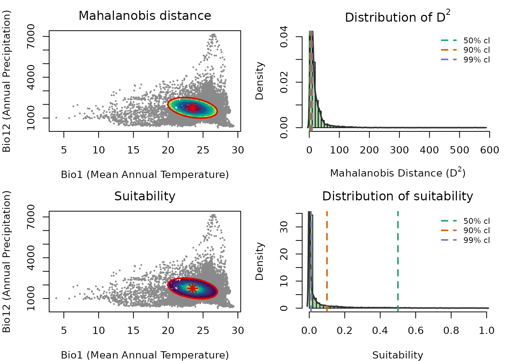

  

The color gradients in the scatter plots are reversed between the two
metrics, reflecting their mathematical relationship: $D^{2}$ increases
as you move away from the centroid, so darker colors near the center
indicate lower distance. Suitability decreases with distance, so
brighter colors near the center indicate higher suitability. Distance
measures how far a point is from the niche center; suitability
transforms that distance into an ecologically interpretable value
between 0 and 1.

The histograms connect this to the MVN. Under the MVN assumption,
$D^{2}$ follows a chi-square distribution, and the vertical dashed lines
mark chi-square quantiles at 50%, 90%, and 99%, which correspond to
ellipsoid boundaries at those confidence levels. The same thresholds
appear in the suitability histogram, showing the equivalent suitability
value at each boundary. This makes it clear that the choice of `cl` when
building the ellipsoid has a direct and interpretable effect on what
suitability value marks the edge of the niche.

  

### Additional function arguments

Beyond the basic call,
[`predict()`](https://rspatial.github.io/terra/reference/predict.html)
lets you control which outputs are returned independently. The four
output types are:

| Argument                | Default | Description                                                                                                     |
|-------------------------|---------|-----------------------------------------------------------------------------------------------------------------|
| `include_mahalanobis`   | `TRUE`  | Squared Mahalanobis distance $D^{2}$ for every point. Not truncated. Ranges from 0 at the centroid to infinity. |
| `include_suitability`   | `TRUE`  | Suitability $S = \exp\left( - 0.5\, D^{2} \right)$. Not truncated. Ranges from near 0 to 1.                     |
| `mahalanobis_truncated` | `FALSE` | $D^{2}$ with values outside the ellipsoid set to `NA`.                                                          |
| `suitability_truncated` | `FALSE` | $S$ with values outside the ellipsoid set to 0.                                                                 |

Two additional arguments control what is returned alongside predictions:

- `keep_data`: whether predictor columns are included in the returned
  object. Default is `TRUE` for `data.frame` input and `FALSE` for
  `SpatRaster`. Coordinate columns (`x`, `y`, `lon`, `lat`, etc.) are
  always retained when `keep_data = TRUE`.
- `adjust_truncation_level`: a number strictly between 0 and 1 that
  overrides the `cl` stored in the ellipsoid for truncated outputs,
  without refitting the ellipsoid. See [Effect of the confidence level
  on predictions](#effect-of-the-confidence-level-on-predictions).

  

### All four outputs at once

Any combination of the four flags can be set to `TRUE` in a single call.
All requested outputs are returned together.

``` r
pred_df_all <- predict(ref_ellipse,
                       newdata = back_data[, ref_ellipse$var_names],
                       include_mahalanobis   = TRUE,
                       include_suitability   = TRUE,
                       mahalanobis_truncated = TRUE,
                       suitability_truncated = TRUE)
#> Starting: suitability prediction using newdata of class: data.frame...
#> Step: Using 2 predictor variables: bio_1, bio_12
#> Done: Prediction completed successfully. Returned columns: bio_1, bio_12, Mahalanobis, suitability, Mahalanobis_trunc, suitability_trunc

colnames(pred_df_all)
#> [1] "bio_1"             "bio_12"            "Mahalanobis"      
#> [4] "suitability"       "Mahalanobis_trunc" "suitability_trunc"
```

  

To see what truncation does concretely, compare one row from outside the
ellipsoid across all four columns. The non-truncated outputs always have
a value; the truncated ones apply the boundary.

``` r
# A point outside the ellipsoid
outside_idx <- which(!is.na(pred_df_all$Mahalanobis) &
                       is.na(pred_df_all$Mahalanobis_trunc))[1]

pred_df_all[outside_idx, ]
#>      bio_1 bio_12 Mahalanobis  suitability Mahalanobis_trunc suitability_trunc
#> 1 18.16097    680    59.71094 1.081269e-13                NA                 0
```

  

The same applies to raster output:

``` r
pred_rast_all <- predict(ref_ellipse,
                         newdata = ma_bios[[ref_ellipse$var_names]],
                         include_mahalanobis   = TRUE,
                         include_suitability   = TRUE,
                         mahalanobis_truncated = TRUE,
                         suitability_truncated = TRUE)
#> Starting: suitability prediction using newdata of class: SpatRaster...
#> Step: Using 2 predictor variables: bio_1, bio_12
#> Done: Prediction completed successfully. Returned raster layers: Mahalanobis, suitability, Mahalanobis_trunc, suitability_trunc

pred_rast_all
#> class       : SpatRaster 
#> size        : 150, 240, 4  (nrow, ncol, nlyr)
#> resolution  : 0.1666667, 0.1666667  (x, y)
#> extent      : -100, -60, 5, 30  (xmin, xmax, ymin, ymax)
#> coord. ref. : lon/lat WGS 84 (EPSG:4326) 
#> source(s)   : memory
#> names       :  Mahalanobis,   suitability, Mahalanobis_trunc, suitability_trunc 
#> min values  : 2.992248e-03, 7.035461e-127,       0.002992248,          0.000000 
#> max values  : 5.809547e+02,  9.985050e-01,       9.206901663,          0.998505
names(pred_rast_all)
#> [1] "Mahalanobis"       "suitability"       "Mahalanobis_trunc"
#> [4] "suitability_trunc"
```

  

### The role of the confidence level and truncation

The ellipsoid boundary is defined by the chi-square cutoff
$\chi_{p,\,\text{cl}}^{2}$. Without truncation, $D^{2}$ and $S$ are
computed for every point in `newdata` regardless of whether it falls
inside or outside the ellipsoid, and every point on Earth receives a
positive suitability value. This can be misleading when the goal is to
identify where the species could potentially occur.

Truncation operationalizes the ellipsoid boundary ecologically:

- `mahalanobis_truncated = TRUE`: points with
  $D^{2} > \chi_{p,\,\text{cl}}^{2}$ receive `NA`, meaning those
  environments are outside the niche and their distance is not reported.
- `suitability_truncated = TRUE`: points with
  $D^{2} > \chi_{p,\,\text{cl}}^{2}$ receive $S = 0$, meaning unsuitable
  environments are explicitly scored as zero rather than receiving a
  small positive value.

The plots in [Truncated predictions in
E-space](#truncated-predictions-in-e-space) and [Truncated suitability
map](#truncated-suitability-map) below show truncated outputs. Outside
points are rendered in grey so the full background extent is preserved
in the view.

  

### Effect of the confidence level on predictions

The choice of `cl` directly controls how much of the environmental space
is classified as suitable. A lower `cl` produces a smaller, more
conservative ellipsoid boundary; a higher `cl` produces a larger, more
permissive one. The ellipsoid object itself remains unchanged, only the
boundary used for truncation shifts.

The `adjust_truncation_level` argument lets you explore different
thresholds without refitting the ellipsoid:

``` r
# More conservative: only the innermost 90% of the MVN distribution
pred_conservative <- predict(ref_ellipse,
                             newdata = back_data[, ref_ellipse$var_names],
                             suitability_truncated = TRUE,
                             adjust_truncation_level = 0.90)

# More permissive: the innermost 99%
pred_permissive <- predict(ref_ellipse,
                           newdata = back_data[, ref_ellipse$var_names],
                           suitability_truncated = TRUE,
                           adjust_truncation_level = 0.99)
```

`adjust_truncation_level` must be a single number strictly between 0 and
1 and only affects truncated outputs.

The figure below shows truncated suitability in E-space at three
confidence levels side by side.

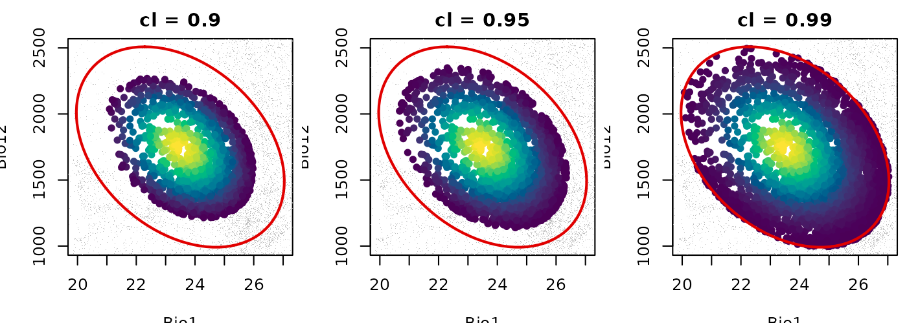

  

As `cl` increases from 0.90 to 0.99 the suitable area grows larger while
the ellipsoid object itself remains unchanged. The colored interior
represents the gradient of suitability within each boundary and grey
points are those classified as outside. The choice of `cl` is a
meaningful modeling decision that should be justified in the context of
the research question.

  

## Visualizing predictions in environmental space

Visualizing predictions in E-space is the most direct way to understand
what the model is saying about the niche. Each point represents an
environmental combination and its color encodes the prediction value.
The ellipsoid boundary is overlaid to show the niche limit.

  

### Mahalanobis distance in E-space

``` r
maha_df <- predict(ref_ellipse,
                   newdata = back_data[, ref_ellipse$var_names],
                   include_mahalanobis = TRUE,
                   include_suitability = FALSE,
                   verbose = FALSE)

par(mar = mars)

plot_ellipsoid(ref_ellipse,
               prediction = maha_df,
               col_layer  = "Mahalanobis",
               col_ell    = "#e10000",
               lwd = 2, pch = 16, cex_bg = 0.5,
               xlab = "Bio1 (Mean Annual Temperature)",
               ylab = "Bio12 (Annual Precipitation)",
               main = "Mahalanobis Distance (D\u00b2) in E-space")

add_data(as.data.frame(t(ref_ellipse$centroid)),
         x = "bio_1", y = "bio_12",
         pts_col = "#e10000", pch = 8, cex = 1.5, lwd = 2)

legend("topright",
       legend = c("Ellipsoid boundary", "Centroid",
                  "Low D\u00b2", "High D\u00b2"),
       col = c("#e10000", vir_pal[5], vir_pal[95]),
       pch = c(NA, 8, 16, 16), lty = c(1, NA, NA, NA),
       lwd = c(2, NA, NA, NA), cex = 0.75, bty = "n")
```

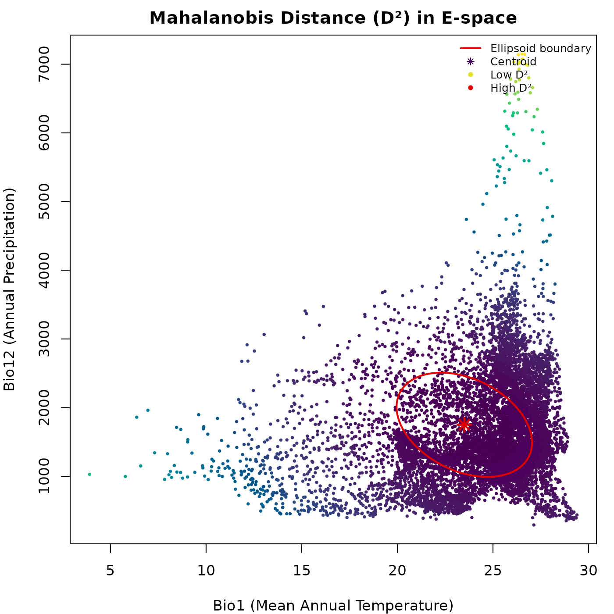

  

The gradient from dark to light radiates outward from the centroid. The
distance continues to grow beyond the ellipsoid boundary without any
discontinuity: the untruncated $D^{2}$ does not distinguish inside from
outside.

  

### Suitability in E-space

``` r
suit_df <- predict(ref_ellipse,
                   newdata = back_data[, ref_ellipse$var_names],
                   include_mahalanobis = FALSE,
                   include_suitability = TRUE,
                   verbose = FALSE)

par(mar = mars)

plot_ellipsoid(ref_ellipse,
               prediction = suit_df,
               col_layer  = "suitability",
               pal        = vir_pal,
               col_ell    = "#e10000",
               lwd = 2, pch = 16, cex_bg = 0.5,
               xlab = "Bio1 (Mean Annual Temperature)",
               ylab = "Bio12 (Annual Precipitation)",
               main = "Suitability in E-space")

add_data(as.data.frame(t(ref_ellipse$centroid)),
         x = "bio_1", y = "bio_12",
         pts_col = "#e10000", pch = 8, cex = 1.5, lwd = 2)

legend("topright",
       legend = c("Ellipsoid boundary", "Centroid",
                  "Low suitability", "High suitability"),
       col = c("#e10000", "#e10000", vir_pal[5], vir_pal[95]),
       pch = c(NA, 8, 16, 16), lty = c(1, NA, NA, NA),
       lwd = c(2, NA, NA, NA), cex = 0.75, bty = "n")
```

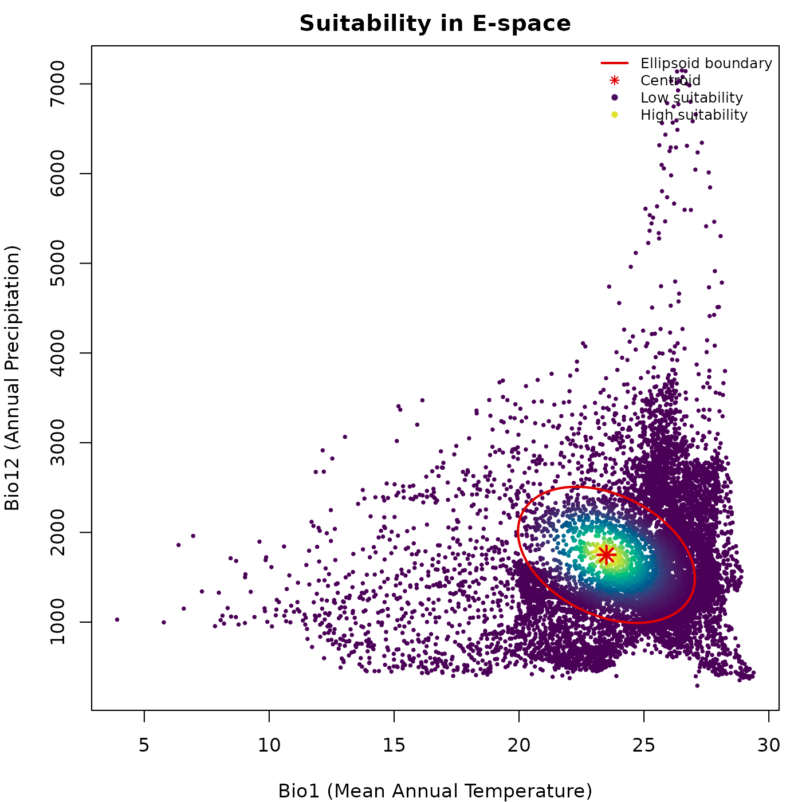

  

Suitability peaks at the centroid and declines outward. The brightest
colors mark the core of the niche, where environmental conditions best
match those used to construct the ellipsoid.

  

### Truncated predictions in E-space

``` r
trunc_df <- predict(ref_ellipse,
                    newdata = back_data[, ref_ellipse$var_names],
                    include_mahalanobis   = FALSE,
                    include_suitability   = FALSE,
                    mahalanobis_truncated = TRUE,
                    suitability_truncated = TRUE,
                    verbose = FALSE)

par(mfrow = c(1, 2), cex = 0.7, mar = mars)

plot_ellipsoid(ref_ellipse,
               prediction = trunc_df,
               col_layer  = "Mahalanobis_trunc",
               col_bg = "#d4d4d4",
               col_ell  = "#e10000",
               lwd = 2, pch = 16, cex_bg = 0.4,
               xlab = "Bio1 (Mean Annual Temperature)",
               ylab = "Bio12 (Annual Precipitation)",
               main = "Mahalanobis Trunc. (D\u00b2)")

add_data(as.data.frame(t(ref_ellipse$centroid)),
         x = "bio_1", y = "bio_12",
         pts_col = "#e10000", pch = 8, cex = 1.2, lwd = 2)

legend("topright",
       legend = c("Ellipsoid boundary", "Inside (low D\u00b2)",
                  "Inside (high D\u00b2)", "Outside (NA)"),
       col = c("#e10000", vir_pal[5], vir_pal[95], "#d4d4d4"),
       pch = c(NA, 16, 16, 16), lty = c(1, NA, NA, NA),
       lwd = c(2, NA, NA, NA), cex = 0.65, bty = "n")

plot_ellipsoid(ref_ellipse,
               prediction = trunc_df,
               col_layer  = "suitability_trunc",
               col_bg     = "#d4d4d4",
               col_ell    = "#e10000",
               lwd = 2, pch = 16, cex_bg = 0.4,
               xlab = "Bio1 (Mean Annual Temperature)",
               ylab = "Bio12 (Annual Precipitation)",
               main = "Suitability Trunc.")

add_data(as.data.frame(t(ref_ellipse$centroid)),
         x = "bio_1", y = "bio_12",
         pts_col = "#e10000", pch = 8, cex = 1.2, lwd = 2)

legend("topright",
       legend = c("Ellipsoid boundary", "Low suitability",
                  "High suitability", "Outside (zero)"),
       col = c("#e10000", vir_pal[5], vir_pal[95], "#d4d4d4"),
       pch = c(NA, 16, 16, 16), lty = c(1, NA, NA, NA),
       lwd = c(2, NA, NA, NA), cex = 0.65, bty = "n")
```

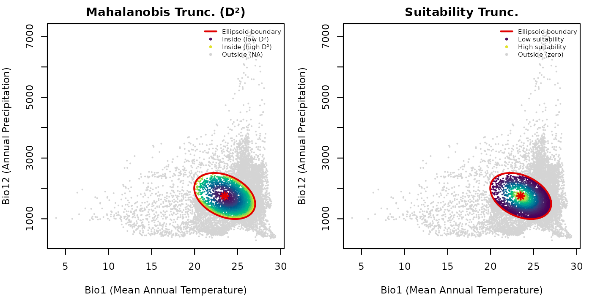

  

Truncation makes the ellipsoid boundary ecologically operative. Outside
points are shown in grey so the full background extent is preserved in
the plot, making it easy to see what fraction of the background falls
inside versus outside the ellipsoid.

  

### Binary suitable vs. unsuitable environments

The truncated suitability output provides a direct route to binary
presence-absence predictions in E-space. Points with $S > 0$ are
suitable (inside the ellipsoid) and points with $S = 0$ are unsuitable
(outside).

``` r
par(mar = mars)

plot_ellipsoid(ref_ellipse,
               prediction = trunc_df,
               col_layer  = "suitability_trunc",
               pal        = c("#d4d4d4", "#0004d5"),
               col_bg     = "#d4d4d4",
               col_ell    = "#e10000",
               lwd = 2, pch = 16, cex_bg = 0.5,
               xlab = "Bio1 (Mean Annual Temperature)",
               ylab = "Bio12 (Annual Precipitation)",
               main = "Binary Suitability in E-space")

legend("topright",
       legend = c("Ellipsoid boundary", "Suitable (inside)",
                  "Unsuitable (outside)"),
       col = c("#e10000", "#0004d5", "#d4d4d4"),
       pch = c(NA, 16, 16), lty = c(1, NA, NA),
       lwd = c(2, NA, NA), cex = 0.75, bty = "n")
```

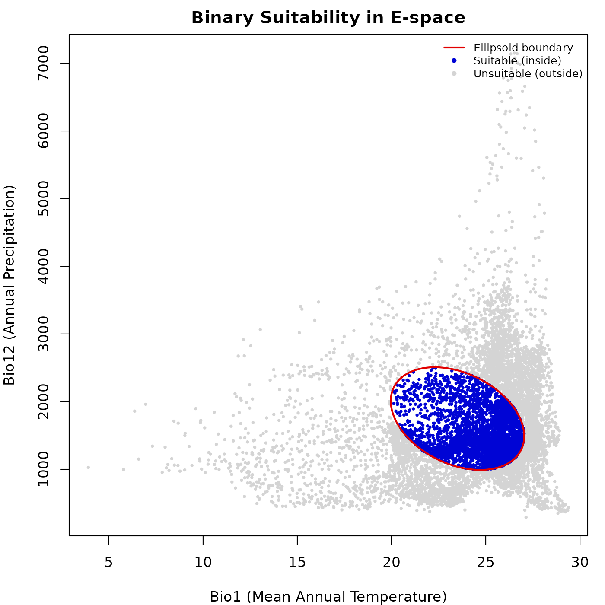

  

The blue region corresponds exactly to the interior of the ellipsoid in
E-space. This binary representation is the starting point for deriving
potential distribution maps and species richness estimates.

  

## Visualizing predictions in geographic space

Projecting predictions to G-space using a `SpatRaster` translates niche
model outputs into maps of potential distribution. Each cell represents
a geographic location evaluated against the niche model using the
environmental values of its corresponding layers.

  

### Mahalanobis distance map

``` r
maha_rast <- predict(ref_ellipse,
                     newdata = ma_bios[[ref_ellipse$var_names]],
                     include_mahalanobis = TRUE,
                     include_suitability = FALSE,
                     verbose = FALSE)

par(mar = marsr)

terra::plot(maha_rast$Mahalanobis,
            axes = FALSE, box = TRUE,
            main = "Mahalanobis Distance (D\u00b2) in G-space")
```

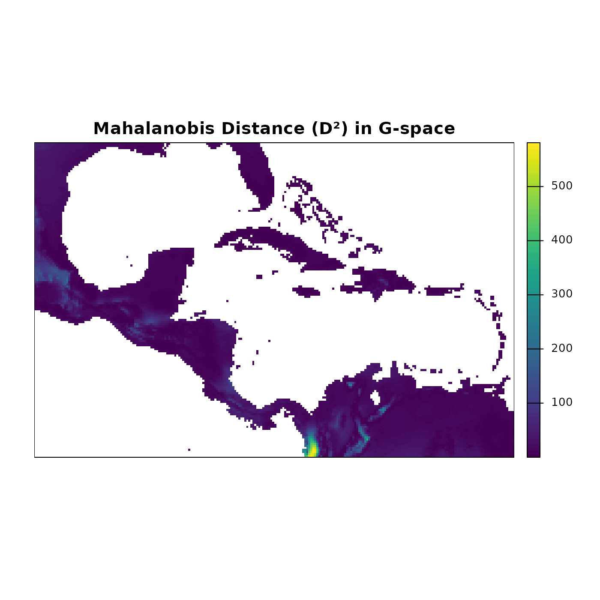

  

The Mahalanobis distance map highlights regions where environmental
conditions closely match the niche centroid (low values, dark blue)
versus regions with increasingly different conditions (high values,
lighter colors). Latitudinal and coastal gradients in temperature and
precipitation produce complex spatial patterns that are not visible in
E-space alone.

  

### Suitability map

``` r
suit_rast <- predict(ref_ellipse,
                     newdata = ma_bios[[ref_ellipse$var_names]],
                     include_mahalanobis = FALSE,
                     include_suitability = TRUE,
                     verbose = FALSE)

par(mar = marsr)

terra::plot(suit_rast$suitability,
            axes = FALSE, box = TRUE,
            main = "Suitability in G-space")
```

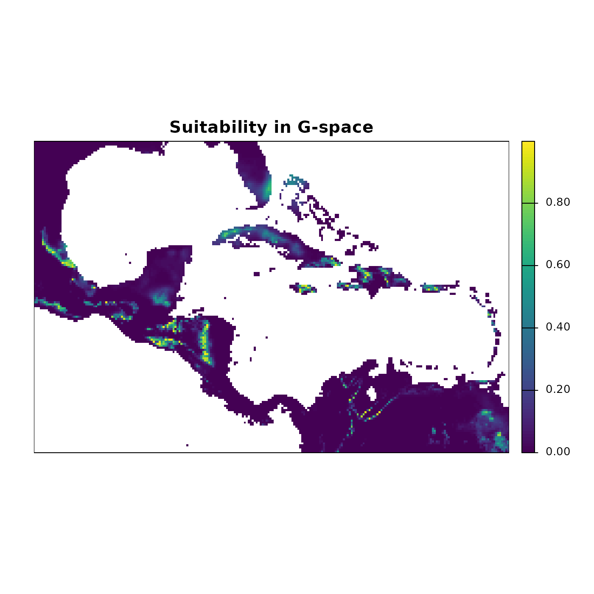

  

The suitability map shows the continuous gradient of potential habitat
quality. Bright yellow-green areas represent the highest suitability,
corresponding to conditions closest to the niche centroid. These are not
predictions of where the species is present; they are predictions of
where environmental conditions are most similar to those used to build
the ellipsoid.

  

### Truncated suitability map

``` r
trunc_rast <- predict(ref_ellipse,
                      newdata = ma_bios[[ref_ellipse$var_names]],
                      include_mahalanobis   = FALSE,
                      include_suitability   = FALSE,
                      mahalanobis_truncated = TRUE,
                      suitability_truncated = TRUE,
                      verbose = FALSE)

par(mfrow = c(1, 2), cex = 0.7)

terra::plot(trunc_rast$Mahalanobis_trunc,
            axes = FALSE, box = TRUE, mar = marsr,
            main = "Mahalanobis Trunc. (D\u00b2)")

terra::plot(trunc_rast$suitability_trunc,
            axes = FALSE, box = TRUE, mar = marsr,
            main = "Suitability Trunc.")
```

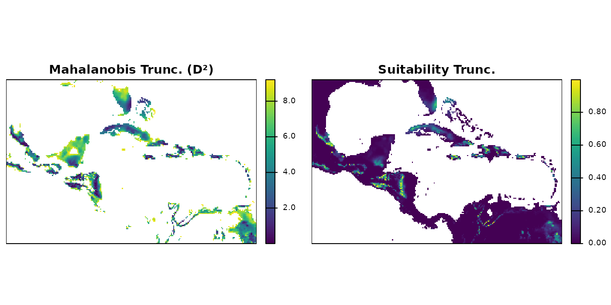

  

Truncated maps show predictions only within the region of geographic
space where environmental conditions fall inside the ellipsoid. Cells
outside the boundary receive `NA` (Mahalanobis) or 0 (suitability).

  

### Binary potential distribution map

``` r
binary_rast <- (trunc_rast$suitability_trunc > 0) * 1

par(mar = marsr)

terra::plot(binary_rast,
            axes = FALSE, box = TRUE,
            col  = c("#d4d4d4", "#0004d5"),
            main = "Potential Distribution (Binary)")
```

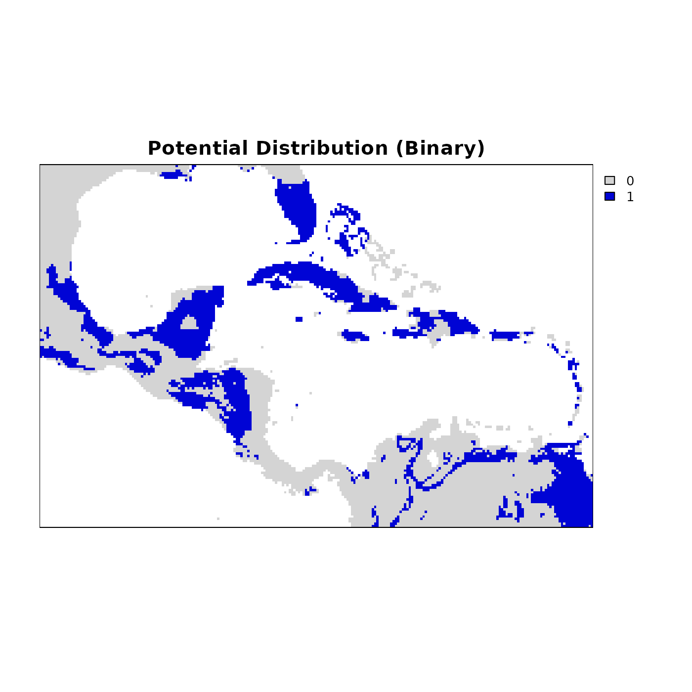

  

Blue cells represent areas where environmental conditions fall within
the niche, and grey cells are outside it. This layer is directly usable
for downstream analyses such as species richness mapping, PAM
construction, and comparisons with observed occurrence data.

  

## Three-dimensional example

The examples above use a two-dimensional ellipsoid defined by bio1 and
bio12. `nicheR` works with any number of dimensions and both predictions
and pairwise visualizations scale accordingly. Here we build a
three-dimensional ellipsoid from known ranges for bio1 (Mean Annual
Temperature), bio12 (Annual Precipitation), and bio15 (Precipitation
Seasonality), and predict suitability over the background.

``` r
range_3d <- data.frame(bio_1  = c(27, 35),
                       bio_12 = c(1000, 1500),
                       bio_15 = c(60, 75))

ellipse_3d <- build_ellipsoid(range = range_3d)
#> Starting: building ellipsoidal niche from ranges...
#> Step: computing covariance matrix...
#> Step: computing additional ellipsoidal niche metrics...
#> Done: created ellipsoidal niche.

print(ellipse_3d)
#> nicheR Ellipsoid Object
#> -----------------------
#> Dimensions:        3D
#> Chi-square cutoff: 11.345
#> Centroid (mu):     31, 1250, 67.5
#> 
#> Covariance matrix:
#>        bio_1   bio_12 bio_15
#> bio_1  1.778    0.000   0.00
#> bio_12 0.000 6944.444   0.00
#> bio_15 0.000    0.000   6.25
#> 
#> Ellipsoid semi-axis lengths:
#>   280.685, 8.421, 4.491
#> 
#> Ellipsoid axis endpoints:
#>  Axis 1:
#>          bio_1   bio_12 bio_15
#> vertex_a    31  969.315   67.5
#> vertex_b    31 1530.685   67.5
#> 
#>  Axis 2:
#>          bio_1 bio_12 bio_15
#> vertex_a    31   1250 59.079
#> vertex_b    31   1250 75.921
#> 
#>  Axis 3:
#>           bio_1 bio_12 bio_15
#> vertex_a 26.509   1250   67.5
#> vertex_b 35.491   1250   67.5
#> 
#> Ellipsoid volume:  44461.61
```

  

``` r
suit_3d <- predict(ellipse_3d,
                   newdata = back_data[, ellipse_3d$var_names],
                   include_mahalanobis   = FALSE,
                   include_suitability   = TRUE,
                   suitability_truncated = TRUE,
                   verbose = FALSE)

colnames(suit_3d)
#> [1] "bio_1"             "bio_12"            "bio_15"           
#> [4] "suitability"       "suitability_trunc"
head(suit_3d)
#>      bio_1 bio_12   bio_15  suitability suitability_trunc
#> 1 18.16097    680 39.75968 9.333979e-58                 0
#> 2 18.06556    703 38.44158 7.446140e-60                 0
#> 3 17.95946    725 37.43598 1.611035e-61                 0
#> 4 18.01018    734 36.24147 1.307242e-63                 0
#> 5 18.14458    748 34.95365 1.353496e-65                 0
#> 6 18.36623    771 33.73626 5.276799e-67                 0
```

  

With a three-dimensional ellipsoid there are three pairwise projections:
bio1 vs. bio12, bio1 vs. bio15, and bio12 vs. bio15. The
[`plot_ellipsoid_pairs()`](https://castanedam.github.io/nicheR/reference/plot_ellipsoid_pairs.md)
function arranges these automatically in a multi-panel layout, with axis
limits shared globally across all panels so the relative spread of the
ellipsoid in each dimension is directly comparable.

``` r
par(cex = 0.7)

plot_ellipsoid_pairs(ellipse_3d,
                     prediction = suit_3d,
                     col_layer  = "suitability_trunc",
                     col_bg     = "#d4d4d4",
                     col_ell    = "#e10000",
                     lwd = 2, pch = 16, cex_bg = 0.3)
```

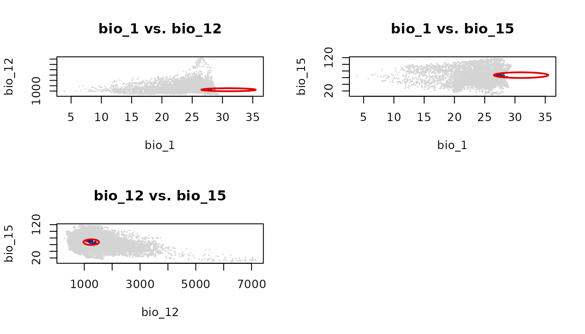

  

Each panel shows the ellipsoid projected onto a different pair of
environmental axes. The empty cell in the 2x2 grid is a consequence of
having three pairs and a layout that rounds up to four cells.

  

``` r
par(original_par)
```

  

## Save and import

Prediction outputs are standard R objects and can be saved using
standard functions. For `nicheR_ellipsoid` objects, use the
`save_nicheR` and `read_nicheR` functions.

``` r
temp_ellipse <- file.path(tempdir(), "ref_ellipse.rds")
save_nicheR(ref_ellipse, file = temp_ellipse)

ref_ellipse_imported <- read_nicheR(temp_ellipse)
```

  

``` r
temp_df   <- file.path(tempdir(), "predictions_df.csv")
temp_rast <- file.path(tempdir(), "predictions_rast.tif")

write.csv(pred_df, file = temp_df, row.names = FALSE)
terra::writeRaster(pred_rast, filename = temp_rast)

pred_df_imported   <- read.csv(temp_df)
pred_rast_imported <- terra::rast(temp_rast)
```
