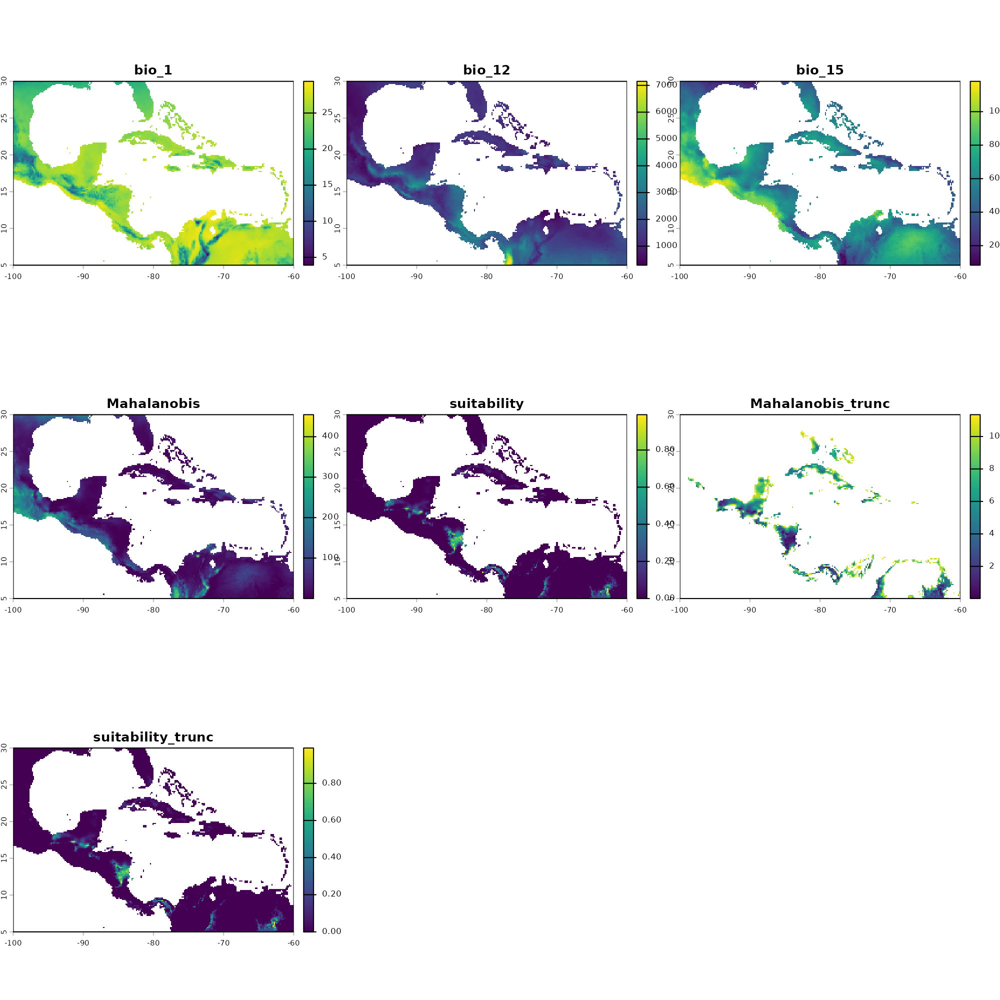
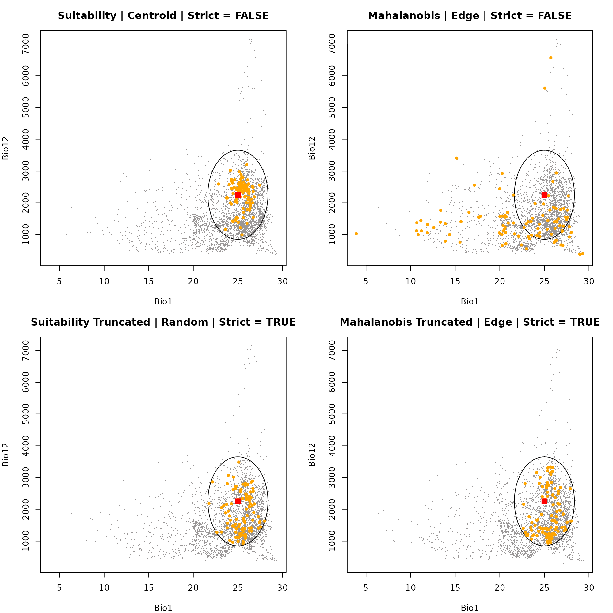
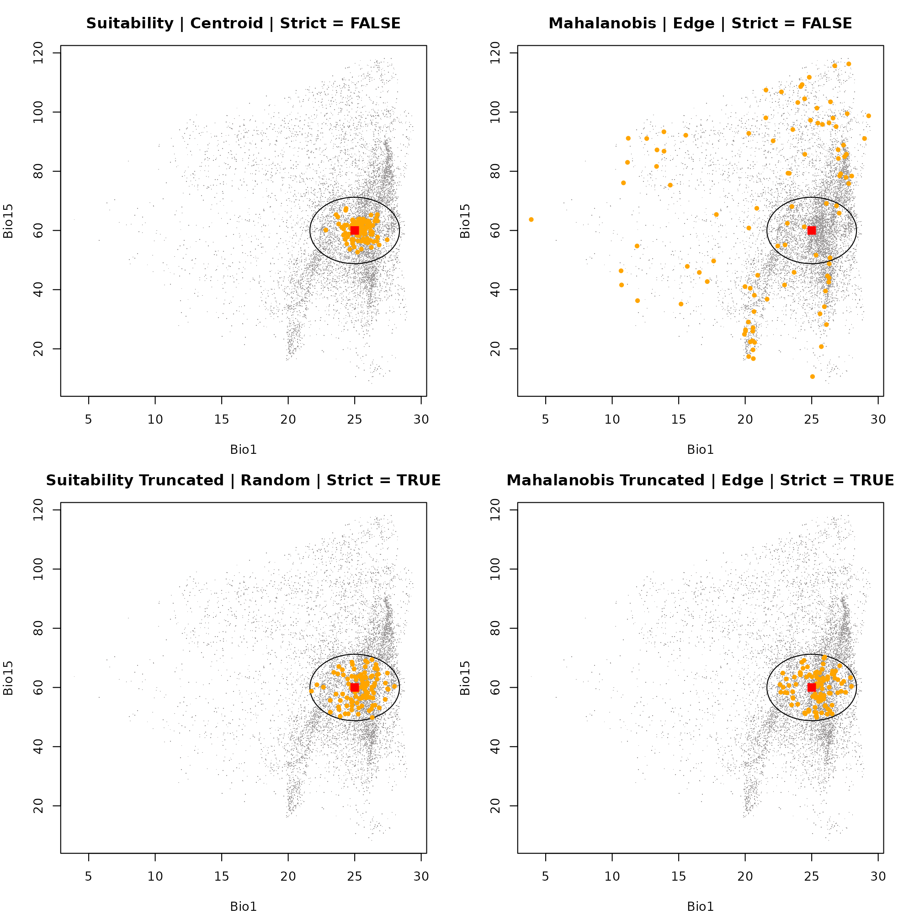
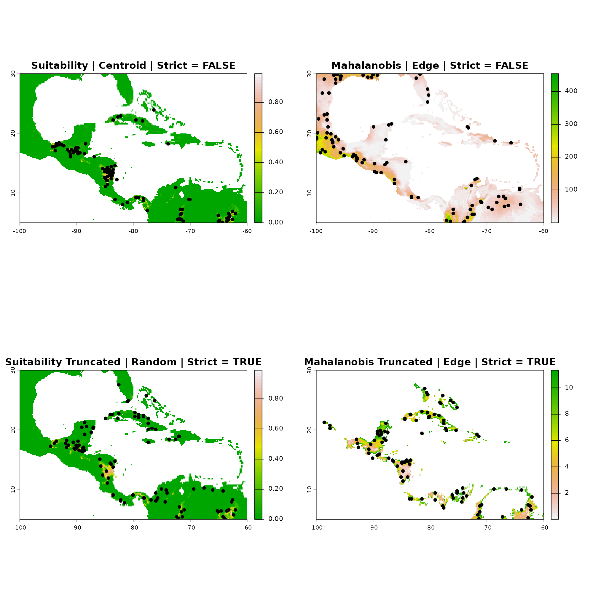

# Sampling occurrence data

### Summary

- [Description](#description)

- [Getting ready](#getting-ready)

- [Defining the Niche Space](#defining-the-niche-space)

- [Generating the Prediction
  Surface](#generating-the-prediction-surface)

- [Standard Occurrence Sampling](#standard-occurrence-sampling)

  - [Generating the Samples](#generating-the-samples)

  - [Visualizing in E-Space](#visualizing-in-e-space)

  - [Visualizing in G-Space](#visualizing-in-g-space)

------------------------------------------------------------------------

## Description

The `nicheR` package provides a flexible suite of sampling functions for
drawing occurrence points from raster layers, data frames, or virtual
species objects.

This vignette covers the first three steps of the core workflow:

1.  Defining the fundamental niche space in environmental dimensions
    ([`build_ellipsoid()`](https://castanedam.github.io/nicheR/reference/build_ellipsoid.md)).

2.  Projecting the niche to geographic space to generate a prediction
    surface
    ([`predict()`](https://rspatial.github.io/terra/reference/predict.html)).

3.  Sampling standard occurrence points and comparing their
    distributions in both environmental space (e-space) and geographic
    space (g-space)
    ([`sample_data()`](https://castanedam.github.io/nicheR/reference/sample_data.md)).

  

## Getting ready

First, we need to load the core packages required for our spatial and
niche operations.

``` r
# Load packages
library(nicheR)
library(terra)
```

  

## Defining the Niche Space

[`build_ellipsoid()`](https://castanedam.github.io/nicheR/reference/build_ellipsoid.md)

The first step in simulating or modeling species distributions is
defining the environmental conditions the species can tolerate (its
fundamental niche). We do this by defining ranges for environmental
variables and building a niche ellipsoid.

  

### Key Arguments

- **`range`**: A data frame where each column represents an
  environmental variable, and the rows contain the minimum and maximum
  tolerable values for the species.

``` r
# Load environmental covariates (Bio1, Bio12, Bio15)
bios_file <- system.file("extdata", "ma_bios.tif", package = "nicheR")
bios <- rast(bios_file)
vars <- c("bio_1", "bio_12", "bio_15")

# Define environmental ranges (Min and Max)
range_df <- data.frame(bio_1  = c(22, 28),
                       bio_12 = c(1000, 3500),
                       bio_15 = c(50, 70))

# Build ellipsoid niche model
ell <- build_ellipsoid(range = range_df)
#> Starting: building ellipsoidal niche from ranges...
#> Step: computing covariance matrix...
#> Step: computing additional ellipsoidal niche metrics...
#> Done: created ellipsoidal niche.
```

  

## Generating the Prediction Surface

[`predict()`](https://rspatial.github.io/terra/reference/predict.html)

Once the niche space is defined, we project it onto a geographic
landscape (a `SpatRaster` of environmental variables). This yields
spatial predictions of habitat suitability and environmental distance
(Mahalanobis distance).

  

### Key Arguments

- **`object`**: The ellipsoid object created in the previous step.

- **`newdata`**: A spatial raster (`SpatRaster`) containing the
  environmental layers for the geographic region.

- **`include_mahalanobis`**: Logical. If `TRUE`, calculates the
  Mahalanobis distance from the niche centroid for each pixel.

- **`include_suitability`**: Logical. If `TRUE`, converts the distances
  into a continuous habitat suitability index (0 to 1).

- **`suitability_truncated` / `mahalanobis_truncated`**: Logical. If
  `TRUE`, truncates the metrics so that areas strictly outside the
  defined ellipsoid limits are assigned a suitability of 0 (or maximum
  distance for Mahalanobis).

``` r
# Predict spatial surfaces based on the defined ellipsoid
pred <- predict(ell,
                newdata = bios,
                include_mahalanobis = TRUE,
                include_suitability = TRUE,
                suitability_truncated = TRUE,
                mahalanobis_truncated = TRUE,
                keep_data = TRUE)
#> Starting: suitability prediction using newdata of class: SpatRaster...
#> Step: Ignoring extra predictor columns: bio_5, bio_6, bio_7, bio_13, bio_14
#> Step: Using 3 predictor variables: bio_1, bio_12, bio_15
#> Done: Prediction completed successfully. Returned raster layers: bio_1, bio_12, bio_15, Mahalanobis, suitability, Mahalanobis_trunc, suitability_trunc

# Visualize the resulting continuous prediction layers
plot(pred)
```



  

## Standard Occurrence Sampling

[`sample_data()`](https://castanedam.github.io/nicheR/reference/sample_data.md)

**Objective:** To generate presence points from a continuous prediction
surface (e.g., habitat suitability or Mahalanobis distance) using
weighted random sampling.

  

### Key Arguments

- **`n_occ`**: The total number of occurrence points to sample.

- **`prediction`**: The multi-layer `SpatRaster` generated by
  [`predict()`](https://rspatial.github.io/terra/reference/predict.html).

- **`prediction_layer`**: The specific layer name within the raster to
  use as the base for our sampling weights (e.g., `"suitability"`,
  `"Mahalanobis_trunc"`).

- **`sampling`**: Determines the spatial bias of the sampling
  probability:

  - `"centroid"`: Samples more frequently from optimal conditions.

  - `"edge"`: Samples more frequently from marginal conditions.

  - `"random"`: Samples uniformly based strictly on the available space.

- **`method`**: Two weighting methods control the probability used to
  draw samples:

  - `"suitability"` — weights by suitability score.

  - `"mahalanobis"` — weights by Mahalanobis distance from the centroid.

- **`strict`**: Logical. If `TRUE`, the algorithm strictly forbids
  sampling in pixels outside the fundamental niche boundaries.

  

### Generating the Samples

Below, we generate four separate occurrence datasets reflecting
different theoretical sampling scenarios. We also extract the
environmental data for these points so we can plot them in e-space
later.

``` r
# Scenario A: Centroid Sampling from Suitability
# Generates points strongly biased toward the absolute best habitat.
# Suitability | Centroid | Strict = FALSE
occ_suit_cent <- sample_data(
  n_occ = 100,
  prediction = pred,
  prediction_layer = "suitability",
  sampling = "centroid",
  method = "suitability",
  seed = 123,
  strict = FALSE
)
#> Starting: sample_data()
#> Done: sampled 100 points.

# Scenario B: Edge Sampling from Mahalanobis Distance
# Simulates a species frequently found in its marginal/edge environments.
# Mahalanobis | Edge | Strict = FALSE
occ_maha_edge <- sample_data(
  n_occ = 100,
  prediction = pred,
  prediction_layer = "Mahalanobis",
  sampling = "edge",
  method = "mahalanobis",
  seed = 123,
  strict = FALSE
)
#> Starting: sample_data()
#> 
#> Done: sampled 100 points.

# Scenario C: Random Sampling from Truncated Suitability
# A proportional sample where points are restricted strictly to suitable areas.
# Suitability Truncated | Random | Strict = TRUE
occ_suit_trunc_rand <- sample_data(
  n_occ = 100,
  prediction = pred,
  prediction_layer = "suitability_trunc",
  sampling = "random",
  method = "suitability",
  seed = 123,
  strict = TRUE
)
#> Starting: sample_data()
#> 
#> Done: sampled 100 points.

# Scenario D: Edge Sampling from Truncated Mahalanobis Distance
# Marginal sampling, but strictly forbidden from crossing the hard threshold.
# Mahalanobis Truncated | Edge | Strict = TRUE
occ_maha_trunc_edge <- sample_data(
  n_occ = 100,
  prediction = pred,
  prediction_layer = "Mahalanobis_trunc",
  sampling = "edge",
  method = "mahalanobis",
  seed = 123,
  strict = TRUE
)
#> Starting: sample_data()
#> 
#> Done: sampled 100 points.
```

  

### Visualizing in E-Space

**E-Space** represents the n*-*dimensional coordinate system defined by
your environmental variables. By plotting our sampled points over the
[`build_ellipsoid()`](https://castanedam.github.io/nicheR/reference/build_ellipsoid.md)
object, we can see exactly where our sampled occurrences fall relative
to the species’ fundamental niche tolerances.

Notice how `"centroid"` sampling clusters points near the red square
(the optimal niche center), while `"edge"` sampling pushes points
outward toward the borders of the ellipsoid.

  

#### Dimension 1: Bio1 vs. Bio12

First, we will look at how the samples are distributed along the axes of
Annual Mean Temperature (Bio1) and Annual Precipitation (Bio12).

``` r
par(mfrow = c(2, 2), mar = c(4, 4, 3, 2)) 

# Plot 1: Suitability | Centroid
plot_ellipsoid(ell, background = as.data.frame(bios[[vars]]), dim = c(1, 2), pch = ".", col_bg = "#9a9797", 
               xlab = "Bio1", ylab = "Bio12", main = "Suitability | Centroid | Strict = FALSE")
add_data(occ_suit_cent, x = "bio_1", y = "bio_12", pts_col = "orange", pch = 20)
add_data(as.data.frame(t(ell$centroid)), x = "bio_1", y = "bio_12", pts_col = "red", pch = 15, cex = 1.5)

# Plot 2: Mahalanobis | Edge
plot_ellipsoid(ell, background = as.data.frame(bios[[vars]]), dim = c(1, 2), pch = ".", col_bg = "#9a9797", 
               xlab = "Bio1", ylab = "Bio12", main = "Mahalanobis | Edge | Strict = FALSE")
add_data(occ_maha_edge, x = "bio_1", y = "bio_12", pts_col = "orange", pch = 20)
add_data(as.data.frame(t(ell$centroid)), x = "bio_1", y = "bio_12", pts_col = "red", pch = 15, cex = 1.5)

# Plot 3: Suitability Truncated | Random
plot_ellipsoid(ell, background = as.data.frame(bios[[vars]]), dim = c(1, 2), pch = ".", col_bg = "#9a9797", 
               xlab = "Bio1", ylab = "Bio12", main = "Suitability Truncated | Random | Strict = TRUE")
add_data(occ_suit_trunc_rand, x = "bio_1", y = "bio_12", pts_col = "orange", pch = 20)
add_data(as.data.frame(t(ell$centroid)), x = "bio_1", y = "bio_12", pts_col = "red", pch = 15, cex = 1.5)

# Plot 4: Mahalanobis Truncated | Edge
plot_ellipsoid(ell, background = as.data.frame(bios[[vars]]), dim = c(1, 2), pch = ".", col_bg = "#9a9797", 
               xlab = "Bio1", ylab = "Bio12", main = "Mahalanobis Truncated | Edge | Strict = TRUE")
add_data(occ_maha_trunc_edge, x = "bio_1", y = "bio_12", pts_col = "orange", pch = 20)
add_data(as.data.frame(t(ell$centroid)), x = "bio_1", y = "bio_12", pts_col = "red", pch = 15, cex = 1.5)
```



``` r

dev.off()
#> null device 
#>           1
```

  

#### Dimension 2: Bio1 vs. Bio115

Next, we swap out our Y-axis to visualize the exact same points, but now
looking at their distribution relative to Precipitation Seasonality
(Bio15).

``` r
par(mfrow = c(2, 2), mar = c(4, 4, 3, 2)) 

# Plot 1: Suitability | Centroid
plot_ellipsoid(ell, background = as.data.frame(bios[[vars]]), dim = c(1, 3), pch = ".", col_bg = "#9a9797", 
               xlab = "Bio1", ylab = "Bio15", main = "Suitability | Centroid | Strict = FALSE")
add_data(occ_suit_cent, x = "bio_1", y = "bio_15", pts_col = "orange", pch = 20)
add_data(as.data.frame(t(ell$centroid)), x = "bio_1", y = "bio_15", pts_col = "red", pch = 15, cex = 1.5)

# Plot 2: Mahalanobis | Edge
plot_ellipsoid(ell, background = as.data.frame(bios[[vars]]), dim = c(1, 3), pch = ".", col_bg = "#9a9797", 
               xlab = "Bio1", ylab = "Bio15", main = "Mahalanobis | Edge | Strict = FALSE")
add_data(occ_maha_edge, x = "bio_1", y = "bio_15", pts_col = "orange", pch = 20)
add_data(as.data.frame(t(ell$centroid)), x = "bio_1", y = "bio_15", pts_col = "red", pch = 15, cex = 1.5)

# Plot 3: Suitability Truncated | Random
plot_ellipsoid(ell, background = as.data.frame(bios[[vars]]), dim = c(1, 3), pch = ".", col_bg = "#9a9797", 
               xlab = "Bio1", ylab = "Bio15", main = "Suitability Truncated | Random | Strict = TRUE")
add_data(occ_suit_trunc_rand, x = "bio_1", y = "bio_15", pts_col = "orange", pch = 20)
add_data(as.data.frame(t(ell$centroid)), x = "bio_1", y = "bio_15", pts_col = "red", pch = 15, cex = 1.5)

# Plot 4: Mahalanobis Truncated | Edge
plot_ellipsoid(ell, background = as.data.frame(bios[[vars]]), dim = c(1, 3), pch = ".", col_bg = "#9a9797", 
               xlab = "Bio1", ylab = "Bio15", main = "Mahalanobis Truncated | Edge | Strict = TRUE")
add_data(occ_maha_trunc_edge, x = "bio_1", y = "bio_15", pts_col = "orange", pch = 20)
add_data(as.data.frame(t(ell$centroid)), x = "bio_1", y = "bio_15", pts_col = "red", pch = 15, cex = 1.5)
```



``` r

dev.off()
#> null device 
#>           1
```

  

### Visualizing in G-Space

**G-Space** represents the physical, real-world landscape defined by
spatial coordinates (Longitude vs. Latitude). Here, we plot the exact
same four datasets on top of their respective prediction maps.

This duality reveals how clustering in the center of E-Space translates
to points occurring in the highest suitability geographic patches,
whereas E-Space edge sampling translates to points scattered in
peripheral, marginal habitats on the map.

``` r
par(mfrow = c(2, 2), mar = c(4, 4, 3, 2)) 

# Plot 1: Suitability | Centroid | Strict = FALSE
plot(pred[["suitability"]], main = "Suitability | Centroid | Strict = FALSE", col = grDevices::terrain.colors(50))
points(occ_suit_cent[, c(1:2)], pch = 20, col = "black", cex = 1.2)

# Plot 2: Mahalanobis | Edge | Strict = FALSE
plot(pred[["Mahalanobis"]], main = "Mahalanobis | Edge | Strict = FALSE", col = rev(grDevices::terrain.colors(50)))
points(occ_maha_edge[, c(1:2)], pch = 20, col = "black", cex = 1.2)

# Plot 3: Truncated Suitability | Random | Strict = TRUE
plot(pred[["suitability_trunc"]], main = "Suitability Truncated | Random | Strict = TRUE", col = grDevices::terrain.colors(50))
points(occ_suit_trunc_rand[, c(1:2)], pch = 20, col = "black", cex = 1.2)

# Plot 4: Truncated Mahalanobis | Edge | Strict = TRUE
plot(pred[["Mahalanobis_trunc"]], main = "Mahalanobis Truncated | Edge | Strict = TRUE", col = rev(grDevices::terrain.colors(50)))
points(occ_maha_trunc_edge[, c(1:2)], pch = 20, col = "black", cex = 1.2)
```



``` r

dev.off()
#> null device 
#>           1
```
