# Virtual community simulation

## Summary

- [Description](#description)
- [Getting ready](#getting-ready)
- [Loading example data](#loading-example-data)
- [Simulating a random community](#simulating-a-random-community)
  - [Effect of background density](#effect-of-background-density)
  - [Effect of proportion arguments](#effect-of-proportion-arguments)
- [Simulating nested communities](#simulating-nested-communities)
  - [Effect of proportion argument](#effect-of-proportion-argument)
  - [Effect of bias argument](#effect-of-bias-argument)
- [Niche conservatism in
  communities](#niche-conservatism-in-communities)
  - [Effect of background density](#effect-of-background-density)
  - [Effect of proportion arguments](#effect-of-proportion-arguments)
- [Predictions for communities](#predictions-for-communities)
  - [Predict to data frames](#predictions-to-data-frames)
  - [Predict to SpatRaster](#predictions-to-spatraster)
  - [Truncating predictions](#truncating-predictions)
  - [Simple community outcomes](#simple-community-outcomes)
- [Save and import](#save-and-import)

------------------------------------------------------------------------

## Description

This vignette shows how to simulate virtual communities using functions
in the nicheR package. For our purposes, we will consider a community a
set of species niches (ellipses) that are distributed in a given
environmental space. The simulation of virtual communities is useful to
generate hypothetical scenarios of community assembly and explore
patterns derived from the way species are distributed in envrionmental
and geographical space.

The main functions that automate community simulations in `nicheR` are:

- [`random_ellipses()`](https://castanedam.github.io/nicheR/reference/random_ellipses.md):
  generates a set of random ellipses in the environmental space
  provided. A scenario in which niche conservatism is not present.
- [`nested_ellipses()`](https://castanedam.github.io/nicheR/reference/nested_ellipses.md):
  generates a set of nested ellipses taking the reference niche as the
  biggest possible ellipse. A scenario in which all species niches are
  contained within the reference niche, and each is contained within the
  previous one.
- [`conserved_ellipses()`](https://castanedam.github.io/nicheR/reference/conserved_ellipses.md):
  generates a set of ellipses in the environmental space provided aiming
  for a set of ellipses that are similar to the reference niche. A
  scenario of niche conservatism.

  

## Getting ready

If `nicheR` has not been installed yet, please do so. See the [Main
guide](https://castanedam.github.io/nicheR/articles/index.md) for
installation instructions.

Use the following lines of code to load `nicheR` and other packages
needed for this vignette, and to set a working directory (if necessary).

Note: We will display functions from other packages as
`package::function()`.

``` r
# Load packages
library(nicheR)
#library(terra)

# Current directory
getwd()

# Define new directory
#setwd("YOUR/DIRECTORY")  # modify if setting a new directory

# Saving original plotting parameters
original_par <- par(no.readonly = TRUE)
```

  

## Loading example data

The lines of code below help us load the data to run our example
comunity simulations. The data are included in the `nicheR` package and
consist of an `nicheR_ellipsoid` object with a reference niche defined
by two environmental variables (bio1 and bio12) and these envrionmental
variables for North America to represent the background for our
simulations.

``` r
# Reference niche
data("ref_ellipse", package = "nicheR")

# Background data
data("back_data", package = "nicheR")

# Raster layers for predictions
ma_bios <- terra::rast(system.file("extdata", "ma_bios.tif",
                                   package = "nicheR"))
```

  

Let’s take a look at the reference niche and the background data to get
familiar with them before we start simulating communities. The raster
layers will be used later for predictions, so we will just check them
here to make sure they are loaded correctly.

``` r
# Check reference niche
print(ref_ellipse)
#> nicheR Ellipsoid Object
#> -----------------------
#> Dimensions:        2D
#> Chi-square cutoff: 9.21
#> Centroid (mu):     23.5, 1750
#> 
#> Covariance matrix:
#>           bio_1 bio_12
#> bio_1     1.361   -100
#> bio_12 -100.000  62500
#> 
#> Ellipsoid semi-axis lengths:
#>   758.715, 3.326
#> 
#> Ellipsoid axis endpoints:
#>  Axis 1:
#>           bio_1   bio_12
#> vertex_a 24.714  991.286
#> vertex_b 22.286 2508.714
#> 
#>  Axis 2:
#>           bio_1   bio_12
#> vertex_a 26.826 1750.005
#> vertex_b 20.174 1749.995
#> 
#> Ellipsoid volume:  7927.882

# Check background data
head(back_data)
#>           x        y    bio_1    bio_5   bio_6    bio_7 bio_12 bio_13 bio_14
#> 1 -99.91667 29.91667 18.16097 33.23550 0.86900 32.36650    680     84     26
#> 2 -99.75000 29.91667 18.06556 33.32575 0.65550 32.67025    703     87     28
#> 3 -99.58333 29.91667 17.95946 33.33925 0.44600 32.89325    725     92     31
#> 4 -99.41667 29.91667 18.01018 33.34200 0.62200 32.72000    734     95     33
#> 5 -99.25000 29.91667 18.14458 33.40400 0.99125 32.41275    748     97     34
#> 6 -99.08333 29.91667 18.36623 33.76550 1.02025 32.74525    771    101     36
#>     bio_15
#> 1 39.75968
#> 2 38.44158
#> 3 37.43598
#> 4 36.24147
#> 5 34.95365
#> 6 33.73626

# Check the raster layers
ma_bios
#> class       : SpatRaster 
#> size        : 150, 240, 8  (nrow, ncol, nlyr)
#> resolution  : 0.1666667, 0.1666667  (x, y)
#> extent      : -100, -60, 5, 30  (xmin, xmax, ymin, ymax)
#> coord. ref. : lon/lat WGS 84 (EPSG:4326) 
#> source      : ma_bios.tif 
#> names       :    bio_1,   bio_5, bio_6,    bio_7, bio_12, bio_13, ... 
#> min values  :  3.91325,  8.4285, -0.39,  5.90000,    291,     65, ... 
#> max values  : 29.39055, 37.8985, 24.70, 32.89325,   7150,    767, ...
```

  

Now, let’s plot the reference niche and the background data to visualize
the environmental space in which we will simulate our communities. We
will use the
[`plot_ellipsoid()`](https://castanedam.github.io/nicheR/reference/plot_ellipsoid.md)
function to plot the reference niche and the background data together.

``` r
# Pick the variables for the background data
vars <- c("bio_1", "bio_12")

# Plotting the background data to visualize the environmental space
mars <- c(4, 4, 2, 1)
par(mar = mars)  # adjust margins for better visualization

plot_ellipsoid(ref_ellipse, background = back_data[, vars],
               pch = ".", col_bg = "#9a9797", lwd = 2,
               xlab = "Bio1 (Mean Annual Temperature)",
               ylab = "Bio12 (Annual Precipitation)",
               main = "Reference Niche and Background Environmental Space")
```

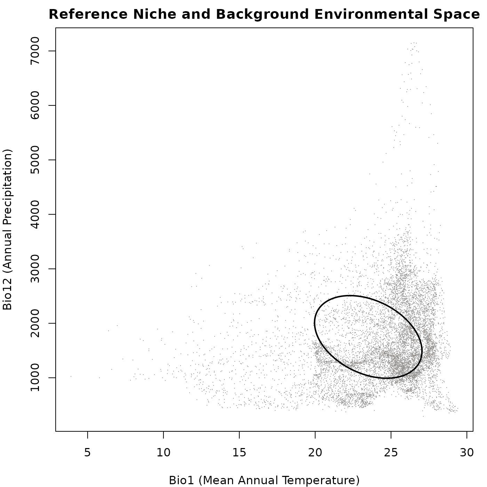

  

## Simulating random communities

The
[`random_ellipses()`](https://castanedam.github.io/nicheR/reference/random_ellipses.md)
function helps to create a community of species with niches that are
randomly distributed in the environmental space. The size and shape of
these niches are constrained by the reference niche but they vary. Below
we show an general example of how to use this function.

``` r
# Simulating the community
rand_comm <- random_ellipses(object = ref_ellipse,
                             background = back_data[, vars],
                             n = 20)  # number of species in the community

# check the a few details from the generated community
names(rand_comm)  # elements in the community object
#> [1] "details"           "reference"         "ellipse_community"

print(rand_comm)  # a summary of the elements in the community object
#> nicheR Community Object
#> -----------------------
#> Generation Metadata:
#>   Pattern:            random
#>   Number of ellipses: 20
#>   Smallest prop.:     0.1
#>   Largest prop.:      1
#>   Thin background:    FALSE
#>   Resolution:         50
#>   Random seed:        1
#> 
#> Reference ellipsoid summary:
#>   Dimensions:        2D
#>   Variables:         bio_1, bio_12
#>   Centroid (mu):     23.5, 1750
#>   Ellipsoid volume:  7927.882
#> 
#> Community summary (n = 20 ):
#>   Centroid positions | mean (+/-SD):
#>    bio_1: 23.979 (+/-3.693)
#>    bio_12: 1812.35 (+/-984.717)
#> 
#>   Ellipsoid volumes:
#>    Mean: 3986.409
#>    SD:   1340.256
```

  

Now let’s plot the generated community to visualize the distribution of
the random ellipses in environmental space. We will use the
[`plot_community()`](https://castanedam.github.io/nicheR/reference/plot_community.md)
function for this purpose.

``` r
# Plotting the community
par(mar = mars)  # adjust margins for better visualization

plot_community(rand_comm, background = back_data[, vars],
               pch = ".", col_bg = "#9a9797",
               xlab = "Bio1 (Mean Annual Temperature)",
               ylab = "Bio12 (Annual Precipitation)",
               main = "Community of Random Ellipses")
```

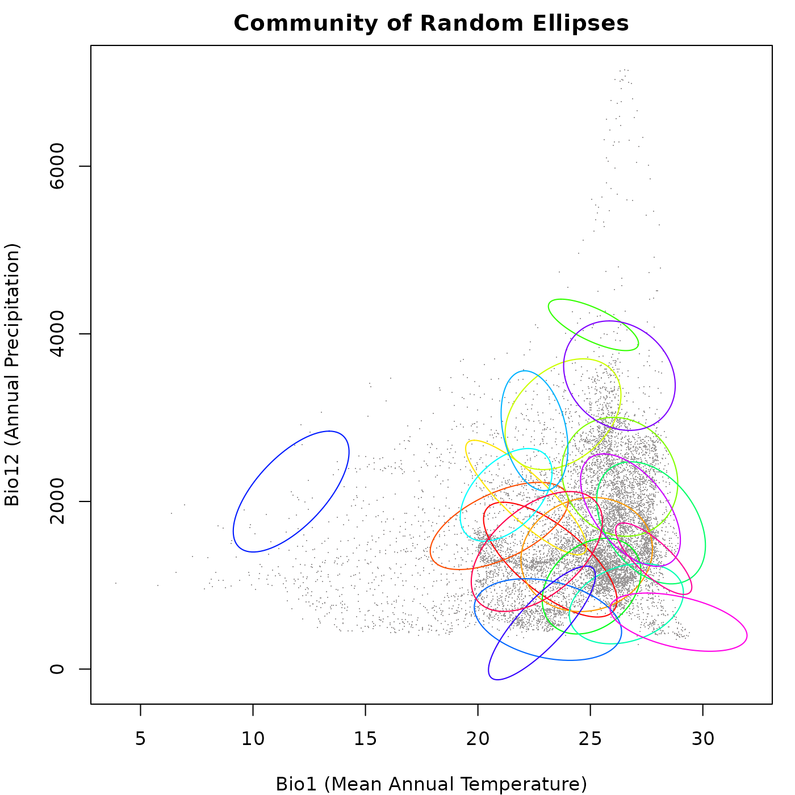

  

### Effect of background density

As the
[`random_ellipses()`](https://castanedam.github.io/nicheR/reference/random_ellipses.md)
function uses the background as a reference to pick ellipse centroids,
the density of the background data can affect the distribution of these
ellipses. If the background data is dense in certain areas of the
environmental space, it may lead to a higher concentration of ellipses
in those areas, while sparse background data may result in fewer
ellipses being generated in those regions. This can influence the
overall structure and diversity of the simulated community, as well as
the patterns observed in niche overlap and species interactions.

The example below shows how the density of the background can affect the
distribution of random ellipses in the environmental space. We will
simulate two communities: (1) using the full background as reference,
and (2) using the arguments thin_background and resolution to reduce the
effect of uneven point density. We will increase the number of species
in the community to better visualize the effect of background density on
the distribution of ellipses.

``` r
# Simulating the community with the full background
rand_comm_full <- random_ellipses(object = ref_ellipse,
                                  background = back_data[, vars], n = 25)

# Simulating the community with a thinned background
rand_comm_thin <- random_ellipses(object = ref_ellipse,
                                  background = back_data[, vars], n = 25,
                                  thin_background = TRUE, resolution = 20)
```

  

Let’s check the distribution of ellipses in the two communities with a
plot to visualize the effect of the arguments `thin_background` and
`resolution`.

``` r
# Plotting the communities
par(mfrow = c(1, 2), cex = 0.6, mar = mars)  # set up the plotting area

## Plotting the community with the full background
plot_community(rand_comm_full, background = back_data[, vars],
               pch = ".", col_bg = "#9a9797",
               xlab = "Bio1 (Mean Annual Temperature)",
               ylab = "Bio12 (Annual Precipitation)",
               main = "Random Community from Full Background")

## Plotting the community with the thinned background
plot_community(rand_comm_thin, background = back_data[, vars],
               pch = ".", col_bg = "#9a9797",
               xlab = "Bio1 (Mean Annual Temperature)",
               ylab = "Bio12 (Annual Precipitation)",
               main = "Random Community from Thinned Background")
```

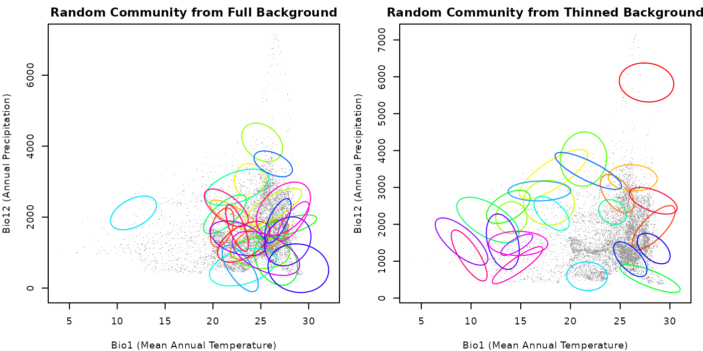

  

As you can see in the plots, the community generated with the full
background has a higher concentration of ellipses in areas where the
background data is denser, whereas the community created with thinned
background has a more even distribution of ellipses. This highlights the
importance of considering this factor when simulating communities using
random ellipses. Play with the value for the argument `resolution` to
see how it can affect the distribution of ellipses in the community.
Keep in mind that the largest the value for this argument, the more
points will be available for the function to pick centroids.

  

### Effect of proportion arguments

The size of the ellipses in the communities is determined by the
reference niche and the arguments `smallest_proportion` and
`largest_proportion` in the
[`random_ellipses()`](https://castanedam.github.io/nicheR/reference/random_ellipses.md)
function. Based on the reference niche, playing with the values for the
areguments `smallest_proportion` and `largest_proportion` can help
explore scenarios with . This can affect elements of the community
structure such as the level of niche overlap observed among the species
(ellipses).

The example below shows how these proportions can affect the coverage
and overlap of random ellipses in environmental space. Considering that
`smallest_proportion` must be smaller than `largest_proportion`, we will
simulate four communities: (1) both arguments are small; and (2) both
arguments are large; (3) `smallest_proportion` is large and
`largest_proportion` is small; and (4) `smallest_proportion` is small
and `largest_proportion` is large. We will thin the background in both
cases to reduce the effect of uneven point density and better visualize
the effect of the proportion arguments.

``` r
# Community with both arguments small
rand_comm1 <- random_ellipses(object = ref_ellipse,
                              background = back_data[, vars], n = 25,
                              thin_background = TRUE, resolution = 20,
                              smallest_proportion = 0.1,
                              largest_proportion = 0.5)

# Community with both arguments large
rand_comm2 <- random_ellipses(object = ref_ellipse,
                              background = back_data[, vars], n = 25,
                              thin_background = TRUE, resolution = 20,
                              smallest_proportion = 0.7,
                              largest_proportion = 1.5)

# Community with smallest_proportion large and largest_proportion small
rand_comm3 <- random_ellipses(object = ref_ellipse,
                              background = back_data[, vars], n = 25,
                              thin_background = TRUE, resolution = 20,
                              smallest_proportion = 0.5,
                              largest_proportion = 0.7)

# Community with smallest_proportion small and largest_proportion large
rand_comm4 <- random_ellipses(object = ref_ellipse,
                              background = back_data[, vars], n = 25,
                              thin_background = TRUE, resolution = 20,
                              smallest_proportion = 0.1,
                              largest_proportion = 1.5)
```

  

Let’s check the distribution of ellipses in the two communities with a
plot to visualize the effect of the proportion arguments.

``` r
# Plotting the communities
par(mfrow = c(2, 2), cex = 0.6, mar = mars)  # set up the plotting area

## Community with small proportions
plot_community(rand_comm1, background = back_data[, vars],
               pch = ".", col_bg = "#9a9797",
               xlab = "Bio1 (Mean Annual Temperature)",
               ylab = "Bio12 (Annual Precipitation)",
               main = "Random Community with Small Proportions")

## Community with large proportions
plot_community(rand_comm2, background = back_data[, vars],
               pch = ".", col_bg = "#9a9797",
               xlab = "Bio1 (Mean Annual Temperature)",
               ylab = "Bio12 (Annual Precipitation)",
               main = "Random Community with Large Proportions")

## Community with large smallest_proportion and small largest_proportion
plot_community(rand_comm3, background = back_data[, vars],
               pch = ".", col_bg = "#9a9797",
               xlab = "Bio1 (Mean Annual Temperature)",
               ylab = "Bio12 (Annual Precipitation)",
               main = "Random Community with Large and Small")

## Community with small smallest_proportion and large largest_proportion
plot_community(rand_comm4, background = back_data[, vars],
               pch = ".", col_bg = "#9a9797",
               xlab = "Bio1 (Mean Annual Temperature)",
               ylab = "Bio12 (Annual Precipitation)",
               main = "Random Community with Small and Large")
```

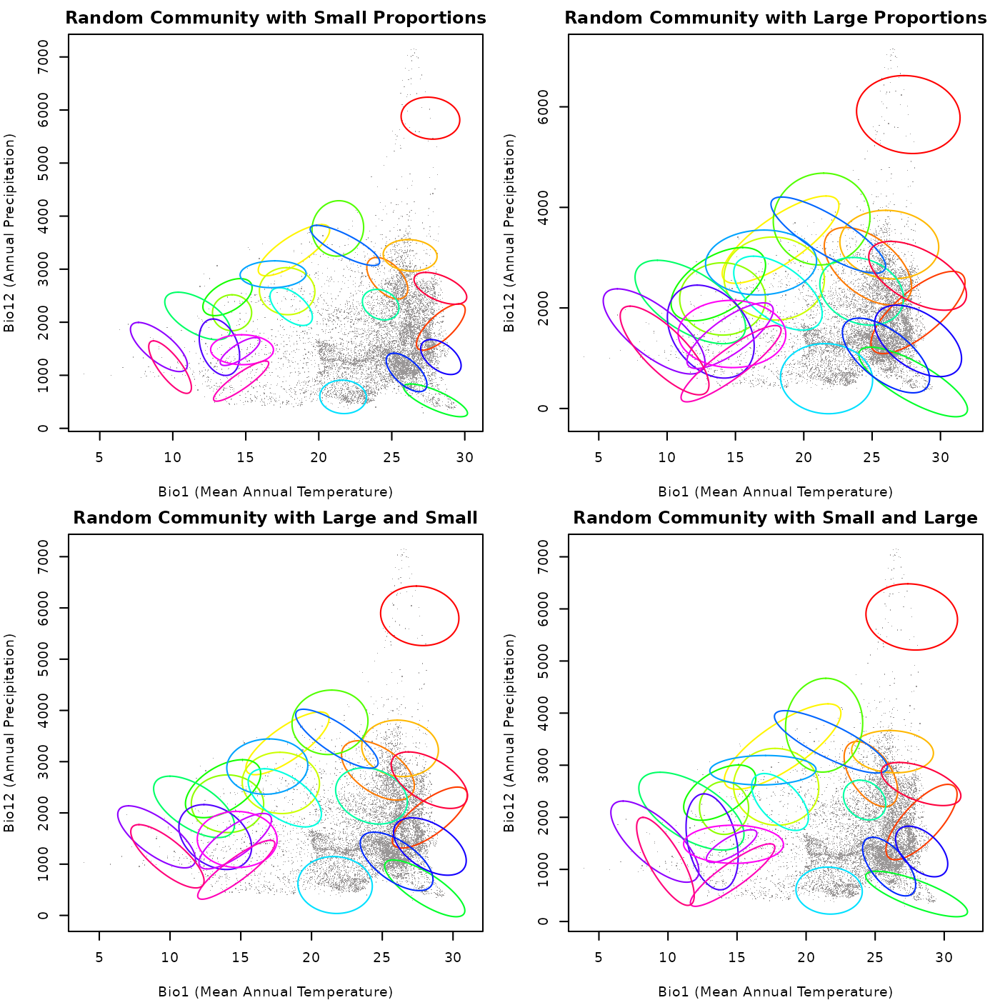

  

As shown in the plots, when both arguments are small, the ellipses are
generally smaller and there is less overlap among them. When both
arguments are large, the ellipses tend to be larger and there is more
overlap among them. When `smallest_proportion` is large and
`largest_proportion` is small, the ellipses tend to be of intermediate
size. Finally, when `smallest_proportion` is small and
`largest_proportion` is large, the ellipses tend to be more variable in
size. This highlights how the size of the ellipses can affect the
structure of the community and the “interactions” among species niches
(ellipses). Play with the values for these arguments to explore
different scenarios and pick the ones that are more convinient for your
research.

  

## Simulating nested communities

The
[`nested_ellipses()`](https://castanedam.github.io/nicheR/reference/nested_ellipses.md)
function helps to create a community of species with niches that are
nested in the environmental space. The size and shape of these niches
are constrained by the reference niche but they vary. Below we show an
general example of how to use this function.

``` r
# Simulating the community
nest_comm <- nested_ellipses(object = ref_ellipse, n = 20)

# check the a few details from the generated community
print(nest_comm)  # a summary of the elements in the community object
#> nicheR Community Object
#> -----------------------
#> Generation Metadata:
#>   Pattern:            nested
#>   Number of ellipses: 20
#>   Smallest prop.:     0.1
#>   Bias exponent:      1
#> 
#> Reference ellipsoid summary:
#>   Dimensions:        2D
#>   Variables:         bio_1, bio_12
#>   Centroid (mu):     23.5, 1750
#>   Ellipsoid volume:  7927.882
#> 
#> Community summary (n = 20 ):
#>   Centroid positions | mean (+/-SD):
#>    bio_1: 23.5 (+/-0)
#>    bio_12: 1750 (+/-0)
#> 
#>   Ellipsoid volumes:
#>    Mean: 2989.646
#>    SD:   2502.944
```

  

Now let’s plot the generated community to visualize the distribution of
the nested ellipses in environmental space. We will use the
[`plot_community()`](https://castanedam.github.io/nicheR/reference/plot_community.md)
function for this purpose.

``` r
# Plotting the community
par(mfrow = c(1, 2), cex = 0.6, mar = mars)  # set up the plotting area

## Plotting the community of nested ellipses
plot_community(nest_comm,
               xlab = "Bio1 (Mean Annual Temperature)",
               ylab = "Bio12 (Annual Precipitation)",
               main = "Community of Nested Ellipses")

## Plotting the community of nested ellipses with the background
plot_community(nest_comm, background = back_data[, vars],
               pch = ".", col_bg = "#9a9797",
               xlab = "Bio1 (Mean Annual Temperature)",
               ylab = "Bio12 (Annual Precipitation)",
               main = "Nested Community with Background")
```

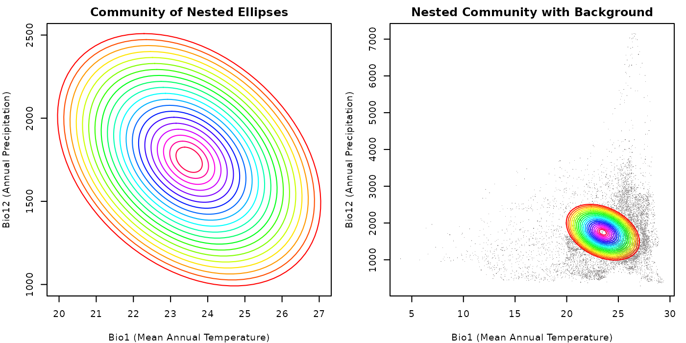

  

Despite the fact that background was not used to create nested ellipses,
since the reference niche is located in the same environmental space, we
can see how the generated ellipses are distributed in that space. The
nested structure of the community is evident in both plots, with each
ellipse being contained within the previous one.

  

### Effect of proportion argument

An important arument in the
[`nested_ellipses()`](https://castanedam.github.io/nicheR/reference/nested_ellipses.md)
function is `smallest_proportion`, which determines the size of the
smallest nested ellipse to be generated, in relation to the reference
niche. A smaller value for `smallest_proportion` will result in a
greater range of ellipse sizes.

``` r
# Simulating the community with a small smallest_proportion
nest_comm_small <- nested_ellipses(object = ref_ellipse, n = 20,
                                   smallest_proportion = 0.1)

# Simulating the community with a large smallest_proportion
nest_comm_large <- nested_ellipses(object = ref_ellipse, n = 20,
                                   smallest_proportion = 0.6)

# Lets check the volume stats for the communities for comparison
## Communities with small smallest_proportion
mean(sapply(nest_comm_small$ellipse_community, function(x) x$volume))
#> [1] 2989.646

## Communities with large smallest_proportion
mean(sapply(nest_comm_large$ellipse_community, function(x) x$volume))
#> [1] 5190.676
```

  

Below we plot the two communities to visualize the effect of the
argument `smallest_proportion` on the distribution of nested ellipses in
environmental space.

``` r
# Plotting the communities
par(mfrow = c(1, 2), cex = 0.6, mar = mars)  # set up the plotting area

## Plotting the community with a small smallest_proportion
plot_community(nest_comm_small,
               xlab = "Bio1 (Mean Annual Temperature)",
               ylab = "Bio12 (Annual Precipitation)",
               main = "Nested with Small Proportion")

## Plotting the community with a large smallest_proportion
plot_community(nest_comm_large,
               xlab = "Bio1 (Mean Annual Temperature)",
               ylab = "Bio12 (Annual Precipitation)",
               main = "Nested with Large Proportion")
```

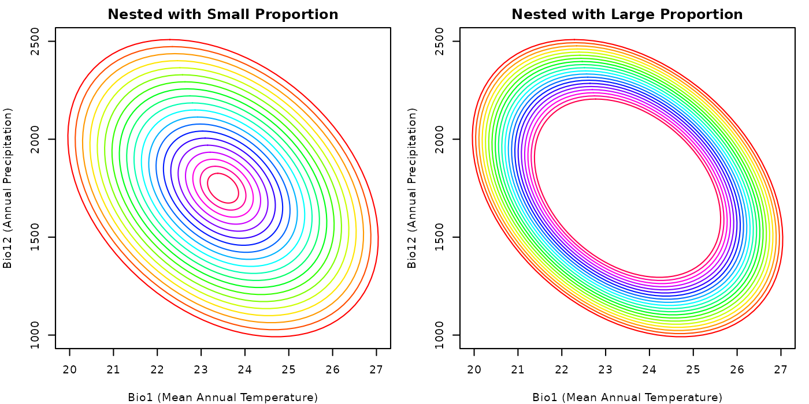

  

From the plot, it is clear why the mean volume of the ellipses in the
community with a small `smallest_proportion` is smaller than the mean
volume of the ellipses in the community with a large
`smallest_proportion`.

  

### Effect of bias argument

Another important arument in the
[`nested_ellipses()`](https://castanedam.github.io/nicheR/reference/nested_ellipses.md)
function is `bias`, which determines the degree of bias towards
generating smaller or larger ellipses in the community. A value of
`bias` clusters ellipses toward the border of the reference ellipse,
whereas a value greater than 1 clusters them toward the centroid of the
reference ellipse. We will keep the value for `smallest_proportion` the
same in both cases to better visualize the effect of the argument
`bias`.

``` r
# Simulating the community with a bias towards the border
nest_comm_small_bias <- nested_ellipses(object = ref_ellipse, n = 20,
                                        smallest_proportion = 0.1, bias = 0.2)

# Simulating the community with a bias towards the centroid
nest_comm_large_bias <- nested_ellipses(object = ref_ellipse, n = 20,
                                        smallest_proportion = 0.1, bias = 2)

# Lets check the volume stats for the communities for comparison
## Community with bias towards the border
mean(sapply(nest_comm_small_bias$ellipse_community, function(x) x$volume))
#> [1] 5725.061

## Community with bias towards the centroid
mean(sapply(nest_comm_large_bias$ellipse_community, function(x) x$volume))
#> [1] 1953.741
```

  

Now, let’s plot the two communities to visualize the effect of the
argument `bias` on the distribution of nested ellipses in environmental
space.

``` r
# Plotting the communities
par(mfrow = c(1, 2), cex = 0.6, mar = mars)  # set up the plotting area

## Plotting the community with a bias towards the border
plot_community(nest_comm_small_bias,
               xlab = "Bio1 (Mean Annual Temperature)",
               ylab = "Bio12 (Annual Precipitation)",
               main = "Nested with Bias Towards Border")

## Plotting the community with a bias towards the centroid
plot_community(nest_comm_large_bias,
               xlab = "Bio1 (Mean Annual Temperature)",
               ylab = "Bio12 (Annual Precipitation)",
               main = "Nested with Bias Towards Centroid")
```

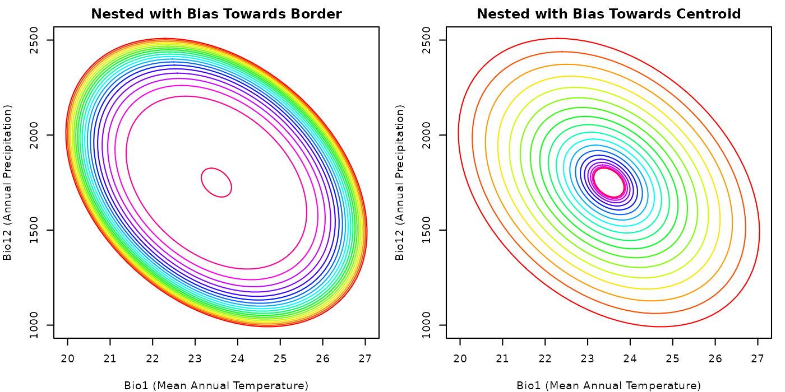

  

The plots clearly show the effect of the argument `bias` on the
distribution of nested ellipses. A community created with `bias` values
close to zero will tend to have larger volumes than one created with
values larger than one. We used these values only for reference, play
with the argument to explore different scenarios and pick the one that
helps you explore your questions.

  

## Niche conservatism in communities

The function `conserved_ellipses` creates a ellipses based on a
reference ellipse aiming for a set of results that are similar to the
reference. To do that centroids for the new ellipses are sampled from a
background with a bias towards the centroid of the reference ellipse. A
general example of how to use this function is shown below.

``` r
# Simulating the community
cons_comm <- conserved_ellipses(object = ref_ellipse,
                                background = back_data[, vars],
                                n = 20)

# check the a few details from the generated community
print(cons_comm)  # a summary of the elements in the community object
#> nicheR Community Object
#> -----------------------
#> Generation Metadata:
#>   Pattern:            conserved
#>   Number of ellipses: 20
#>   Smallest prop.:     0.1
#>   Largest prop.:      1
#>   Thin background:    FALSE
#>   Resolution:         100
#>   Random seed:        1
#> 
#> Reference ellipsoid summary:
#>   Dimensions:        2D
#>   Variables:         bio_1, bio_12
#>   Centroid (mu):     23.5, 1750
#>   Ellipsoid volume:  7927.882
#> 
#> Community summary (n = 20 ):
#>   Centroid positions | mean (+/-SD):
#>    bio_1: 23.691 (+/-0.952)
#>    bio_12: 1577.7 (+/-197.577)
#> 
#>   Ellipsoid volumes:
#>    Mean: 3756.766
#>    SD:   1539.154
```

  

The plot below shows the generated community.

``` r
# Plotting the community withe the background
par(mar = mars)  # adjust margins for better visualization

plot_community(cons_comm, background = back_data[, vars],
               pch = ".", col_bg = "#9a9797",
               xlab = "Bio1 (Mean Annual Temperature)",
               ylab = "Bio12 (Annual Precipitation)",
               main = "Community of Conserved Ellipses")
```

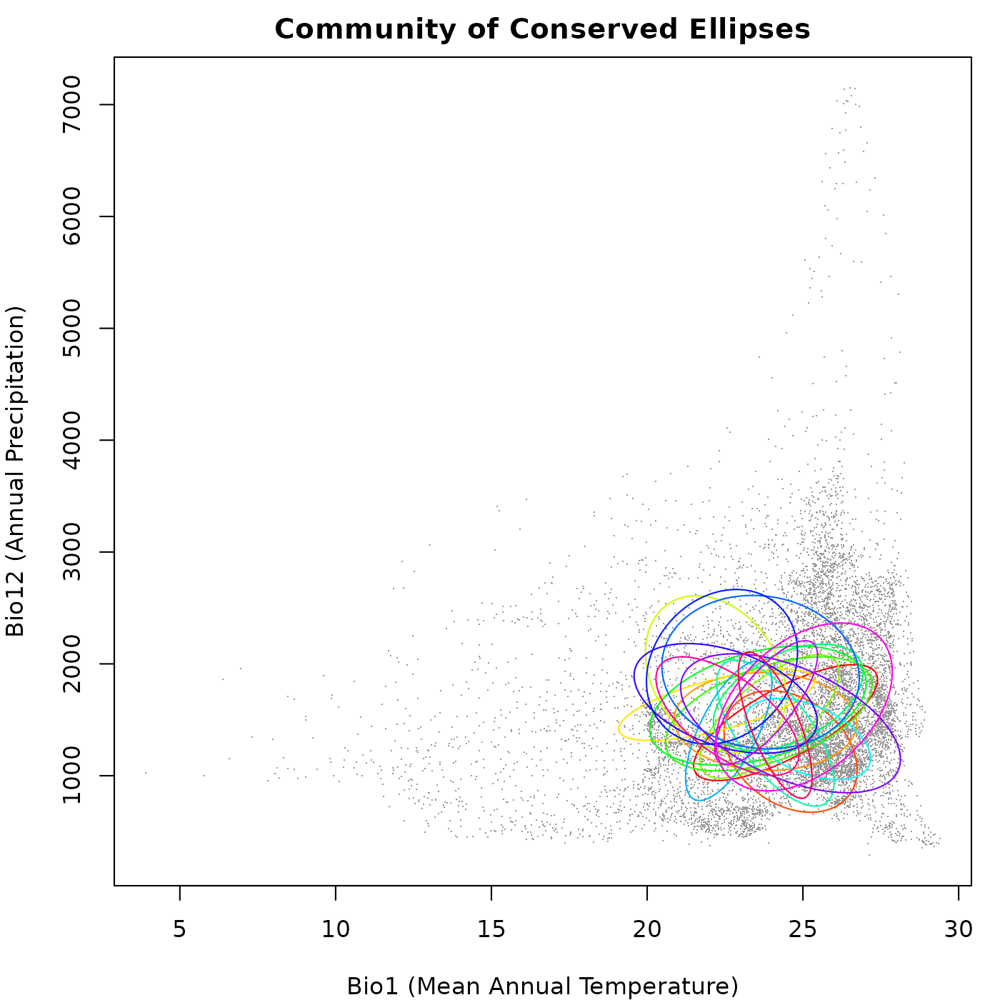

  

As you can see in the plot, the ellipses generated vary in size,
direction, and position, but they don’t go very far from the original
ellipdsoid. This follows the ideas of niche conservatism, which say that
closely related species tend to have similar ecological niches.

  

### Effect of background density

Similar to the
[`random_ellipses()`](https://castanedam.github.io/nicheR/reference/random_ellipses.md)
function, the
[`conserved_ellipses()`](https://castanedam.github.io/nicheR/reference/conserved_ellipses.md)
function uses the background as a reference to pick ellipse centroids.
Differences in background density can affect the bias used to generate
the ellipses (bias = tend to select new centroids close to the reference
centroid). If the effect of background density is not controlled, it
will be like saying that niche position evolution depends on the how
close you are to the ancester niche position and how common are
environments. Keeping in mind that ancestry is not considered here, the
trick is that those common environments are not necessarily
geographically available as geography is not considered here.

The example below shows how the density of the background can affect the
distribution of random ellipses when using the function. We will
simulate two communities: (1) using the full background as reference,
and (2) using the arguments `thin_background` and `resolution` to reduce
the effect of uneven point density.

``` r
# Simulating the community with the full background
cons_comm_full <- conserved_ellipses(object = ref_ellipse,
                                     background = back_data[, vars], n = 20)

# Simulating the community with a thinned background
cons_comm_thin <- conserved_ellipses(object = ref_ellipse,
                                     background = back_data[, vars], n = 20,
                                     thin_background = TRUE, resolution = 10)
```

  

Let’s check the distribution of ellipses in the two communities with a
plot to visualize the effect of the arguments `thin_background` and
`resolution`.

``` r
# Plotting the communities
par(mfrow = c(1, 2), cex = 0.6, mar = mars)  # set up the plotting area

## Plotting the community with the full background
plot_community(cons_comm_full, background = back_data[, vars],
               pch = ".", col_bg = "#9a9797",
               xlab = "Bio1 (Mean Annual Temperature)",
               ylab = "Bio12 (Annual Precipitation)",
               main = "Conserved Community from Full Background")

## Plotting the community with the thinned background
plot_community(cons_comm_thin, background = back_data[, vars],
               pch = ".", col_bg = "#9a9797",
               xlab = "Bio1 (Mean Annual Temperature)",
               ylab = "Bio12 (Annual Precipitation)",
               main = "Conserved Community from Thinned Background")
```

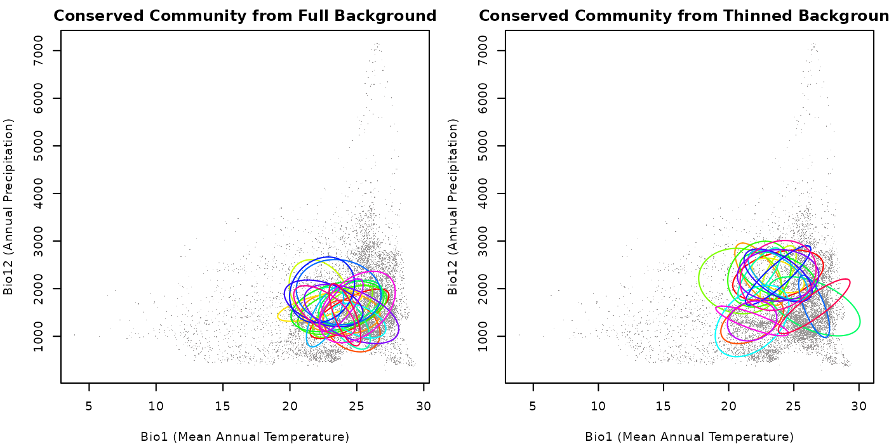

  

As you can see in the plots, the community generated with the full
background has a higher concentration of ellipses in areas where the
background data is denser compared to the one created with thinned
background. This highlights the importance of considering this factor
when simulating communities using the function
[`conserved_ellipses()`](https://castanedam.github.io/nicheR/reference/conserved_ellipses.md).
Play with the value for the argument `resolution` to see how it can
affect the distribution of ellipses in the community (larger values,
more points available).

  

### Effect of proportion arguments

We have explored before the effect of the arguments that control the
smallest and largest proportions when generating new ellipses
considering the reference. We will explore two examples with the
function
[`conserved_ellipses()`](https://castanedam.github.io/nicheR/reference/conserved_ellipses.md):
(1) both argeuments are small; and (2) `smallest_proportion` is small
and `largest_proportion` is large. We will thin the background in both
examples to better visualize the effect of the porportion arguments.

``` r
# Community with both arguments small
cons_comm1 <- conserved_ellipses(object = ref_ellipse,
                                 background = back_data[, vars], n = 20,
                                 thin_background = TRUE, resolution = 10,
                                 smallest_proportion = 0.1,
                                 largest_proportion = 0.5)

# Community with smallest_proportion small and largest_proportion large
cons_comm2 <- conserved_ellipses(object = ref_ellipse,
                                 background = back_data[, vars], n = 20,
                                 thin_background = TRUE, resolution = 10,
                                 smallest_proportion = 0.1,
                                 largest_proportion = 1.5)
```

  

Let’s check the distribution of ellipses in the two communities with a
plot to visualize the effect of the porportion arguments.

``` r
# Plotting the communities
par(mfrow = c(1, 2), cex = 0.6, mar = mars)  # set up the plotting area

## Community with small proportions
plot_community(cons_comm1, background = back_data[, vars],
               pch = ".", col_bg = "#9a9797",
               xlab = "Bio1 (Mean Annual Temperature)",
               ylab = "Bio12 (Annual Precipitation)",
               main = "Conserved Community with Small Proportions")

## Community with small smallest_proportion and large largest_proportion
plot_community(cons_comm2, background = back_data[, vars],
               pch = ".", col_bg = "#9a9797",
               xlab = "Bio1 (Mean Annual Temperature)",
               ylab = "Bio12 (Annual Precipitation)",
               main = "Conserved Community with Small and Large")
```

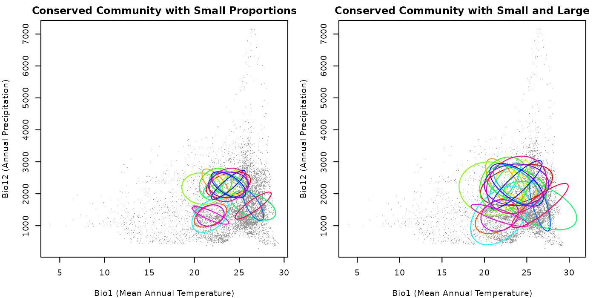

  

The plot show that when both arguments are small, the ellipses are
generally smaller. When `smallest_proportion` is small and
`largest_proportion` is large, the ellipses are more variable in size,
but larger than in the previous case because of the values we used. A
larger number of ellipses generated can help visualize the effect of the
arguments on the sizes of the ellipses a little better. Play with the
values for these arguments to explore different scenarios and pick the
ones that are more convinient for your research.

  

## Predictions for communities

Once we have our communities simmulated using the functions explored
above, we can predict over new data to observe the patterns of
Mahalanobis distance and suitability derived from the ellipses. The
function
[`predict()`](https://rspatial.github.io/terra/reference/predict.html)
can be used with `nicheR_community` objects to obtain predictions. The
difference between predict for community objects and that for
`nicheR_ellipsoid` objects is that only one type of `prediction` can be
obtained at a time. The options for the `prediction` argument for
`nicheR_community` objects are:

- `Mahalanobis`: Mahalanobis distance from the centroid of ellipses to
  every point in `newdata`.
- `suitability`: mutivariate normal probability for every point in
  `newdata`, derived from the Mahalanobis distance, interpreted as
  suitability. Values outside the ellipse are returned as `NA`.
- `Mahalanobis_trunc`: the same Mahalanobis distance but truncated to
  the limit of the ellipses.
- `suitability_trunc`: the same suitability but truncated to the limit
  of the ellipses. Values outside the ellipse are returned as zero.

Predictions can be produced for `newdata` in the form of `data.frame` or
`SpatRaster` objects. The `newdata` can contain multiple variables, but
the names of the ones used to create the reference ellipse and the
communities must be included. As long as those two variable names match
with the ones in `newdata`, predictions are possible (i.e., predictions
to distinct areas in the world are possible). We will explore
implementations for both types of objects below.

  

### Predict to data frames

The most intuitive way to work with ellipses is in environmental space.
This is because ecologicla niches are defined in this space. Since
envrionmental values can easily be organized in a data fame, predictions
for those objects are easy to obtain. See a quick example below, using
one of the communities generated in which we assumed niche conservatism
and background data as `newdata`.

``` r
# Predicting Mahalanobis distances
maha_cons_pred <- predict(cons_comm, newdata = back_data[, vars],
                          prediction = "Mahalanobis")
#> Starting: using newdata of class: data.frame...
#> Predictions for a conserved community of 20 ellipses...
#>   |                                                                              |                                                                      |   0%  |                                                                              |====                                                                  |   5%  |                                                                              |=======                                                               |  10%  |                                                                              |==========                                                            |  15%  |                                                                              |==============                                                        |  20%  |                                                                              |==================                                                    |  25%  |                                                                              |=====================                                                 |  30%  |                                                                              |========================                                              |  35%  |                                                                              |============================                                          |  40%  |                                                                              |================================                                      |  45%  |                                                                              |===================================                                   |  50%  |                                                                              |======================================                                |  55%  |                                                                              |==========================================                            |  60%  |                                                                              |==============================================                        |  65%  |                                                                              |=================================================                     |  70%  |                                                                              |====================================================                  |  75%  |                                                                              |========================================================              |  80%  |                                                                              |============================================================          |  85%  |                                                                              |===============================================================       |  90%  |                                                                              |==================================================================    |  95%  |                                                                              |======================================================================| 100%
#> 
#> Finalizing results...

# Predicting suitability
suit_cons_pred <- predict(cons_comm, newdata = back_data[, vars],
                          prediction = "suitability")
#> Starting: using newdata of class: data.frame...
#> 
#> Predictions for a conserved community of 20 ellipses...
#>   |                                                                              |                                                                      |   0%  |                                                                              |====                                                                  |   5%  |                                                                              |=======                                                               |  10%  |                                                                              |==========                                                            |  15%  |                                                                              |==============                                                        |  20%  |                                                                              |==================                                                    |  25%  |                                                                              |=====================                                                 |  30%  |                                                                              |========================                                              |  35%  |                                                                              |============================                                          |  40%  |                                                                              |================================                                      |  45%  |                                                                              |===================================                                   |  50%  |                                                                              |======================================                                |  55%  |                                                                              |==========================================                            |  60%  |                                                                              |==============================================                        |  65%  |                                                                              |=================================================                     |  70%  |                                                                              |====================================================                  |  75%  |                                                                              |========================================================              |  80%  |                                                                              |============================================================          |  85%  |                                                                              |===============================================================       |  90%  |                                                                              |==================================================================    |  95%  |                                                                              |======================================================================| 100%
#> 
#> Finalizing results...

# Check Mahalanobis predictions
maha_cons_pred[1:5, 1:5]
#>      bio_1 bio_12    ell_1    ell_2    ell_3
#> 1 18.16097    680 41.75216 120.2610 67.80944
#> 2 18.06556    703 43.25588 121.6585 67.18455
#> 3 17.95946    725 45.12359 123.5213 66.84268
#> 4 18.01018    734 44.46696 121.2863 65.50442
#> 5 18.14458    748 42.60751 116.1174 62.75064

# Check suiatbility predictions
suit_cons_pred[1:5, 1:5]
#>      bio_1 bio_12        ell_1        ell_2        ell_3
#> 1 18.16097    680 8.582898e-10 7.685140e-27 1.885240e-15
#> 2 18.06556    703 4.046737e-10 3.821066e-27 2.576675e-15
#> 3 17.95946    725 1.590514e-10 1.505505e-27 3.057006e-15
#> 4 18.01018    734 2.208627e-10 4.602756e-27 5.968912e-15
#> 5 18.14458    748 5.596257e-10 6.101304e-26 2.365219e-14
```

  

Now let’s check how the results look like in a plot. Predictions are
produced for all ellipses, and in the returned results, every prediction
is added as a new column to `newdata`. We will plot results for only the
first and second ellipses to show clearly the differences between
Mahalanobis and suitability predictions.

``` r
# Plotting the results
## Colors for mahalanobis distance
blue_pal <- hcl.colors(100, palette = "Oslo", rev = TRUE)

### Map columns with values for colors
col_maha <- lapply(3:4, function(x) {  # 3 and 4 have values for ellipse 1 and 2
  val_range <- range(maha_cons_pred[[x]], na.rm = TRUE)
  color_indices <- findInterval(maha_cons_pred[[x]],
                                seq(val_range[1], val_range[2],
                                    length.out = 100),
                                all.inside = TRUE)
  blue_pal[color_indices]
})

## Colors for suitability 
vir_pal <- hcl.colors(100, palette = "Viridis")

### Map columns with values for colors
col_suit <- lapply(3:4, function(x) {  # 3 and 4 have values for ellipse 1 and 2
  val_range <- range(suit_cons_pred[[x]], na.rm = TRUE)
  color_indices <- findInterval(suit_cons_pred[[x]],
                                seq(val_range[1], val_range[2],
                                    length.out = 100),
                                all.inside = TRUE)
  vir_pal[color_indices]
})

## Plotting area parameters
par(mfrow = c(2, 2), cex = 0.6, mar = mars)  # adjust margins for visualization

## plots
plot(maha_cons_pred[, vars],  # plot the variables as points
     col = col_maha[[1]],  # color points according to Mahalanobis distance
     pch = 16, xlab = "Bio1 (Mean Annual Temperature)",
     ylab = "Bio12 (Annual Precipitation)",
     main = "Mahalanobis Distance Ellipse 1")

add_ellipsoid(cons_comm[[3]][[1]], lwd = 2, col = "#e10000")

plot(maha_cons_pred[, vars],  # plot the variables as points
     col = col_maha[[2]],  # color points according to Mahalanobis distance
     pch = 16, xlab = "Bio1 (Mean Annual Temperature)",
     ylab = "Bio12 (Annual Precipitation)",
     main = "Mahalanobis Distance Ellipse 2")

add_ellipsoid(cons_comm[[3]][[2]], lwd = 2, col = "#e10000")

plot(suit_cons_pred[, vars],  # plot the variables as points
     col = col_suit[[1]],  # color points according to Mahalanobis distance
     pch = 16, xlab = "Bio1 (Mean Annual Temperature)",
     ylab = "Bio12 (Annual Precipitation)",
     main = "Suitability Ellipse 1")

add_ellipsoid(cons_comm[[3]][[1]], lwd = 2, col = "#e10000")

plot(suit_cons_pred[, vars],  # plot the variables as points
     col = col_suit[[2]],  # color points according to Mahalanobis distance
     pch = 16, xlab = "Bio1 (Mean Annual Temperature)",
     ylab = "Bio12 (Annual Precipitation)",
     main = "Suitability Ellipse 2")

add_ellipsoid(cons_comm[[3]][[2]], lwd = 2, col = "#e10000")
```

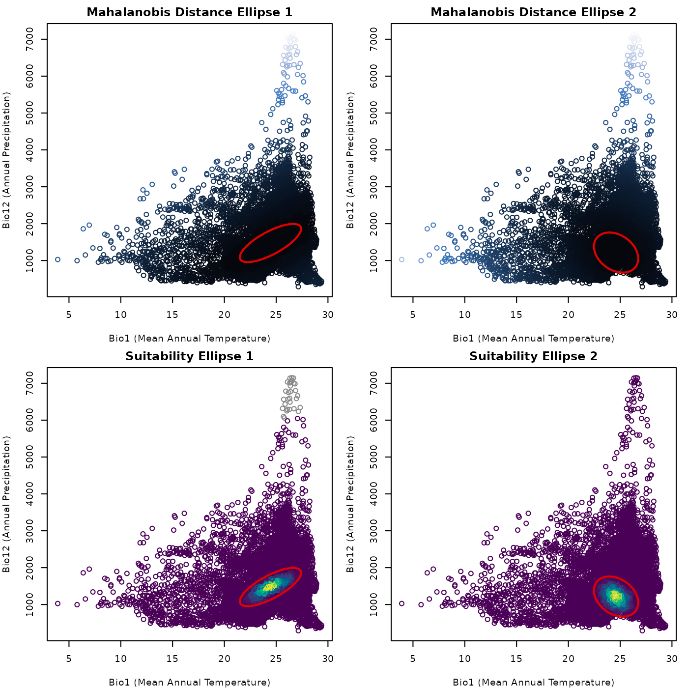

  

The plots shown are simple, but show clear patterns. For reference, dark
colors mean low values for both, Mahalanobis distance and suitability.
We can see that distance is larger the farther from the ellispse
centroid, and suitability is higher closer to the centroid. That is the
back bone of the theory behind using ellipses (or ellipsoids) as models
of ecological niche.

  

### Predict to SpatRaster

Now, let’s predict suing `SpatRaster` objects as `newdata`. The
important implication of this is that it allows us to see goegraphic
representations of our predictions. The geographic patterns of our
predictions are relevant for questions about species geographic
distributions. The code below shows how to produce this predictions. We
will use the smae community and the raster layers from which our
background derives (originally form
[WorldClim](https://www.worldclim.org/), inlcuded as data in the
`nicheR` package).

``` r
# Predicting Mahalanobis distances
maha_cons_predr <- predict(cons_comm, newdata = ma_bios,
                           prediction = "Mahalanobis")
#> Starting: using newdata of class: SpatRaster...
#> Predictions for a conserved community of 20 ellipses...
#>   |                                                                              |                                                                      |   0%  |                                                                              |====                                                                  |   5%  |                                                                              |=======                                                               |  10%  |                                                                              |==========                                                            |  15%  |                                                                              |==============                                                        |  20%  |                                                                              |==================                                                    |  25%  |                                                                              |=====================                                                 |  30%  |                                                                              |========================                                              |  35%  |                                                                              |============================                                          |  40%  |                                                                              |================================                                      |  45%  |                                                                              |===================================                                   |  50%  |                                                                              |======================================                                |  55%  |                                                                              |==========================================                            |  60%  |                                                                              |==============================================                        |  65%  |                                                                              |=================================================                     |  70%  |                                                                              |====================================================                  |  75%  |                                                                              |========================================================              |  80%  |                                                                              |============================================================          |  85%  |                                                                              |===============================================================       |  90%  |                                                                              |==================================================================    |  95%  |                                                                              |======================================================================| 100%
#> 
#> Finalizing results...

# Predicting suitability
suit_cons_predr <- predict(cons_comm, newdata = ma_bios,
                           prediction = "suitability")
#> Starting: using newdata of class: SpatRaster...
#> 
#> Predictions for a conserved community of 20 ellipses...
#>   |                                                                              |                                                                      |   0%  |                                                                              |====                                                                  |   5%  |                                                                              |=======                                                               |  10%  |                                                                              |==========                                                            |  15%  |                                                                              |==============                                                        |  20%  |                                                                              |==================                                                    |  25%  |                                                                              |=====================                                                 |  30%  |                                                                              |========================                                              |  35%  |                                                                              |============================                                          |  40%  |                                                                              |================================                                      |  45%  |                                                                              |===================================                                   |  50%  |                                                                              |======================================                                |  55%  |                                                                              |==========================================                            |  60%  |                                                                              |==============================================                        |  65%  |                                                                              |=================================================                     |  70%  |                                                                              |====================================================                  |  75%  |                                                                              |========================================================              |  80%  |                                                                              |============================================================          |  85%  |                                                                              |===============================================================       |  90%  |                                                                              |==================================================================    |  95%  |                                                                              |======================================================================| 100%
#> 
#> Finalizing results...

# Check Mahalanobis predictions
maha_cons_predr
#> class       : SpatRaster 
#> size        : 150, 240, 20  (nrow, ncol, nlyr)
#> resolution  : 0.1666667, 0.1666667  (x, y)
#> extent      : -100, -60, 5, 30  (xmin, xmax, ymin, ymax)
#> coord. ref. : lon/lat WGS 84 (EPSG:4326) 
#> source(s)   : memory
#> names       :    ell_1,    ell_2,    ell_3,    ell_4,    ell_5,    ell_6, ... 
#> min values  :    0.000,    0.000,    0.000,    0.000,   0.0000,    0.000, ... 
#> max values  : 2254.287, 1277.837, 1564.944, 4586.265, 727.9395, 1636.542, ...

# Check suiatbility predictions
suit_cons_predr
#> class       : SpatRaster 
#> size        : 150, 240, 20  (nrow, ncol, nlyr)
#> resolution  : 0.1666667, 0.1666667  (x, y)
#> extent      : -100, -60, 5, 30  (xmin, xmax, ymin, ymax)
#> coord. ref. : lon/lat WGS 84 (EPSG:4326) 
#> source(s)   : memory
#> names       : ell_1,         ell_2, ell_3, ell_4,         ell_5, ell_6, ... 
#> min values  :     0, 3.320709e-278,     0,     0, 8.510317e-159,     0, ... 
#> max values  :     1,  1.000000e+00,     1,     1,  1.000000e+00,     1, ...
```

  

Let’s check how the results look like in a plot.

``` r
# Plotting area parameters
par(mfrow = c(2, 2), cex = 0.6)  # adjust margins for visualization
marsr <- c(0.5, 0.5, 2, 4)

# Plots
terra::plot(maha_cons_predr$ell_1,
            axes = FALSE, box = TRUE, mar = marsr,
            main = "Mahalanobis Distance Ellipse 1")

terra::plot(maha_cons_predr$ell_2,
            axes = FALSE, box = TRUE, mar = marsr,
            main = "Mahalanobis Distance Ellipse 2")

terra::plot(suit_cons_predr$ell_1,
            axes = FALSE, box = TRUE, mar = marsr,
            main = "Suitability Ellipse 1")

terra::plot(suit_cons_predr$ell_2,
            axes = FALSE, box = TRUE, mar = marsr,
            main = "Suitability Ellipse 2")
```

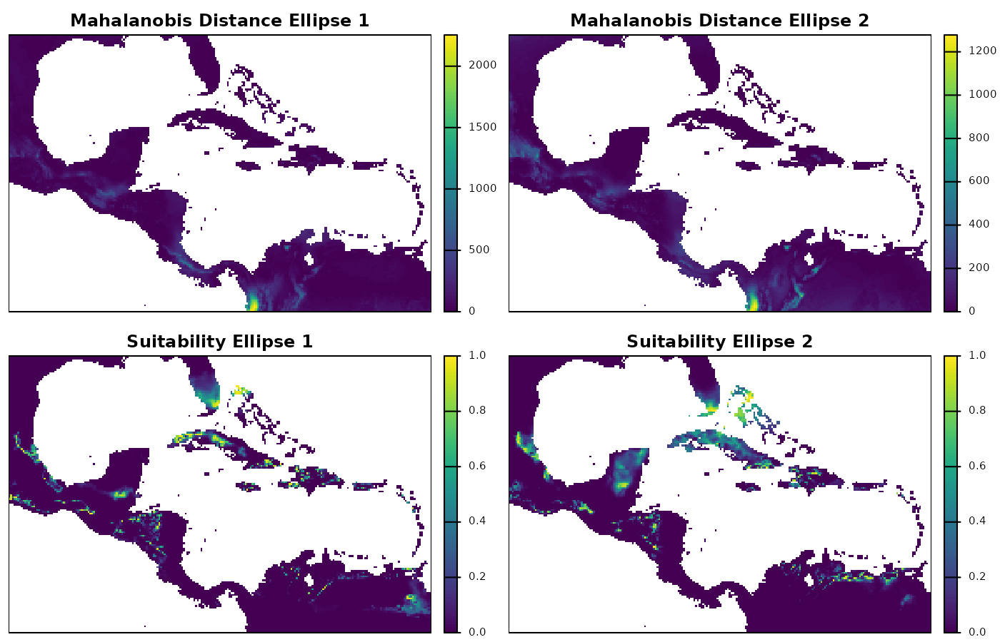

  

The raster plots show us the geographic patterns of Mahalanobis
distances and suitability, which are much more complex than the ones in
environmental space. Exploring this plots can help identify clusters of
highly suitable areas, for instance. High suitability is expected to
favor the presence of a species, which is why geographic projections of
ecological niche models are used for explorations of potential
distributional areas.

  

### Truncating predictions

An important decision to make when stauding what conditions are good for
a species to mantain populations for long periods of time is when
environments stop being suitable. Here is where ellipsoids shyne as
models of suitability, because their formulation gives us that
threshold. The limit of the ellipses we created, are the theoretical
limits for what is suitable and not suitable.

The options for `prediction` in our
[`predict()`](https://rspatial.github.io/terra/reference/predict.html)
function include results for Mahalanobis and suitanility that can be
“truncated” using that ellipsoid limit. For Mahalanobis distances,
truncation implies that all conditions outside the ellipsoid limit
become NA. Whereas, for suitability, all values outside the limit become
zero. This is important when trying to translate ideas of niche into
potential distributions.

Let’s explore an example with suitability predictions, truncated based
on the ellipse limits.

``` r
# Predicting suitability truncated using a data frame
suit_cons_predt <- predict(cons_comm, newdata = back_data[, vars],
                           prediction = "suitability_trunc")
#> Starting: using newdata of class: data.frame...
#> Predictions for a conserved community of 20 ellipses...
#>   |                                                                              |                                                                      |   0%  |                                                                              |====                                                                  |   5%  |                                                                              |=======                                                               |  10%  |                                                                              |==========                                                            |  15%  |                                                                              |==============                                                        |  20%  |                                                                              |==================                                                    |  25%  |                                                                              |=====================                                                 |  30%  |                                                                              |========================                                              |  35%  |                                                                              |============================                                          |  40%  |                                                                              |================================                                      |  45%  |                                                                              |===================================                                   |  50%  |                                                                              |======================================                                |  55%  |                                                                              |==========================================                            |  60%  |                                                                              |==============================================                        |  65%  |                                                                              |=================================================                     |  70%  |                                                                              |====================================================                  |  75%  |                                                                              |========================================================              |  80%  |                                                                              |============================================================          |  85%  |                                                                              |===============================================================       |  90%  |                                                                              |==================================================================    |  95%  |                                                                              |======================================================================| 100%
#> 
#> Finalizing results...

# Predicting suitability truncated using raster data
suit_cons_predrt <- predict(cons_comm, newdata = ma_bios,
                            prediction = "suitability_trunc")
#> Starting: using newdata of class: SpatRaster...
#> 
#> Predictions for a conserved community of 20 ellipses...
#>   |                                                                              |                                                                      |   0%  |                                                                              |====                                                                  |   5%  |                                                                              |=======                                                               |  10%  |                                                                              |==========                                                            |  15%  |                                                                              |==============                                                        |  20%  |                                                                              |==================                                                    |  25%  |                                                                              |=====================                                                 |  30%  |                                                                              |========================                                              |  35%  |                                                                              |============================                                          |  40%  |                                                                              |================================                                      |  45%  |                                                                              |===================================                                   |  50%  |                                                                              |======================================                                |  55%  |                                                                              |==========================================                            |  60%  |                                                                              |==============================================                        |  65%  |                                                                              |=================================================                     |  70%  |                                                                              |====================================================                  |  75%  |                                                                              |========================================================              |  80%  |                                                                              |============================================================          |  85%  |                                                                              |===============================================================       |  90%  |                                                                              |==================================================================    |  95%  |                                                                              |======================================================================| 100%
#> 
#> Finalizing results...

# Check predictions in data.frame
suit_cons_predt[1:5, 1:5]
#>      bio_1 bio_12 ell_1 ell_2 ell_3
#> 1 18.16097    680     0     0     0
#> 2 18.06556    703     0     0     0
#> 3 17.95946    725     0     0     0
#> 4 18.01018    734     0     0     0
#> 5 18.14458    748     0     0     0

# Check predictions in raster
suit_cons_predrt
#> class       : SpatRaster 
#> size        : 150, 240, 20  (nrow, ncol, nlyr)
#> resolution  : 0.1666667, 0.1666667  (x, y)
#> extent      : -100, -60, 5, 30  (xmin, xmax, ymin, ymax)
#> coord. ref. : lon/lat WGS 84 (EPSG:4326) 
#> source(s)   : memory
#> names       : ell_1, ell_2, ell_3, ell_4, ell_5, ell_6, ... 
#> min values  :     0,     0,     0,     0,     0,     0, ... 
#> max values  :     1,     1,     1,     1,     1,     1, ...
```

  

Compared to our previous predictions of suitability, now the truncated
results include zero.

Let’s explore the results using plots. First, the truncated results as
they are produced.

``` r
# Colors for suitability
## Map ellipse 1 column with values for colors
val_range <- range(suit_cons_predt$ell_1, na.rm = TRUE)
color_indices <- findInterval(
  suit_cons_predt$ell_1,
  seq(val_range[1], val_range[2], length.out = 100),
  all.inside = TRUE
)
col_suitt <- vir_pal[color_indices]


# Plotting area parameters
par(mfrow = c(1, 2), cex = 0.6, mar = mars)

## the binary for the background
plot(suit_cons_predt[, vars],  # plot the variables as points
     col = col_suitt,  # color points according to Mahalanobis distance
     pch = 16, xlab = "Bio1 (Mean Annual Temperature)",
     ylab = "Bio12 (Annual Precipitation)",
     main = "Suitability Trunc. E Space")

## the binary raster
terra::plot(suit_cons_predrt$ell_1,
            axes = FALSE, box = TRUE, mar = marsr,
            main = "Suitability Trunc. G Space")
```

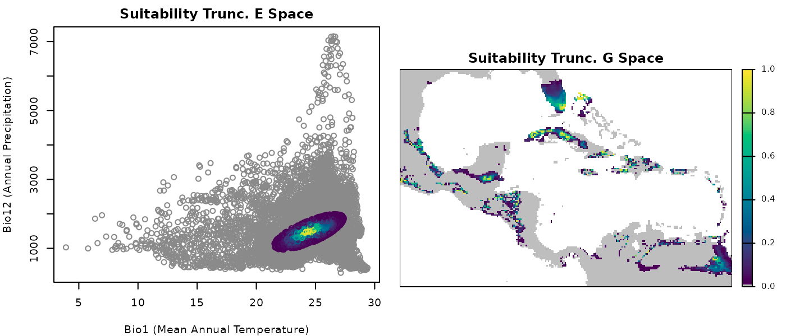

  
These plots of truncated suitability look very similar to the simple
suitability ones. But this is just an artefact from color assigning in
plotting.

Now, let’s plot suitable vs usuitable environments and areas. We start
by transforming everything inside the ellipse into one and what is
outside remains as zero.

``` r
# Obtaining values of zero and one
## results in data.frame
bin_suit_cons_predt <- suit_cons_predt
bin_suit_cons_predt[, -(1:2)] <- (bin_suit_cons_predt[, -(1:2)] > 0) * 1

## results in raster
bin_suit_cons_predrt <- suit_cons_predrt
bin_suit_cons_predrt <- (bin_suit_cons_predrt > 0) * 1


# Plotting
## Colors for suitability
bincol <- c("#c9c9c9", "#0004d5")

## Plotting area parameters
par(mfrow = c(1, 2), cex = 0.6, mar = mars)

## the binary for the background
plot(bin_suit_cons_predt[, vars],  # plot the variables as points
     col = bincol[as.factor(bin_suit_cons_predt$ell_1)],
     pch = 16, xlab = "Bio1 (Mean Annual Temperature)",
     ylab = "Bio12 (Annual Precipitation)",
     main = "Suitability Binary E Space")

## the binary raster
terra::plot(bin_suit_cons_predrt$ell_1, col = bincol,
            axes = FALSE, box = TRUE, mar = marsr,
            main = "Suitability Binary G Space")
```

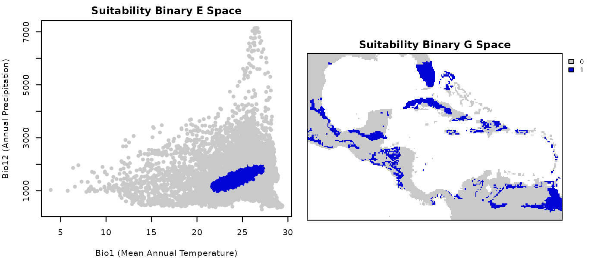

  

Now it is a lot more evident what was considered inside the ellipsoid in
environmental and geographic space.

  

### Simple community outcomes

He have shown examples for a couple of the ellipses generated, but this
can be done for all the ones in the comunity. Once all the elements in
the comunity are considered, interesting community level metrics and
indices can be explored. Using the binary results obtained from the
truncated predictions we will derive further results.

First, we already have a **Presence-absence matrix (PAM)** with our
binary results as a data.frame. These type of matrices are commonly used
in ecology because they tell us which species (columns) are where (rows:
each rown is a site).

Let’s visualize our PAM below:

``` r
# Exclude sites with no species to make the plot easier
pam <- bin_suit_cons_predt[, -(1:2)]
pam <- as.matrix(pam[!rowSums(pam) == 0, ])

# Plot PAM using image
par(mar = c(1, 1, 5, 1), cex = 0.6)

image(1:ncol(pam), 1:nrow(pam), t(pam[nrow(pam):1, ]),
      col = bincol, axes = FALSE)
box()
text(x = 1:ncol(pam), y = nrow(pam) * 1.01,
     labels = colnames(pam),
     srt = 90, adj = 0, xpd = TRUE)

title(main = "Species Presence-Absence Matrix", line = 3.5)
```

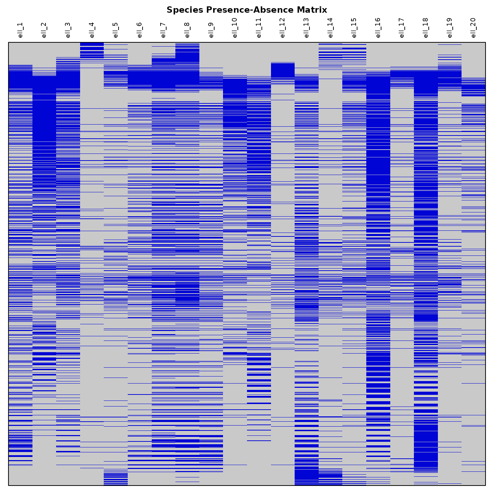

  

Now let’s plot a simple **Species Richness Map**. We need to compute
richness using our binary truncated results.

``` r
# Compute richness
richness <- terra::app(bin_suit_cons_predrt, sum)

# Plot richness
terra::plot(richness, mar = marsr, col = rev(heat.colors(20)),
            main = "Species Richness Map")
```

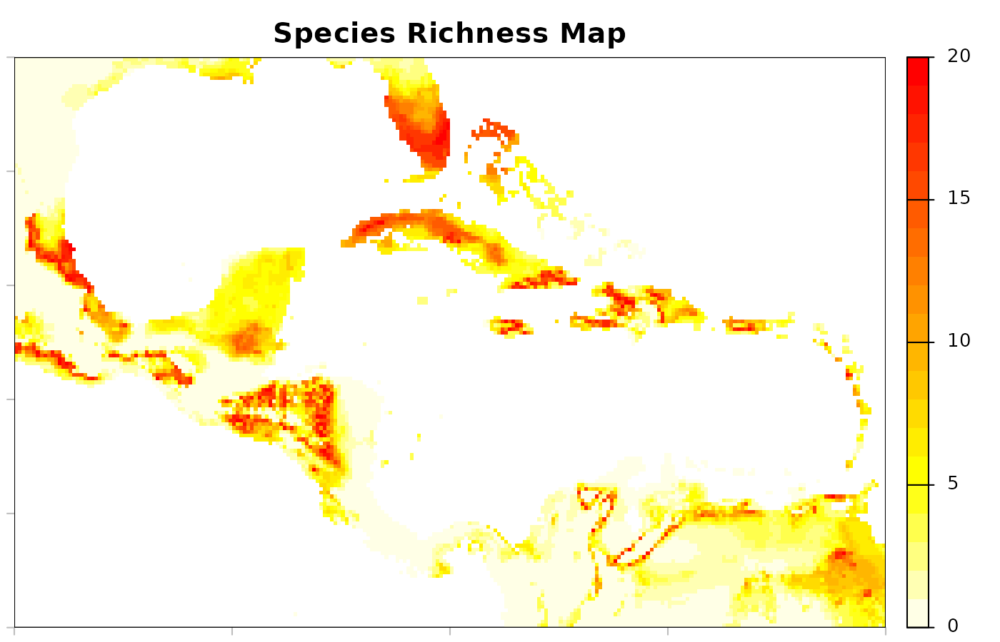

  

A lot of other results can be derived from the community predictions. We
hope these demonstrations have helped inspire new ideas.

  

``` r
# Reset plotting parameters
par(original_par)
```

  

## Save and import

To facilitate writing nicheR objects to local directories and importing
results in later sessions, we created the `save_nicheR` and
`read_nicheR` functions. These functions can be used with the results
obtained from virtual community simulations as `nicheR_community`
objects, as shown below.

``` r
# file name (in a temporary directory for demonstration purposes)
temp_file <- file.path(tempdir(), "conserved_community.rds")

# Save the community object to a local directory
save_nicheR(cons_comm, file = temp_file)

# Import the community object from a local directory
read_com <- read_nicheR(temp_file)
```

  

Results from predictions obatined as `data.frame` or `SpatRaster` can be
saved using functions that are convinient for those types of objects.
For instance, [`write.csv()`](https://rdrr.io/r/utils/write.table.html)
for the data.frame and
[`terra::writeRaster()`](https://rspatial.github.io/terra/reference/writeRaster.html)
for the raster results. Importing those files can be done with
[`read.csv()`](https://rdrr.io/r/utils/read.table.html) and
[`terra::rast()`](https://rspatial.github.io/terra/reference/rast.html).

``` r
# file names (in a temporary directory for demonstration purposes)
temp_df_file <- file.path(tempdir(), "df_cons_com_predictions.csv")
temp_raster <- file.path(tempdir(), "raster_cons_com_predictions.tif")

# Save predictions in data.frame objects
write.csv(suit_cons_predt, file = temp_df_file, row.names = FALSE)

# Save predictions in raster objects
terra::writeRaster(suit_cons_predt, filename = temp_raster)

# Import predictions as data.frame objects
read_com_pred_df <- read.csv(temp_df_file)

# Import predictions as SpatRaster objects
read_com_pred_ras <- terra::rast(temp_raster)
```
